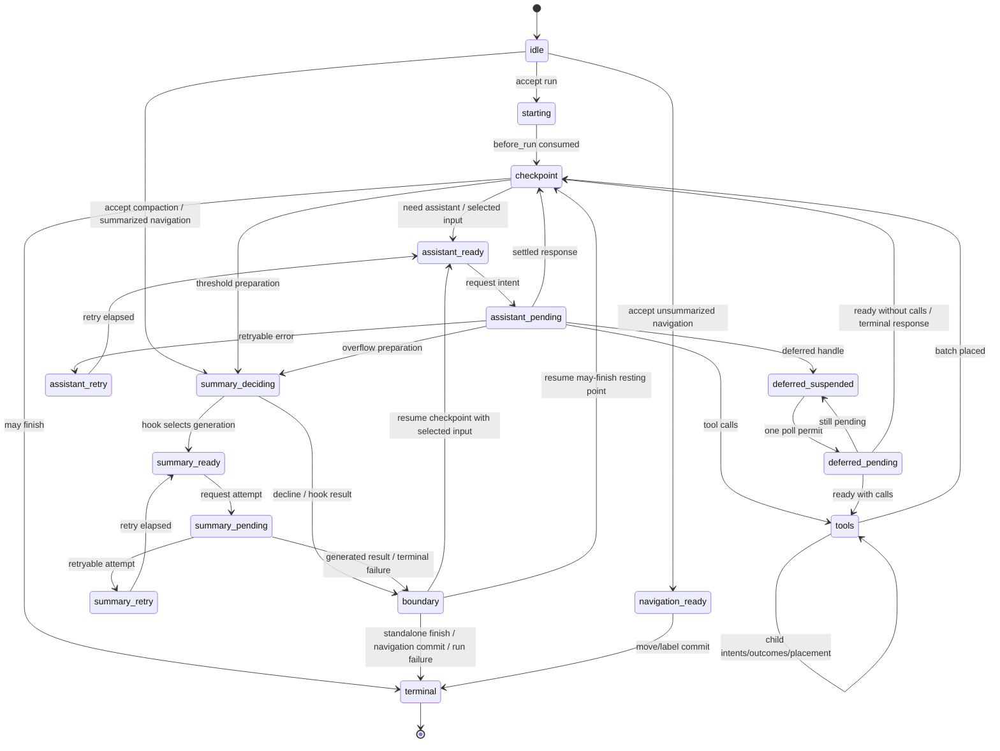

本文是 `harness.md` 的中文阅读版；命令、路径、API 名称保持英文。

# AgentHarness — 实现规范 {#agentharness--implementation-specification}

各节按（§N.M）编号以便交叉引用；按部分的目录：

- [第 0 部分 — 导览](#part-0--orientation)：系统模型 · 三个存储 · 工作示例 · 非目标 · 记法/源类型 · 校验边界 · 实现状态
- [第 1 部分 — 存储](#part-1--storage)：模型 · 身份 · 绑定 value/list · 事务 · 查询 · usage ledger · 后端 · 理由
- [第 2 部分 — 对话树](#part-2--the-conversation-tree)：entries · 放置 · Branches/AgentLanes · 元数据 · branch 查询/context · branch 索引 · forks · Session/repository（含 C1、search） · 精确 rewrite
- [第 3 部分 — 操作状态机](#part-3--the-operation-state-machine)：operations · 状态 · lane 状态 · 转换规则 · 图 · 接纳 · assistant · tools · summaries · 导航 · inbox · 边界 · 终端结果
- [第 4 部分 — 执行、恢复、abort、close](#part-4--execution-recovery-abort-close)：Drive · effect gate · mutation line · attachment · 恢复 · abort · close · faults
- [第 5 部分 — 公共表面](#part-5--public-surface)：lane · harness · Session/Branch · 快照 · 事件 · hooks · 执行块 · telemetry
- [第 6 部分 — 未来：分区保留（Postgres）](#part-6--future-partitioned-retention-postgres)
- [第 7 部分 — Schema 演进](#part-7--schema-evolution)
- [第 8 部分 — 工作包](#part-8--work-packages)
- [第 9 部分 — 不变量与测试](#part-9--invariants-and-tests)：38 条不变量 · 竞态目录 · 测试层级
- [附录 A — 术语表](#appendix-a--glossary) · [附录 B — Coding-agent v3 格式兼容](#appendix-b--coding-agent-v3-format-compatibility) · [附录 C — 开放问题](#appendix-c--open-questions)

# 第 0 部分 — 导览 {#part-0--orientation}

## 0.1 这是什么 {#01-what-this-is}

一个用于 agent 对话的持久运行时：它持久化对话与操作状态，使被中断的工作可以在不重复已结算 effect 的情况下恢复。本文是规范规格；§0.9 标出已规定但尚未实现的部分。公共类型声明住在 §0.7 点名的源文件中——本文仅在形状本身就是规则时才重复一份声明。

## 0.2 系统模型 {#02-system-model}

一个 **session** 有四部分：不可变 **entry 树**（message、compaction、branch summary，或应用定义的 custom entries；branches 共享该树，从而在保留历史的同时支持 branching、compaction、forking 与并行工作）；绑定类型化地址上的可变 **value 与 list**（内置项：session 名、entry 标签；应用定义自己的抗碰撞地址）；**Branches 与 AgentLanes**（Branch 是一条带可移动 tip 的具名数据路径；AgentLane 再加上全部模型配置、队列，以及最多一个 operation；session 可以两者都为零开始，`main` 是普通显式名）；以及仅追加的 **usage ledger**。

Session 层拥有全局持久数据与 Branch 能力。**Harness** 通过四个原语驱动 lanes——`accept` 持久创建 operation，`drive` 推进期望的 operation，`requestAbort` 持久请求取消，`inspectExecution` 原子报告当前与最近终端执行——再加上把它们与进程本地等待策略组合的便利方法（`prompt`、`resume`、`abort`，…）。Serving 层也可以改为通过 alarms、jobs 或另一 host 运行时调度 `drive` 调用。Harness 还拥有 harness 范围的 tool 与 prompt-resource registry、hooks、被动事件以及运行时配置。

一个 **operation** 是一个被接受的 lane 工作单元：run、compaction 或 navigation。不可变元数据记录身份、意图与起点；一个全部当前状态记录阶段、control 与恢复数据；排队输入属于 lane。Acceptance 与执行所有权是分开的：一个已接受 operation 可以没有进程本地 driver。完成删除 operation 拥有的状态，并写入一条不可变结果记录。

**Context。** 每个异步公共 harness/lane/Session/Branch/repository/storage 方法都接收显式尾部 `Context`；同步注册（`events.on()`、`hooks.on()`）无 context，并且 handler 在被调用时收到 Context。之所以存在 Context，是因为并发调用需要独立 telemetry 父级，并且 RPC 适配器必须把一次请求的取消作为 `context.abortSignal` 携带。共享接收者从不保留调用者 Context，也不通过 `AsyncLocalStorage` 发现一个。请求 ID RPC 取消已实现：client 把它的 signal 映射到 `cancel(requestId)`，server 派生带 `AbortController` 的请求 Context，该 controller 在匹配取消或断开时 abort。Trace 注入/提取与远程 telemetry 父级重建已规定但未实现（T1，§5.8）。Context 是进程本地 invocation 权威，从不是持久数据：abort 它不会调用 `requestAbort()` 或写入 `cancel_requested`。

**存储**（第 1 部分）在三种持久形式上暴露原子事务与查询。`pi.op.meta` 每个 operation 写一次；`pi.op.state` 在每次转换后用完整当前状态替换；有界进度的 tool checkpoint 是辅助的，从不证明 effect 完成。终端事务删除 operation 拥有的 value/list，并写入不可变 `pi.result/{operationId}`。从不暴露部分事务。

## 0.3 三个存储 {#03-the-three-stores}

第 1–5 部分的一切都来自四条规则。

**1. 三个存储，一条不变量。**

```text
entries        conversation tree — write-once, append-only
values/lists   current mutable state — replaceable values; append-only lists
               (append or whole-list delete)
usage ledger   cost history — append-only rows
```

*每个 payload 都在 entry、绑定 value/list 或 ledger 中；没有第三个地方。* Entry 是完整对话记录：放置与 payload 在一行。`Value<T>` 只持有其当前值；`ValueList<T>` 持有按写入序号排序的不可变元素，只能整表删除。在树放置之前就已持久存在的完整内容——排队输入、延迟写入、已最终化的乱序 tool 结果——等在 `pi.pending.entry` 中，并在放置它的事务中成为 entry；tool 进度仅在其 effect 不确定时可以占据 `pi.pending.tool_output`；流式 assistant 帧仅在其响应处于 effect-pending 时占据 `pi.pending.assistant_frame`（§3.7）。按后端的投影（branch 索引、search、stats）可重建，并且不携带权威。

**2. 原子事务**（§1.4）：entry/usage 插入与 value/list 写入全有或全无提交，并带严格递增序号；事务内部不存在崩溃状态；唯一写入原语。

**3. 持久重启点**（§3.2）：每次持久转换之后，harness 用*完整、全部*当前状态替换 `operationState(operationId)`——从不依赖先前状态。任务丢失之后，恢复读取它并从负责过程开始，从不 replay journal 或从缺失内容推断位置。小捕获值内联；大稳定 payload 住在兄弟 operation 拥有地址，或按 id 命名；终端事务删除它们，恰好留下对话、ledger，以及少量 lane/session value。

**4. Intent 与结算**（§0.4 轨迹，§3.7–§3.8）：provider 请求与真实 tool 调用包在两次提交中——intent（“即将做 X；输出将使用 ids R 和 U”）、不确定 effect，然后结算（完整输出 + 下一状态，以及对 tools 的按源顺序物化）。Hooks 改为遵循 replay 契约：hook 结果在消费它的事务中变得持久，该事务之前的崩溃可以重跑 hook。因此每个外部 effect 都可以在没有持久结算的情况下发生；intent 在 replay 策略依赖这一点时把它说清楚，幂等 hooks 把它当作非目标接受。

## 0.4 工作示例 — Slack 线程 {#04-worked-example--a-slack-thread}

用户在有 400 条历史 entries 的频道发帖；应用创建锚定在频道 tip 的 lane 并调用 `lane.prompt(...)`。规范写入顺序（每个 `TX[...]` 是一次原子提交）：acceptance 无 hook，并且不启动任务或 effect；intent 在发送任何东西之前铸造 response/usage ids；流式事件追加紧凑帧而不阻塞流（§3.7）；结算一起提交响应、usage、下一状态以及帧 list 删除；tool 调用遵循 intent → effect → outcome 结算，按 assistant 源顺序物化；终端事务删除 operation value/list 并写入 `pi.result/O`：

```text
TX[ insert entry n1 (user msg), upsert pi.branch.tip = n1,
    upsert pi.op.meta/O, upsert pi.op.state/O = starting,
    upsert pi.lane.state = { currentOperationId: O } ]
… first drive owns real work; before_drive then before_run …
TX[ insert injected messages if any, upsert pi.branch.tip when needed,
    upsert pi.op.state/O = checkpoint need_assistant ]
TX[ upsert pi.op.state/O = assistant ready (config snapshot) ]
TX[ upsert pi.op.state/O = effect_pending (reserves response n2, usage u1) ]
… provider streams …                                  ← the uncertain window
TX[ append pi.pending.assistant_frame/O:n2 += frame ]    ← zero or one per non-terminal
                                                        event, enqueued without awaiting
TX[ insert entry n2, insert usage u1, upsert pi.branch.tip = n2,
    delete list pi.pending.assistant_frame/O:n2,
    upsert pi.op.state/O = tools (result id n3 reserved) ]
TX[ upsert pi.op.tool_args/O:s1:0, upsert pi.op.state/O = call 0 effect_pending ]
… tool runs; selected bounded updates may replace pi.pending.tool_output/O:n3 …
TX[ upsert pi.pending.entry/n3 = finalized tool result,
    delete pi.pending.tool_output/O:n3, upsert pi.op.state/O = call 0 outcome_ready ]
TX[ insert entry n3, delete pi.pending.entry/n3, upsert pi.branch.tip = n3,
    upsert pi.op.state/O = checkpoint ]
… second turn: ready · intent · stream · settle (n4, u2) …
TX[ delete pi.op.meta/O, pi.op.state/O, pi.op.tool_args/O:*,
    set pi.result/O = { operationId: O, kind: "run", status: "completed",
                        fromTipId, tipId: n4, startedAt, endedAt },
    upsert pi.lane.state = { currentOperationId: null,
                             lastOperationId: O, inbox: [] } ]
```

在任意两次事务之间杀死进程并重启：harness 读取 lane 的所需 value，看到哪次最后提交，并继续。Provider 流期间死亡留下一个可能已计费、也可能产生或未产生输出的请求——唯一真正不确定的窗口；§4.5 规定策略，已提交帧前缀保留最新持久部分，用于合成结算与重连显示，而不证明请求如何结束。同一频道中的第二个线程在同一共享历史上运行自己的 lane，无需协调。

## 0.5 工作示例 — tool 中途崩溃 {#05-worked-example--a-crash-mid-tool}

模型为 `lane.prompt("delete the stale migrations and run the test suite")` 返回两个 tool 调用。Harness 提交批次计划，然后是 call 0 的 intent，带其精确参数与 `replay: "never"`。Tool 删除文件，每 100 ms 发出有界进度，并每两秒请求一次持久 checkpoint。进程在一次 checkpoint 提交之后死亡：

```text
TX[ insert entry n2 (assistant, 2 calls), insert usage u1, upsert pi.branch.tip = n2,
    upsert pi.op.state/O = tools (result ids n3, n4 reserved) ]
TX[ upsert pi.op.tool_args/O:s1:0, upsert pi.op.state/O = call 0 effect_pending,
                                                    replay: "never" ]
… tool deletes files; live updates u1 … u19 …
TX[ upsert pi.pending.tool_output/O:n3 = bounded update u1 ]
… live updates u2 … u19 …  ← CRASH
```

重启时，`pi.op.state` 说 `calls[0].status = "effect_pending", replay = "never"`，因此删除不会重跑。稍后的 drive 按 §4.5 对账孤立项：最新持久 checkpoint 内容加上显式中断警告，作为预留 id 下的合成错误暂存，然后正常物化：

```text
TX[ upsert pi.pending.entry/n3 = synthetic interrupted result containing u1,
    delete pi.pending.tool_output/O:n3, upsert pi.op.state/O = call 0 outcome_ready ]
TX[ insert entry n3, delete pi.pending.entry/n3, upsert pi.branch.tip = n3,
    upsert pi.op.state/O = call 0 completed ]
```

每个 tool 调用都有结果，并且没有任何东西跑了两次；没有已提交 checkpoint 时，结果只包含警告。如果 tool 声明了 `replay: "safe"`（一次读取、一次查询），harness 会改为用持久参数重新执行它。

## 0.6 非目标 {#06-non-goals}

- **恰好一次外部 effect** — 带副作用的 hooks 必须幂等，按 operation id 键控。
- **Provider 流恢复** — harness 从不重新附加到 provider 流；已提交帧（§3.7）为恢复与重连显示保留最新持久部分，并且已结算响应在任何东西分类它之前被*完整*持久化。
- **多个可写所有者** — 同一时刻恰好一个 host 分配的所有者可以持有可写 Session；通常该所有者是其 Session worker，而 server 可以在交接之前临时拥有新创建或 fork 的目标。存储后端不强制这条 host 生命周期规则。只读 repository 工作，例如 SQLite 源快照，可以与 worker 重叠（§1.7，§2.7）。Lanes 覆盖看起来像多写的工作负载。
- **工作调度** — harness 从不创建平台 alarms、扫描 repositories 寻找被遗弃 session、租用托管提交，或承诺 HTTP 回执；它通过 `drive` 报告持久等待，由 serving 层决定何时再次调用。
- **复制** — session 住在一个地方。
- **持久写入历史** — values 只保留当前状态，lists 只保留到整表删除；没有 API 或表暴露被替换的 values 或已删除元素。测试写入顺序断言使用围绕 `commit()` 的插装装饰器（第 9 部分）；生产审计属于 telemetry（§5.8）。
- **删除作为运行时功能** — entries 与 usage 行从不删除：compaction 改变 provider context，不是存储；终端清理只删除 values/lists；`retainedTail` 把旧消息向前复制，summaries 从旧内容派生，因此 compaction 不是擦除。合规级擦除是管理性精确 rewrite（§2.9），唯一被批准的例外。

## 0.7 记法与源类型 {#07-notation-and-source-types}

- `TX[ a, b, c ]` — 一次原子提交，写入按该顺序。写入词汇：`insert entry`、`insert usage`、`setValue`、`deleteValue`、`appendList`、`deleteList`。轨迹可以把绑定地址缩写为其持久 `namespace/key`；那从不是 API 签名或第二个 key 参数（§1.3）。
- Ids 是 UUIDv7s（§1.2），缩写为 `e_*`/`u_*`/`op_*`；时间前缀重要时，示例会展示它。
- `S(next)` 用下一个全部状态覆盖 `operationState(operationId)`；`L(next)` 对 `laneState(lane)` 做同样的事。
- 声明性规则、转换/竞态表、不变量，以及被显式称为规范的轨迹是规范的；示例与标为 informative 的节不是。**must / must not** 强调义务，但不是唯一规范措辞。这澄清旧速记：测试消费的表是契约的一部分。

路径约定：`src/...` 相对 `packages/agent/`；诸如 `session/types.ts` 或 `agent-harness.ts` 的裸 harness 路径相对 `packages/agent/src/harness/`；`docs/...` 相对 `packages/agent/`；以 `packages/` 开头的路径相对仓库根。源类型出处：`AgentMessage`、`AgentTool`、`AgentToolResult`、`QueueMode`、`ThinkingLevel` — `packages/agent/src/types.ts`。`Skill`、`PromptTemplate`、`AgentHarnessResources`（下文 `Resources`）、`AgentHarnessTool*` 族、`AgentHarnessStreamOptions`/`Patch` — `packages/agent/src/harness/types.ts`。`Model`、`Models`、`Tool`、`Usage`、`RetryPolicy`、`StopReason`、`AssistantMessage`、`ImageContent`、provider 消息、流选项、deferred handles — `packages/ai`；`AiContext` 把 pi-ai 的 provider 请求 `Context` 别名化，以区别于 harness invocation `Context`。`AssistantMessageFrame`、`AssistantMessageFrameEncoder`、`reduceAssistantMessageFrames` — `packages/ai` 的 `src/utils/assistant-message-frame.ts`；harness 不定义第二套帧编解码器或 reducer。`CompactionSettings`、`CompactionPreparation`、`CompactResult`、`BranchPreparation`、`BranchSummaryResult` — `packages/agent/src/harness/compaction/`；除非本文改变它们，既有准备与 split-turn 算法仍是实现。`TelemetryContext` 与 schema helpers — `packages/telemetry`；agent 拥有的 schemas — `src/harness/telemetry.ts`。`Context`、`ContextKey`、`BACKGROUND_CONTEXT`、派生 helpers — `src/harness/context.ts`。Harness/lane 公共声明 — `src/harness/agent-harness.ts`；Session/storage 声明 — `src/harness/session/types.ts` 与 `session/values.ts`。

公共 `QueueMode` 是 `"all" | "one-at-a-time"`。公共 `RetryPolicy` 是 `{ enabled, maxRetries, baseDelayMs }`；operation 状态存储规范化的 `{ maxAttempts, baseDelayMs }`。`maxRetries` 与 `baseDelayMs` 必须是有限非负安全整数，并且 `maxRetries + 1` 必须仍安全；禁用 retry 规范化为一次尝试；delay 与 `notBefore` 算术在 `Number.MAX_SAFE_INTEGER` 饱和。公共 `CompactionSettings` 是 `{ enabled, reserveTokens, keepRecentTokens }`；两个 token 计数都必须是有限非负安全整数。构造器与 setter 在发布之前拒绝非法设置。`AgentHarnessStreamOptions` 及其 patch 包含 `deferred?: boolean | { window?: "15m" | "1h" | "24h" }`；结构请求始终把它强制为 false。`SettledAssistantMessage` 是 `AssistantMessage & { stopReason: Exclude<StopReason, "pending"> }`。Provider 分发在请求时通过 `Models` 解析持久 `{ provider, modelId }` 身份（它也应用 auth）；缺失或被换掉的 registry 条目像未知 tool 一样在带内失败该请求。

## 0.8 校验边界 {#08-validation-boundary}

内部 pi 对象是受信任的类型化值：Session、存储、operation 过程以及进程内扩展既不运行时校验形状，也不防御性克隆。存储仍强制其操作不变量（原子性、序号分配、唯一 ids、parent 存在）；后端按需序列化/解析；外部编辑或形状损坏的存储不受支持。运行时 schema 校验属于不受信任的线边界——未来的协议 schema 切片为可序列化 pi-ai/harness 数据定义共享 TypeBox schemas，并从它们派生 TypeScript 类型，而不给内部路径添加校验。Attachment 只校验发布小型 lane/operation 投影所需的关系（§3.3，§4.4）；详细状态导向引用是消费时检查（`watch` 验证其快照需要的 pending/entry 判别式与消息角色关系；drive 验证转换输入），并且可选 assistant 帧 lists 与 tool checkpoints 可以缺失。

## 0.9 实现状态 {#09-implementation-status}

WP00–WP07 已完成（第 8 部分）：operation 图、公共 lane 运行时，以及 SQLite host 所有权对齐已实现。第 9 部分陈述所需一致性矩阵；它不是声称每个列出的行已经有一个专用测试。已知缺失行为与当前契约债务，各自在其节再次标注：

- **J1 — JSONL 快照压缩（§1.7）：** 已规定，未实现；死字节今天从不回收。
- **C1 — 原始 RemoteSession（§2.8）：** 规定的远程 mutation 传输与已交付的进程本地产品矛盾；在实现任一方向之前需要决定。
- **R12 — `watchSession`（§5.2）：** 公共方法抛出 `SliceNotImplemented`；唯一被 stub 的 Harness 方法。
- **T1 — telemetry（§5.8）：** span 词汇已声明；生产只启动 tool-hook span。RPC 入口有请求 ID 取消，但没有 trace 传播。
- **S3 — search（§2.8）：** 仅设计；当前 `src/search/index.ts` 骨架与它冲突，并且没有实现。
- **R11 — schema 迁移（第 7 部分）：** 机制已规定；由激活门控；不存在也不需要迁移。
- **WP08 — 具名 branch 与流式 forks（§2.7）：** Slice A 进行中。显式 scope 与具名 branch 选择、祖先校验、已配置 lane 强制，以及封闭标量 fork 策略已实现。Lists、序号/高水位保留、直接 Memory 构造，以及有界 JSONL/SQLite 传输仍待完成。
- **SQLite branch 分叉（§2.6）：** 当前 compaction 有界算法可以在未 compaction 的 branch 上复制 O(history)，与其有界前缀目标相反。
- **H1 — 契约/测试收口：** 公共 `OperationStatus` 包含 `"running"`，但当前观察只产生 `"open"`/`"aborting"`（§5.4）；rewrite 前的 abort 契约在解析/发信之前绑定 `operation_abort`，但当前代码先发信，并在释放 line 之前绑定接收者（§4.6）；第 9 部分仍是所需一致性矩阵，不是声称每一行都有专用测试。
- **源声明更正：** `CommitResult.stats` 与 `SessionReader.getStats()` 已实现；旧内联声明省略了它们，即使其它旧节依赖提交后总计（§1.4，§2.8）。旧执行块声明也早于当前源形状：独立 `streamHarnessAssistant` 允许缺失 `afterResponse`，而持久 Harness 调用者始终提供它；tool 阶段直接携带 `AgentHarnessTool`、`toolContext` 与 invocation 能力，并在立即原始结果之后创建规范结果消息（§5.7）。这些是源形状更正，不是对持久边界的改变。
- **Gate close 类型（§4.2）：** 生产契约只允许 `HarnessClosed | HarnessFault`；源当前把私有原语放宽为 `Error`，隔离测试使用它。生产调用遵守更窄规则；收窄源类型仍是 H1 清理。
- **精确 rewrite（§2.9）** 与 **分区 Postgres（第 6 部分）：** 管理性/未来；没有实现。

Storage format 4 仍是 WIP（稳定前）：形状可以原地改变而无需迁移；不要为它们发明迁移义务。详细未来工作清单见 [`post-wp05-roadmap.md`](post-wp05-roadmap.md)。

---

# 第 1 部分 — 存储 {#part-1--storage}

存储对 agents、lanes 或对话一无所知。它存储 entries 与 usage 行，更新绑定 values/lists，并回答一小套固定查询。第 2–4 部分完全建立在此之上。

## 1.1 模型 {#11-the-model}

声明：`session/types.ts`、`session/values.ts`。语义：

```ts
type JsonValue = null | boolean | number | string | JsonValue[] | { [k: string]: JsonValue };

/** 一次写入的完整对话记录：放置与 payload 在一行。
    恰好在一次事务中创建，从不修改或删除。具体
    entry 类型：§2.1。 */
interface EntryBase {
  id: string;                // UUIDv7 (§1.2)
  parentId: string | null;
  seq: number;               // storage-assigned at commit
  timestamp: number;         // Unix ms, storage-assigned at commit
  type: "message" | "compaction" | "branch_summary" | "custom";
  customType?: string;       // when type === "custom"
}

/** 唯一可变存储，由绑定类型化地址寻址。 */
function value<T>(namespace: string, key = ""): Value<T>;      // kind: "value"
function list<T>(namespace: string, key = ""): ValueList<T>;   // kind: "list"
interface StoredValue<T> { address: Value<T>; value: T; seq: number }  // seq of last set
interface ListElement<T> { seq: number; value: T }             // global write seq of the append

/** 仅追加的成本 ledger 行。从不修改，从不删除（§1.6）。 */
interface UsageRow {
  id: string;                // UUIDv7 (§1.2)
  seq: number;
  usage: Usage;
  entryId?: string;          // the entry this cost belongs to, when there is one
  adjustment: boolean;       // true = caller-supplied reconciliation, not a provider report
  details?: JsonValue;
}
```

## 1.2 身份 {#12-identity}

每个 id — operation、entry、usage、每个预留 id — 都是来自 session id 生成器的 **UUIDv7**（§2.8）；遗留导入重新铸造以符合（附录 B）。`accept` 可以收到调用者提供的 operation id，以便持久 host 提交与 harness operation 共享一个身份；调用者必须按同一契约铸造它，并且从不重用它。省略则内部铸造。前 48 位是铸造时间，因此每个引用都自描述且可按时间排序；接受的代价是 ids 泄漏创建时间。（第 6 部分 informative 的 Postgres 草图建立在此前缀上。）

铸造规则：(1) ids 在其提交操作开始时用 `now()` 铸造——直接 append 在同一事务中放置；assistant/tool ids 最多落后放置一个请求时长；(2) **tool-result ids 继承其 assistant id 的时间戳**（`idGenerator.next(timestampMs?)`，全新随机尾），因此即使跨越午夜，call-and-results 组在 id 顺序下也时间内聚；(3) 合成结算在已经预留的 ids 下写入（§4.5）——没有特例。

**不透明 payload** — custom entry `data`、应用 values、`details`、消息文本 — 可以嵌入 entry ids；harness 从不跟踪那些引用，它们可能过期。复制内容，不要引用它。

**绝对项。** 在一个 session 内，entries 与 usage 行从不删除——精确 rewrite（§2.9）是唯一例外。缺失 parent 始终是损坏。

## 1.3 绑定 value 与 list {#13-bound-values-and-lists}

公共存储抽象是**绑定类型化地址**：`value<T>(namespace, key?)` 命名一个可替换持久 value，`list<T>(namespace, key?)` 命名一个 `T` 的仅追加持久 list。Namespace 与 key 绑定一次；之后每次读或写只接收该地址。没有全局 value 类型表、token catalog、declaration merging，或单独的应用状态存储机制。内置构造器住在 `session/values.ts` 并被直接 import——没有运行时 catalog 或依赖注入 bundle；核心与应用使用相同的通用构造器。

规则：

- `namespace` 必须非空；任一组件都不得包含 `\u0000`。
- Namespace `pi` 以及每个 `pi.*` namespace 按契约保留给内置项；每个内置 namespace 以 `pi.` 开头。应用使用 `pi.*` 是受信任编程缺陷；构造器不做所有权检查——精确构造器测试、而不是运行时权限检查，强制该约定。
- 空 key 合法，并寻址一个 session 范围 value 或 list。
- 对象身份没有持久含义；相等的 `(kind, namespace, key)` 三元组命名同一位置。
- 用不相容 TypeScript 类型构造一个位置是受信任编程缺陷。Value 与 list 地址在一个 storage version 中不得共享一个 `(namespace, key)`；存储不做跨 kind 碰撞检查。
- 改变 namespace、key 文法、kind 或不相容 value 形状需要迁移（第 7 部分）。地址构造之后，后续操作从不接受另一个 key。

完整内置清单：

| 地址构造器                                       | Kind  | 持久 namespace、key                                      | Value                            | 含义                                 |
| ----------------------------------------------- | ----- | -------------------------------------------------------- | -------------------------------- | ------------------------------------ |
| `branchTip(lane)`                               | value | `pi.branch.tip`，lane                                    | entry id 或 `null`               | 该 lane 下一次 append 的位置         |
| `laneConfig(lane)`                              | value | `pi.lane.config`，lane                                   | `LaneConfiguration`              | 全部 lane 配置                       |
| `laneState(lane)`                               | value | `pi.lane.state`，lane                                    | `LaneState`（§3.3）              | 当前/上次 operation ids 与 inbox     |
| `operationResult(opId)`                         | value | `pi.result`，operation id                                | `OperationResultRecord`（§3.13） | 不可变终端观察                       |
| `operationMeta(opId)`                           | value | `pi.op.meta`，operation id                               | `OperationMeta`（§3.1）          | acceptance 数据；写一次              |
| `operationState(opId)`                          | value | `pi.op.state`，operation id                              | `OperationState`（§3.2）         | 全部持久重启点                       |
| `operationToolArgs(opId, stepId, sourceIndex)`  | value | `pi.op.tool_args`，`{opId}:{stepId}:{sourceIndex}`       | 生效参数                         | 在放行时写一次                       |
| `operationToolMemo(opId, invocationId, name)`   | value | `pi.op.tool_memo`，`{opId}:{invocationId}:{name}`        | `JsonValue`                      | invocation 作用域持久 memo           |
| `operationPreparation(opId, taskId)`            | value | `pi.op.preparation`，`{opId}:{taskId}`                   | `DurableStructuralPreparation`   | 结构准备                             |
| `pendingEntry(entryId)`                         | value | `pi.pending.entry`，预留 entry id                        | `PendingEntry`                   | 等待放置的完整内容                   |
| `pendingToolOutput(opId, invocationId)`         | value | `pi.pending.tool_output`，`{opId}:{invocationId}`        | `AgentToolResult<unknown>`       | 最新有界进度 checkpoint              |
| `pendingAssistantFrames(opId, responseEntryId)` | list  | `pi.pending.assistant_frame`，`{opId}:{responseEntryId}` | `AssistantMessageFrame` 元素     | 已提交流帧前缀                       |
| `sessionName`                                   | value | `pi.session.name`，空 key                                | string                           | session 名                           |
| `entryLabel(entryId)`                           | value | `pi.entry.label`，entry id                               | string                           | entry 标签                           |

恰好五个导出的 scan-prefix 构造器封装 lane 清单与 operation 清理文法。其结果仅作为 namespace 作用域 `scanValues()` 输入有效，从不是精确 get/set/delete 地址：

| 前缀构造器 | Namespace | 前缀 key |
|---|---|---|
| `branchTipInventoryPrefix()` | `pi.branch.tip` | `""`（所有 lanes） |
| `operationToolArgsPrefix(opId, stepId?)` | `pi.op.tool_args` | `{opId}:` 或 `{opId}:{stepId}:` |
| `operationToolMemoPrefix(opId, invocationId?)` | `pi.op.tool_memo` | `{opId}:` 或 `{opId}:{invocationId}:` |
| `operationPreparationPrefix(opId)` | `pi.op.preparation` | `{opId}:` |
| `pendingToolOutputPrefix(opId)` | `pi.pending.tool_output` | `{opId}:` |

```ts
/** 未放置内容：当前可变状态，直到放置事务
    写入完整 entry 并删除该 value（§2.2）。 */
type PendingEntry =
  | { type: "message"; payload: AgentMessage }
  | { type: "custom"; customType: string; payload?: JsonValue };
    // 缺失 custom payload = 没有 data 的 custom entry
```

`DurableStructuralPreparation`（`session/types.ts`）是两变体 union：`kind: "compaction"` 带 `messagesToSummarize`、`turnPrefixMessages`、`retainedTail`、`isSplitTurn`、`tokensBefore`、可选 `previousSummary`、`fileOps`、`settings`；以及 `kind: "branch_summary"` 带 `messages`、`fileOps`、`totalTokens`。`fileOps` 是 `{ read, written, edited: string[] }`。

寿命：

```text
pi.lane.*  pi.session.*  pi.entry.*   session-lived semantic values
pi.result                             immutable lane-lived records, one per terminal operation
pi.op.*                               operation-lived; deleted no later than the terminal transaction (§3.13)
pi.pending.entry                      until placement, cancellation, or owning-operation cleanup
pi.pending.tool_output                only while its invocation is effect-pending
pi.pending.assistant_frame            only while its response is effect-pending
```

- `pi.op.meta` 与 `pi.op.preparation` 恰好写一次；`pi.op.tool_args` 每个 call 一次。Invocation memo 在 invocation 到达 `outcome_ready` 时死亡。每个 `pi.op.*` value 不晚于终端事务删除。
- Lane inbox 及其 pending payload 活过 operations，并且仅在被消费或取消时死亡；operation 拥有的暂存 tool outcome 在放置或终端清理时死亡（§3.11）。
- Tool 输出是可选辅助状态：outcome 暂存原子删除它；安全 replay 在重新执行之前删除它；不安全恢复可以把它消费进中断结果。
- Assistant 帧是按全局写入 `seq` 排序的辅助 list 元素。缺失 list 合法。帧从不证明请求接纳、完成或失败，也从不选择重启点；结算原子删除精确绑定 list（§3.7）。
- `pi.result` 记录由终端事务写一次，运行时从不更新或删除，恢复也从不读取。
- 删除绑定 value 会移除它；在地址类型允许的地方，JSON `null` 与缺失保持不同。

## 1.4 事务 {#14-transactions}

一个 `Write` 是六种操作之一的擦除存储记录——entry insert、usage insert、value set/delete、list append/delete——在适用处携带 `(namespace, key)` 加上 value。原始写入形状是存储内部：所有代码通过 `insertEntry(entry)`、`insertUsage(row)`、`setValue(address, next)`、`deleteValue(address)`、`appendList(address, element)` 与 `deleteList(address)` 构造它们，这些在擦除之前检查绑定地址/value 关系。Value helpers 不能瞄准 list 地址，反之亦然；`NoInfer<T>` 使地址成为权威，而不是 widen `T`。

```ts
interface CommitResult {
  firstSeq: number; seqs: number[]; timestamp: number;
  stats: SessionStats;   // session totals immediately after this commit
}
```

规则：

1. 事务 **全有或全无** 提交；没有可观察状态有一部分写入而没有另一部分。
2. 写入按给定顺序收到 **严格递增** 的 `seq`；空隙在事务内与事务间都合法；`seq` 在所有 lanes 与写入 kind 上 session 范围单调。Value `set` 用其分配的 `seq` 盖章存储 value。
3. 写入在事务内按顺序应用：entry 可以命名同一事务中更早创建的 parent；存储 value 可以引用其中更早创建的 entry/usage ids。放置事务一起插入完整 entry 并删除其 `pendingEntry(id)`（§2.2）——两者从不同时存在。
4. Entry 与 usage ids 共享一个 session 范围 id 命名空间；在任何已有 id 下写入任一种都是 **损坏**，不是更新。
5. Value `set` 替换当前 value；`delete` 移除它；稍后的 `set` 重建它；不保留历史。命名缺失 key 的 `delete` 是 no-op，因此诸如清除未设置标签的公共删除保持合法。
6. 一次 list `append` 携带一个元素，并且从不读取已有元素。元素在提交后不可变，并按分配的写入 `seq` 排序；来自无关写入的空隙无关。不存在按元素的 update、delete、插入或截断。
7. List `delete` 移除 `(namespace, key)` 下的每个元素；删除不存在的 list 是 no-op；一次事务中 `delete` 然后 `append` 原子创建全新 list。“仅追加”描述 key 存在期间的元素——整 key 删除是生命周期清理，不是元素 mutation。
8. 一个 session 上的事务被 **串行化**：一个 writer，一个队列。

Session 把类型化事务传给存储，没有编解码器、运行时形状校验或克隆。失败的已接纳提交 **使 harness 进入 fault**（§4.8）：所有 effect 停止，所有调用拒绝，进程必须重启。部分应用的事务不被容忍。

## 1.5 查询 {#15-queries}

一个 `Storage` 实例服务一个 session；repository 发现与生命周期在它之外（§2.8）。

```ts
interface Storage {
  commit(writes: Write[], context: Context): Promise<CommitResult>;
  getEntries(ids: string[], context: Context): Promise<Map<string, Entry>>;
  getValue<T>(address: Value<T>, context: Context): Promise<StoredValue<T> | undefined>;
  /** Internal namespace-scoped prefix scan; the bound address key is the prefix. */
  scanValues<T>(prefix: Value<T>, context: Context): Promise<StoredValue<T>[]>;
  readList<T>(address: ValueList<T>, options: ListReadOptions | undefined,
              context: Context): Promise<ListElement<T>[]>;
  scanBranch(q: StorageBranchScan, context: Context): Promise<Entry[]>;           // §2.5
  scanBranchStructure(q: StorageBranchScan, context: Context): Promise<EntryStructure[]>;
  scanEntries(q: EntryScan, context: Context): Promise<Entry[]>;   // session-wide inventory
  scanUsage(q: UsageScan, context: Context): Promise<UsageRow[]>;  // ledger read (§1.6)
  getStats(context: Context): Promise<SessionStats>;               // maintained projection
  close(context: Context): Promise<void>;
}
```

`EntryStructure` 是去掉 payload 字段的 entry（`id`、`parentId`、`seq`、`timestamp`、`type`、`customType`）。`EntryScan`/`UsageScan` 按 `type`/`customType`（仅 entries）、`fromSeq`/`toSeq`、`order: "asc" | "desc"`、`limit` 过滤。`ListReadOptions` 是 `{ cursor?: { seq }, order?: "asc" | "desc"（默认 "asc"）, limit? }`；limit 必须是正安全整数，默认 1,000，超过 10,000 钳到 10,000。

List 读取语义：升序返回 `seq > cursor.seq`，降序 `seq < cursor.seq`；结果在 `limit` 之前排序；缺失与空 key 都返回 `[]`；调用者用最后元素的 `seq` 继续，空页结束迭代。游标是序号过滤器，不是快照或 key 世代 token：并发的后续 append 可能出现在后续升序页上，整 key 删除之后读取只是把比较应用到存活元素。刻意没有无界“读取整个 list”helper。

`scanValues(prefix)` 是 namespace 作用域的，把绑定 key 解释为前缀，并按 key 升序返回 values。核心清单/清理只使用五个 §1.3 前缀构造器；核心调用点不重复原始保留文法。普通读取使用精确地址。没有跨 namespace value dump 或持久写入日志。Entry 清单使用 `scanEntries`，ledger 读取使用 `scanUsage`，总计使用 stats 投影（§1.6），测试顺序断言使用插装装饰器（第 9 部分）。

恢复与执行读取必须由索引驱动且有界：从不从缺失 value 推断状态（没有历史可折叠）。精确解引用允许——当前类型化状态可以命名有界的 entries 与 values 集合，并且从当前状态派生的精确 list 地址可以按有界页读取，并由其消费者归约（assistant 帧使用 `reduceAssistantMessageFrames`，§3.7）。基础恢复从不读取 lists（§4.4）。公共清单/调试 API 通过 Session 与 Branch 暴露显式 limit/分页。

`close()` 是幂等的：封闭接纳，拒绝该实例上的后续读取/提交，排空封闭前已接纳的提交，然后释放后端资源。持久数据通过 repository 重开；可写所有者交接属于 host 生命周期，不属于 Storage。

## 1.6 Usage ledger {#16-usage-ledger}

每个已结算 provider 尝试写入一行 `UsageRow`——成功、失败、重试与合成一样，包括其 operation 稍后 abort 的尝试。恢复丢弃或替换的孤立结构/deferred intent 没有已结算 outcome，并可能让其预留 response/usage ids 未使用；仅遗弃不写入合成 usage 行，而任何已经提交的 usage 仍保留。结算一起写入响应 entry 及其 usage 行（§3.7）；合成结算在预留 usage id 下写入零 usage。行是仅追加的：终端清理从不删除 ledger 行，因此计费活过编排状态发生的一切。

- `entryId` 命名该成本所属的 entry（若存在）；在产生 entry 之前失败的结构尝试，以及独立调整，没有它。
- `adjustment: true` 标记调用者提供的对账（`recordUsage`，§5.1），不是 provider 报告；format-3 导入写入一行聚合调整行（附录 B）。
- Provider 尝试 usage ids 在 intent 提交中预留，因此结算恰好在承诺 id 下写入。调整行、tool 报告的 usage、hook 提供的 compaction/navigation usage（§3.9，§3.10）以及导入聚合在提交时铸造 ids；没有任何东西预留它们。
- `getStats()` 是覆盖 ledger 加上 message-entry 计数的维护投影——`messageCount` 只计 `message` entries。每次提交之后它等于 ledger 总和（由一致性断言，第 9 部分）。行通过提交时的 `usage` 事件到达应用（§5.5）；`scanUsage` 按 seq 范围把它们读回，因此持久化最大已应用事件 `seq` 的消费者用 `scanUsage({ fromSeq })` 赶上。恢复从不读取 ledger。

## 1.7 后端 {#17-backends}

同一模型的三种编码随包交付——Memory、JSONL、SQLite——并且都通过同一一致性套件（第 9 部分）。各自记录 session 的 `storageVersion`（第 7 部分）：JSONL header 字段，SQLite catalog 列；Memory sessions 始终是当前的。分区 Postgres 仅 informative（第 6 部分）。

### Memory {#memory}

Entries、标量 values、list 数组与 usage 行的 maps，物理上按 `namespace + separator + key` 键控。一个队列串行化提交。提交检查存储不变量，分配序号与事务时间戳，然后同步应用写入；接纳事务所需要的全部校验与序列化在任何 map mutation 之前完成。Value delete = map delete；list append 推入已编序号元素；整 key list delete 移除数组；list 读取按排他游标过滤并切到已校验 limit。读取是 map 查找；`scanBranch` 在 RAM 中走 `parentId`。Memory 返回类型化值而不克隆，并且恰好持有活动状态——没有日志。

### JSONL {#jsonl}

文件是 Memory maps 的 **replay 配方**，不是状态。每个 `commit()` 一行物理行：存储分配序号/时间戳字段，然后把一次已提交写入编码为 JSON 对象行，或把若干次编码为一行 **数组行**。Header 行是 `{"v":4,"kind":"header","id":…,"storageVersion":1,"createdAt":…,"cwd":…}` 加上可选 `parentSessionId`、`legacyParentSessionPath`，以及由 fork 目标与 v3 规范化写入的 `nextSeq` 高水位（并且对未来 J1 rewrite 是必需的）。

- 这是 format 4。WP01 前未完成的 format-4 拼写被原地替换；不存在也不需要针对它的迁移。Coding-agent format 3 仍受支持（附录 B）。
- Open 按顺序把行 replay 进 maps——entries/usage 累积；稍后的 value `set` 覆盖，`delete` 移除；list `append` 添加 `{ seq, value }`，list `delete` 移除 key。那是*解码*，不是恢复逻辑。Open 验证持久序号单调性（严格递增，空隙合法）与时间戳，并且从不重新生成已提交时间戳。然后所有查询在 RAM 中运行。
- **撕尾的最后一行被整行丢弃**，包括数组行的每个元素，并在接纳新写入之前截断——这使这里的“事务内部没有崩溃前缀”为真。格式错误的*内部*行或非法分帧是损坏。未来更旧的 storage version 仅在显式 R11 迁移定义该全部映射时才被解码；迁移后压缩退役其字节。
- 持久化是进程崩溃级：已 resolve 的 `commit()` 活过进程死亡；没有 fsync 承诺。可选地按 entry 保留 `(offset, length)` 并惰性加载 payload——仅当 profiling 要求时。

**快照压缩（J1 — 已规定，未实现）。** 在 SQLite 中 value `set` 是原地 upsert；在 JSONL 中每次 `set` 都追加，因此 30 轮 run 在终端 `delete` 之后留下约 10 行死 `pi.op.state`：即使逻辑状态没有增长，文件也随写入历史增长。规定的修复通过临时文件 + 原子 rename 把文件重写为 `header + current entries + current values + surviving list elements + usage rows`。存活行保留其原始 `seq` 值（丢行空隙合法；不重新编号）。每个存活 list 元素作为携带其原始 `seq` 的 append 记录被重写，按序号顺序合并——从不折叠成一次合成 append——因此 list 游标存活。已删除 lists 不产生快照记录；`nextSeq` 高水位被保留，因此丢掉尾部 delete 行不能允许序号重用。当死字节比例越过阈值时在 open 时压缩，在终端或 outcome 暂存删除把文件推过阈值之后压缩，并且始终在 schema 迁移之后压缩（第 7 部分）；压缩之间，操作是仅追加的，并且每次提交 O(1)。

在 J1 落地之前，已删除 pending payload、被取代的状态修订、被取代的 tool checkpoints，以及已删除帧 lists 作为字节无限期滞留——逻辑删除立即；物理删除当前从不发生。因此 tool 作者拥有有界 checkpoint 值、节奏与重复抑制（bash：100 ms 实时更新，最多每两秒 checkpoint，仅在变化时；按每个 checkpoint 50 KiB，持续变化输出每十分钟增加约 15 MiB）。Assistant 帧 lists 随模型输出线性增长；[mobile assistant-output handoff](mobile-handoff/01-harness/05-assistant-output/message-update.md) 用作用域存储中的跟踪输出替换按帧的持久化与复制写入。每个终端 operation 一个小不可变 `pi.result` 记录被永久保留，并复制进每个后续快照——结果增长按设计对 operation 计数线性。需要及时物理移除敏感已取消内容的部署，在 J1 存在之后，在终端边界急切压缩。

### SQLite {#sqlite}

后端：`packages/session-backends/sqlite-node`。**每个 session 一个数据库文件是默认；共享容器受支持。** 没有 `databasePath` 时，安全字母数字/下划线/连字符 ids 保留 `{id}.sqlite`；每个其它显式 id 使用其 UTF-16 码元的 `~` 前缀 base64url 编码，因此分隔符、点、百分号与 Unicode 不能逃出 `directory`。有 `databasePath` 时，任意数量 Sessions 共享一个容器。元数据报告规范物理容器路径。每个权威与投影行都按 `session_id` 作用域；共享容器是受支持的部署模式，不是要移除的实现细节。SQLite 提供原子事务与一致 WAL 快照，不是 Session 所有权。

`001_initial.sql`（storage version 1），全部按 `session_id` 作用域：

```sql
entries(id, parent_id, seq, type, custom_type, timestamp, payload) WITHOUT ROWID;
  -- ix_entry_parent(parent_id), ix_entry_seq(seq, type)
scalar_values(namespace, key, seq, value, PRIMARY KEY (namespace, key)) WITHOUT ROWID;
list_values(namespace, key, seq, value, PRIMARY KEY (namespace, key, seq)) WITHOUT ROWID;
usage_ledger(id, seq, entry_id, adjustment, usage, details) WITHOUT ROWID;
  -- ix_usage_seq(seq)

-- Private branch index (§2.6). Not values/lists; no equivalent in other backends.
branch_entries(branch_id, entry_id, entry_seq, entry_type,
               PRIMARY KEY (branch_id, entry_id)) WITHOUT ROWID;
  -- ix_be_seq(branch_id, entry_seq, entry_id, entry_type): entry_seq must directly
  --   follow branch_id or ORDER BY needs a temp b-tree; trailing columns cover
  --   id-only reads. ix_be_type(branch_id, entry_type, entry_seq, entry_id),
  --   ix_be_entry(entry_id)
branch_meta(branch_id PRIMARY KEY, tip_entry_id, tip_seq, base_branch_id, base_seq);
  -- unique ix_bm_tip(tip_entry_id)

sessions(id, created_at, parent_session_id, storage_version, metadata,
         message_count, usage_payload, next_seq);        -- one row per Session
```

触发器在存储层强制共享 entry/usage id 命名空间以及有序 parent 插入。不支持 WP01 前的 format-4 SQLite 文件；迁移机制属于 R11。

一次 `commit()` 是一次 SQL 事务：插入 entries 与 ledger 行，替换/删除标量 values，插入/整表删除 list 元素，维护 branch 索引，提升 session stats（`message_count`、聚合 `usage_payload`）。从不更新或删除 entry 或 ledger 行；可变性限于 values/lists、branch 索引、stats、序号以及 catalog 行。List 分页是 `SELECT seq, value FROM list_values WHERE namespace = ? AND key = ? AND seq > ? ORDER BY seq ASC LIMIT ?`（降序对称；没有游标时省略谓词）；通过 `EXPLAIN QUERY PLAN` 断言它使用主键且没有临时排序。

**每个可能写入的事务必须以 `BEGIN IMMEDIATE` 打开。** 先读后写的延迟 `BEGIN` 取得读快照，并且稍后必须升级到写锁；如果另一 writer 在其间提交，SQLite 升级失败——并且 `busy_timeout` 救不了它，因为等待不能刷新陈旧快照；唯一恢复是回滚并完整重试。每次提交在写入之前读取 session 行的 `next_seq`，因此每个写入事务中读都先于写；branch 创建（§2.6）也在插入之前读取最新 compaction。一致只读快照事务——fork 捕获（§2.7）——可以使用延迟 `BEGIN` 读事务；它们从不升级为写。旧的笼统措辞覆盖每个事务，并与它自己的只读 fork 规则冲突；这把规则收窄到源行为，而不削弱任何写路径。

**Session 所有权由 host 权威。** 通常恰好一个 worker 拥有可写 Session；create/fork 管理可以只在关闭该 Session 并把元数据交给 worker 之前拥有目标。Memory、JSONL 与 SQLite 不检测第二个进程为写入打开同一 Session；绕过 server/worker 生命周期是受信任 host 缺陷。SQLite 没有租约、围栏、心跳或替换所有权原语。Repository 仍拒绝重复可写 handle，并在一个进程中预留它拥有的 create/open/fork/delete 目标。Host 在删除之前关闭 worker；共享容器删除在一次 `BEGIN IMMEDIATE` 事务中只移除该 Session 的行，而按文件删除移除其数据库与 WAL/SHM sidecar。

数据库访问有三种显式模式：有意 create-or-open、no-create 读写，以及 no-create 只读。元数据 `open` 与删除使用 no-create 读写访问；列出与外部 fork 源使用 no-create 只读访问，因此缺失路径从不变成空数据库。可写 `open`/`delete` 元数据必须解析到 repository 亲和的物理路径。外来 fork 源改为从其精确物理路径读取，并且永远不能用相同 Session ID 别名活动本地源。

只读 fork 访问可以与 worker 重叠：WAL 允许 server 的 repository 在 worker 继续提交时捕获活动 worker 拥有的源。每个源使用独立只读连接与一次从不升级或声称可写权威的延迟读事务；它在该事务内校验 Session 行与 storage version，并看到每个源事务完全在其快照边界之前或完全之后。对同一 repository 打开源，reader 先打开，源提交队列上的短回调开始事务并在释放队列之前建立其快照。WAL 帧仅在提交记录落地时变得可见，因此没有 fork 看到提交的一部分。所选行在源 reader 仍打开时流入临时磁盘暂存数据库；该 reader 关闭之后，stage 流入一次目标 `BEGIN IMMEDIATE` 事务，并在 `finally` 中移除。稍后源提交可以在暂存时完成。Repository close 封闭接纳，启动每个打开 Session close，等待全部结算，并直接报告一个错误或在 `AggregateError` 中报告若干错误。

`scanBranch` 的每个物理段使用一次 JOIN（§2.6 组合段范围）：

```sql
SELECT e.id, e.parent_id, e.seq, e.type, e.custom_type, e.timestamp, e.payload
FROM branch_entries b
CROSS JOIN entries e ON e.id = b.entry_id
WHERE b.branch_id = ? AND b.entry_seq > ? AND b.entry_seq <= ?
ORDER BY b.entry_seq;
```

`CROSS JOIN` 是必需的：它强制 `branch_entries` 作为外循环；放任不管时规划器可能从 `entries` 驱动，扫描它，并通过临时 b-tree 排序。在测试中断言计划（`SEARCH b USING COVERING INDEX ix_be_seq …`，然后 `SEARCH e USING PRIMARY KEY`）；任何带 `USE TEMP B-TREE FOR ORDER BY` 或 `entries` 扫描的计划都是回归。`scanBranchStructure` 是同一查询去掉 payload 列；`getEntries` 是主键 `IN (...)` 查找。

在按 session 文件模式中，精确 rewrite（§2.9）可以构建全新数据库（`VACUUM INTO` 或在一个读快照上复制行）并像 JSONL 一样把它原子换到旧路径上。共享容器 rewrite/fork 只复制所选 Session 的行，并且不得 rewrite 无关 Sessions。两种布局中 fork 暂存都写入分开的临时文件；精确 rewrite 工具仍是管理性未来工作。

## 1.8 为什么是一次写入加上 values 与 lists {#18-why-write-once-plus-values-and-lists}

全文依赖的后果：attachment 有界（每个 lane 固定投影点读取，§4.4；一次 compaction 有界 watch 扫描加上精确状态导向读取，§5.4；持久路径上唯一 reducer 是 pi-ai 在一个精确有界 list 上的帧 reducer，§3.7）；崩溃状态可枚举——在事务之间，从不在一个事务内部；清理是删除，不是收集——30 轮 run 替换 `operationState` 约 30 次然后删除它，恰好留下对话、ledger 以及少量 lane/session values（JSONL 把物理回收推迟到 J1；逻辑状态相同）；恢复从不通过 rewrite 修复——它追加 entries，并且只用正常执行会提交的相同转换替换它拥有的 values，因此中断并重跑给出相同结果；读者从不看到部分状态。暂存写入是刻意的：排队内容在入队时序列化进 `pi.pending.entry`，并在放置时再次进入其 entry；已最终化 tool outcome 在按源顺序物化之前暂存，防止已完成并行 effect 在崩溃后 replay；assistant 结算生来就被放置，其帧随结算原子死亡。暂存始终有一个所有者，并随放置或清理原子死亡。

---
# 第 2 部分 — 对话树 {#part-2--the-conversation-tree}

## 2.1 Entries {#21-entries}

一个 **entry** 是完整存储行（§1.1）：放置字段与 payload 在一起。`getEntries` 与扫描返回恰好已提交的内容——没有物化步骤，没有 join。

```ts
interface MessageEntry extends EntryBase {
  type: "message"; message: AgentMessage; terminate?: true;
}
interface CompactionEntry extends EntryBase {
  type: "compaction"; summary: string; retainedTail: AgentMessage[];
  tokensBefore: number; details?: JsonValue; usage?: Usage; fromHook: boolean;
}
/** fromId: 被总结 branch 的导航前提 tip — 产生
    该操作的 sourceTipId（§3.10）— 或当该源是根时为 null。 */
interface BranchSummaryEntry extends EntryBase {
  type: "branch_summary"; fromId: string | null; summary: string;
  details?: JsonValue; usage?: Usage; fromHook: boolean;
}
interface CustomEntry extends EntryBase {
  type: "custom"; customType: string; data?: JsonValue;
}
type Entry = MessageEntry | CompactionEntry | BranchSummaryEntry | CustomEntry;
```

规则：`type`/`customType` 是结构字段——branch 查询按它们过滤，并且 branch 索引反规范化它们（§2.6）；`customType` 恰好设置在 custom entries 上；payload 字段从不驱动结构。Assistant entries 始终包含 `SettledAssistantMessage`——写入前拒绝 `pending`。Tool-result entries 携带 `terminate?: true`，编排状态 `ToolResultMessage` 没有该字段。每个 compaction 与 branch summary 携带 `fromHook`（`true` = hook 输出，`false` = 生成）。每个 compaction 存储完整 `retainedTail`（空时为 `[]`）；**context 从不读过 compaction**——compaction 是自包含 checkpoint，不是指向历史的指针。只有 custom entry 可以缺少 `data`。Payloads 内联；两个 entries 从不共享存储内容，并且没有去重层。

## 2.2 放置 {#22-placement}

> 一个 **entry** 在放置发生时被创建，并且是完整的。放置*之前*持久的内容是等在 `pendingEntry(id)` value 中的当前可变状态；放置事务写入 entry 并删除 pending value。那之后两者都不被修改。

**生来就被放置** — 空闲 lane 上的 assistant 响应与直接 append；内容与放置在一次事务中到达（`TX[ insert entry, upsert pi.branch.tip ]`）。

**内容优先 — 排队输入。** `steer`、`followUp`、`nextRun` 以及 deferred 树写入在入队时铸造 entry id 并构造 `pendingEntry(id)`；队列状态按该 id 引用内容，并且两次事务可以相隔很远：

```text
t0  TX[ upsert pi.pending.entry/e_q1 = { type: "message", payload: <200KB message> },
        S(next){ ...inbox.steer += "e_q1" } ]
t1  TX[ insert e_q1 (parent e_a3), delete pi.pending.entry/e_q1,
        upsert pi.branch.tip/main = "e_q1", S(next){ ...inbox.steer -= "e_q1" } ]
```

`t1` 之前崩溃：仍排队；之后：已放置，pending value 消失。直到放置或取消，pending value 与 entry 恰好存在一个；取消删除 value，并且内容从不进入树（§3.11）。

**内容优先 — 已最终化并行 tool outcome。** Tool 结果 id 在 `pi.op.state` 中开始为普通预留字符串。当执行与 `after_tool` 完成时，完整最终 `ToolResultMessage` 暂存在 `pendingEntry(resultEntryId)`，并且 call 变为 `outcome_ready`；它仅在每个更早源位置都 ready 时进入树（`t0`：暂存 + `outcome_ready`；`t1`：在更早结果之后插入 + 删除 pending + `completed`）。Effect 按完成顺序结算，而 entries 按 assistant 源顺序物化。`t0` 之前崩溃：不确定 effect；`t0` 之后：从不再执行；`t1` 之后：不可变 entry。

**Id 在内容存在之前预留。** Assistant 响应、tool-result 与 usage ids 在 operation 状态中作为字符串铸造。Assistant 结算直接放置其结果；在 effect 窗口期间，预留响应 id 也键控辅助帧 list，结算删除它（§3.7）。

后果：排队或 outcome-ready 项对树查询不可见，但通过其拥有状态与 `pendingEntry(id)` 可见；队列放置/取消与 outcome-ready 物化随其状态变化原子删除 `pi.pending.entry`；预留 tool-result id 经过 `string only → pi.pending.entry → immutable entry`，在提交边界没有两种表示共存；排队输入支付刻意的双写（§1.8），并且已最终化 tool outcome 在源顺序需要时在放置前暂存一次——这个额外写入防止已完成并行 effect 在崩溃后 replay。

## 2.3 Branches 与 AgentLanes {#23-branches-and-agentlanes}

一个 `Branch` 是穿过树的一条具名路径的数据；它恰好在其 tip value `pi.branch.tip/{name}` 存在时存在（entry id 或 `null`）。Branch 只拥有其 tip、相对 branch 的查询，以及直接 append——原始 append 始终在当前 tip 插入，并在一次 Session mutation 中移动 tip。它没有模型、队列、operation 状态、hooks 或执行策略。

已配置 `AgentLane` 是 Branch 加上全部 agent 状态：`pi.lane.config/{name}`（`LaneConfiguration = { model: { provider, modelId }, thinkingLevel, activeToolNames }`）、`pi.lane.state/{name}`（`LaneState`，§3.3），以及每个终端 operation 一个 `pi.result/{operationId}`。

`AgentHarness.lane(name, options?, context)` 是原子 get-or-create：缺失 Branch 一起写入其 tip、不可变 Harness seed 配置以及空闲 lane 状态；仅数据 Branch 在不移动其既有 tip 的情况下收到配置与空闲状态；完整 AgentLane 原样返回；部分组合作为损坏 fault。并发获取发布并返回一个进程本地 AgentLane。全新 Session/Harness 可以没有 Branches 或 AgentLanes；`main` 仅在被显式获取时创建。在活动 run 期间，AgentLane append 方法保留感知 operation 的 deferred-write 语义；原始 Branch append 仍是直接的，并且在 Harness 拥有其 lane 时 mutation 该原始 Branch 是受信任编程缺陷。

## 2.4 Session 元数据与应用 values {#24-session-metadata-and-application-values}

Session 名与 entry 标签是树外的 latest-wins values（`sessionName`、`entryLabel(entryId)`，§1.3）。`getName`/`setName` 与 `getLabel`/`setLabel` 包装它们；传入 `undefined` 删除，删除不存在的 value 是 no-op（§1.4）；这些写入立即提交，并且从不移动 tip。应用定义自己的稳定抗碰撞地址（`value<T>("my-app.state")`、`list<T>("my-app.events")`）；没有内置应用 namespace 或单独的应用状态 API。Fork 行为在 §2.7 定义；应用拥有其迁移策略。

## 2.5 Branch 查询与 context {#25-branch-queries-and-context}

```ts
interface BranchScan {
  start?: string;           // required at Storage; Branch/AgentLane default to the receiver's tip
  stopAtType?: EntryType;   // scan ends after the first match, inclusive
  stopAtId?: string;
  type?: EntryType; customType?: string;
  order?: "newestFirst" | "oldestFirst";   // default newestFirst
  limit?: number;
  cursor?: { seq: number };                // EntryCursor
}
type StorageBranchScan = BranchScan & { start: string };
```

语义：取从 `start` 朝根的路径，排序它（默认 `newestFirst`），在第一个 `stopAt` 匹配处**包含地**停止，按 `type`/`customType` 过滤，应用排他游标（`newestFirst` 保留 `seq < cursor.seq`，`oldestFirst` `seq > cursor.seq`），然后 `limit`。`stopAt` entry 仅在它也通过过滤器时才返回。`stopAtType` 在排序之后应用——带 `stopAtType: "compaction"` 的 `oldestFirst` 停在最旧 compaction 段——因此规范 context 读取使用穿过最新 compaction 的 `newestFirst` 并反转有界结果。

**Context 投影** — 如何构建 provider 请求：

1. `scanBranch({ start: tip, order: "newestFirst", stopAtType: "compaction" })`。
2. 反转到 oldest-first。如果 compaction 终止了扫描，context 是其 `summary`，然后是其 `retainedTail`，然后是它之后的每个 entry。**更早的任何东西都不读取。**
3. 丢弃 stop reason 为 `error`、`aborted` 或 `deferred` 的 assistant 响应；保留真正的输出上限 `length`。
4. 把 custom entries 跑过 `entryProjectors`；未投影的 custom entry 从不进入 context。
5. 运行 `transform_context`，然后 `toProviderMessages`。

溢出响应不需要专用省略规则：它以 stop reason `error` 提交（§3.7），并由规则 3 丢弃。

**仅追加 context 不变量。** 跨一个 lane 的请求，provider context 必须只在尾部增长：在先前请求尾部之前插入会使 provider 的 KV cache 失效并倍增成本。这就是为什么 run 中途写入推迟到 checkpoints，在那里它们追加在尾部。Compaction 是一次刻意的 cache 失效，用更小 context 交换。

## 2.6 Branch 索引 {#26-the-branch-index}

Memory 与 JSONL 在 RAM 中走 parent 指针。SQLite 维护私有分段 branch 缓存，使分叉 append 不复制完整根前缀。`branch_entries` 存储一个段中物理存在的 entries；`branch_meta` 存储其 tip 与可选 `{ baseBranchId, baseSeq }`。一个段在逻辑上包含其 `baseSeq` 之上的自己的行，加上通过 `baseSeq` 引用的 base 前缀。

Append：(1) 如果 branch tip 等于 lane tip，追加一行并移动该 tip；(2) 否则解析实际覆盖该 tip 的 branch，通过完整段链找到 tip 处或之下的最新 compaction，只复制该 compaction 之后到 tip 的行，并把更旧前缀设为新段的 base；(3) 追加新 entry 并让它成为新段 tip。

**已知矛盾（开放）：** 复制边界是最新 compaction，因此从长*未 compaction* transcript 的第一次分叉复制 O(history) 行——那种情况下“没有无界复制”目标未达成。实现遵循所写的 compaction 有界算法。解决这一点需要能在 parent 边界引用覆盖段的段表示（清单在 `post-wp05-roadmap.md`）；规格与表示必须一起改变。

先读最新段；如果请求范围穿过 `baseSeq`，通过 base 链继续，上界封顶在该边界；在过滤/limit 之前把段结果合并成请求顺序。两条正确性规则是强制的：base branch 本身必须在其逻辑范围内覆盖 tip（祖先中包含 tip 不够），并且最新 compaction 搜索必须遍历 base 链（只检查最新物理段可能错过它）。缓存必须保留：一条段链跟到尽头产生没有缺口或重复的精确根路径；所有包含某 entry 的链在其之下一致；运行时读取从不回退到表扫描或 parent 走；陈旧 branches 仍是有效缓存历史；只有显式修复操作从 entries 重建缓存。测试断言这些不变量与所需查询计划；没有墙钟阈值是规范的。

## 2.7 Forks {#27-forks}

Fork 是覆盖一个一致源存储边界的 repository 操作。目标元数据把源 id 记录为 `parentSessionId`。

```ts
type ForkOptions =
  | { scope: "branch"; branch: string; entryId?: string;
      position?: "before" | "at"; id?: string }
  | { scope: "tree"; id?: string };
```

**Branch scope** 要求具名源 Branch 是完整已配置 AgentLane：tip、配置与 lane 状态必须都存在。缺失 tip 是未知 Branch；仅数据 Branch 拒绝；部分配置/状态对，或没有 tip 的 lane values，是损坏。提供 `entryId` 时，它必须在具名 Branch 当前 tip 祖先上，包含；省略选择当前 tip。`position` 默认 `"at"`；`"before"` 选择目标的 parent，并且可能在根 entry 之前产生 `null` 目标 tip。`null` 源 tip 仅在没有 `entryId` 时合法。目标恰好包含同一名字下的那一个 Branch、其选定路径与 tip、复制的配置，以及全新空闲 lane 状态。

**Tree scope** 复制每个不可变 entry，包括从所有当前 tips 不可达的 entries；每个 Branch tip；每个已配置 lane 的配置加上同一名字下的全新空闲 lane 状态；以及每个仅数据 Branch 作为仅数据。部分配置/状态对或没有 tip 的 lane values 是损坏，并且拒绝而不是被丢弃。无 branch 源产生无 branch 目标。

**两种 scope** 只为复制的 entries 复制 session 名与标签。它们排除 usage ledger、`pi.result`、每个 `pi.op.*`，以及每个 `pi.pending.*` value/list，包括 pending entries、tool checkpoints 与 assistant 帧。目标 usage 从零开始，并且 `messageCount` 计复制的 message entries。复制的 entries 保留 ids。

应用状态跟随 scope 而不是历史序号截止：tree scope 复制每个当前应用标量与每个存活应用 list 元素；branch scope 一个都不复制。当前状态没有被替换的 values 或已删除 list 元素可从中重建更早点，因此按 `seq <= selectedTipSeq` 过滤存活行被禁止。应用重新派生 branch 作用域状态。

一条封闭核心策略分类每个 namespace。Session 名复制；标签取决于复制 entry 成员；branch/lane values 被一致重建；operation、pending 与 result namespaces 排除；应用 namespaces 跟随 scope。精确 namespace `pi` 以及每个其它未声明 `pi.*` namespace 仅在当前存活标量或 list 状态存在时拒绝。被替换或删除的历史缺失，并且不能单独拒绝 fork。

复制的 entries、values 与 list 元素保留其源 `seq`。重写的 tips 与全新空闲 lane 状态重用源行的当前序号，并且目标 `nextSeq` 等于源高水位，因此没有序号能被重用。Memory 在其提交队列边界直接构造目标状态。JSONL 捕获固定只读文件前缀，并使用有界磁盘支持的遍历，而不 mutation 源。SQLite 建立独立读快照，流入临时暂存数据库，关闭源 reader，然后在一次目标事务中发布 stage。稍后源提交完全在该 fork 之外。

## 2.8 Session 与 repository 边界 {#28-session-and-repository-boundary}

`Storage` 只服务一个 session。`Session` 拥有全局元数据、values/lists、entry 与 usage 查询、Branch 发现/创建、一条 mutation line，以及一个后端生命周期；它不实现 Branch，并且没有隐式 main。完整声明：`session/types.ts`。按组的表面（每个异步方法接收尾部 `Context`）：

- **`SessionReader`**（由 Session 与 mutation 能力实现）：`getEntries(ids)`、`getStats()`、`getValue(address)`、`scanValues(prefix)`、`readList(address, options?)`、`scanBranch(query: StorageBranchScan)`。
- **`SessionMutation extends SessionReader`**：`commit(writes)` — 零或一次尝试，不释放 — 以及 `end()` — 等待任何已接纳提交，失效，释放。`SessionMutator = Omit<SessionMutation, "end">`。
- **`Branch`**：`name`、`getTipId()`、`findEntries(query?: BranchScan)`、`findEntry(query?: BranchScan)`、`appendMessage(message)` 与 `appendCustomEntry(customType, data?)`（两者都返回新 entry id）。
- **`Session<M extends SessionMetadata>` extends SessionReader**：`metadata`、`idGenerator: { next(timestampMs?) }`、`getEntry(id)`、`findEntries`/`findEntry`（session 范围 `EntryQuery`：`type?`、`customType?`、`order?: "asc"|"desc"`、`limit?`、`cursor?`）、`getName`/`setName(name | undefined)`、`getLabel`/`setLabel(targetId, label | undefined)`、`branch(name)`、`createBranch(name, at)`、`beginMutation()`、`mutate(callback)`、`setValue`/`deleteValue`/`appendList`/`deleteList`、`close()`。

所有受支持 mutation 在一条无 key Session line 上串行化（§4.3）。`beginMutation()` 是显式作用域；**每个直接 `beginMutation()` 调用者必须在 `finally` 中调用 `end()`**。`Session.mutate()` 是回调便利，并且始终在 `finally` 中结束；普通 harness/plugin 代码使用 `mutate`。普通 Session 与 Branch 读取绕过该 line：每次读取观察最新完全应用的提交，但若干读取不是快照——对一致读-决定-写使用 `mutate()`。

**C1 — 原始 RemoteSession（矛盾，需要决定）。** Begin/read/commit/end 生命周期曾被规定为 RemoteSession 传输契约：worker 运行其本地回调与发布，同时 server 持有唯一具体 Session line，然后发送 end；断开或超时终止该作用域；不存在调用者选择的 lane key。没有实现、协议 schema、client 门面、server 持有作用域、worker 适配器或一致性测试存在——已交付产品刻意删除原始 `RemoteSession`，改为进程本地 Session 加上路由语义 service。C1（第 8 部分，roadmap）必须决定是实现还是退役该契约；如果 C1 委托远程 Session，它必须保留相同的读 → 决定 → 提交 → 进程本地发布 → end 顺序（不变量 38）。直到决定之前，把远程生命周期当作有争议的规格，而不是当前行为。

Repository 只创建元数据/header/catalog 状态：没有 Branch、配置或 lane 状态。`createBranch` 原子校验名字、缺失以及非空目标，并且只写入 tip。`SessionRepo` 暴露 `create`、`open`、`list`、`delete` 与 `fork`，带实现特定元数据/列出选项泛型。

### Search {#search}

**S3 — 仅设计，未实现。** 当前 `src/search/index.ts` 导出草案 `SessionSearchService` 骨架（`sync()`、`notify()`、返回数组的 `searchEntries()`），它与本设计冲突并且没有实现；S3 必须在实现之前对账公共 API。设计：

Search 是**带有自己存储的独立 service**；repository 对它一无所知，并且不暴露 search 方法。Sync 工具消费 `repo.list()` 与只读 session 打开来喂索引存储；应用构造 service，在启动时或按计划运行 sync，把 notify 工具接到其事件流以保持新鲜，直接查询 service，并与 `repo.delete()` 一起调用 `search.remove()`（或把陈旧行留给下一次对账）。调用者通过他们已经持有的 repository 连接元数据并获取 entries。草案接口：`SessionSearchHit { sessionId, entryId }`；`SessionSearchOptions { entryTypes?, limit?, signal? }`；`SessionSearch<T>.search(text, options?): AsyncIterable<T>`；`SessionSearchService { searchSessions({ text, limit? }): Promise<SessionSearchResult[]>; searchEntries?: SessionSearch; remove(sessionId); close() }`（`limit` 计 sessions；`SessionSearchResult { sessionId }`；显示 service 可以用 `timestamp`、`snippet`、`score`、`top` 扩展 hits/results）；赶上目标实现 `SessionSearchSyncTarget { getCursor(sessionId, storeGeneration), indexBatch(batch), remove(sessionId) }`，带 `SearchIndexBatch { sessionId, storeGeneration, fromSeq, toSeq, entries: { entryId, seq, text, timestamp }[] }`。

**索引是拉取式的；事件只是提示。** 存储为每个 session 保持持久游标——最高已索引 entry `seq`。Sync 通过 repository 枚举 sessions（旧、新、复制文件一样），读取 `scanEntries({ fromSeq: cursor + 1 })`，按 `(sessionId, entryId)` 幂等索引 message-entry 文本，并在同一存储事务中推进游标；批次中途崩溃重新索引进同一状态，并且多年既有 sessions 用同一循环赶上。Notify 不携带内容——触发去抖拉取的 poke；丢失的 poke 被下一次扫描赶上。索引是零权威的可重建投影；索引失败从不影响 harness 或提交。通过后端只读路径读取其 worker 写入的 Session 合法：host 生命周期防止第二个可写所有者，并且 WAL 给出跨进程快照读取。精确 rewrite（§2.9）可以重新编号 seqs，因此游标按 `(sessionId, storeGeneration)` 键控；rewrite 提升世代计数器，不匹配触发完整重新索引。参考实现：一个独立 SQLite 数据库——覆盖 `(session_id, entry_id, text)` 的 FTS5 表加上游标表——在 JSONL session 文件上不变地工作；若干进程可以共享它（WAL、`busy_timeout`、`BEGIN IMMEDIATE`、幂等行、单调游标更新；writers 串行化）。

**开放问题 — 元数据过滤。** Coding-agent 的 resume 流按 `cwd` 过滤；其它 repositories 没有 cwd 概念，并且 search 选项刻意通用。候选：(a) 类型化过滤器透传（service 对每个 repo 的过滤器词汇泛型）；(b) 通过 repo 自己的列出预先限制，传入可能巨大的候选 id 集；(c) 在应用中后过滤——**不健全**，在排名 `limit` 之后过滤会丢掉结果；(d) 在 sync 时索引所选元数据字段并原生过滤，把 service 耦合到那些字段，并且在它们变化时需要重新 sync。与 S3 一起结算。

## 2.9 精确 rewrite {#29-the-precise-rewrite}

Entries 与 usage 行从不删除（§1.2）；唯一被批准的例外是 **精确 rewrite**：管理性 repository 操作，它把保留集——entries、usage 行、语义 values、lane values、不可变结果记录——复制进覆盖一致快照的全新 session 存储，恰好像 fork 一样，然后原子用它换掉旧存储。其 keep 谓词可以表达没有运行时机制可以表达的东西：合规级擦除（包括复制进 `retainedTail`s 与 summaries 的内容）、修剪被遗弃 branches、重新铸造遗留格式 ids（附录 B）。它是 harness 之上的工具——没有 harness 表面暴露它，没有核心规则依赖它，并且 **没有实现存在**。

即使 rewrite 移除由 `fromTipId`/`tipId` 命名的 entry，结果记录仍被保留；那些指针然后刻意悬空——记录的身份、kind、终端状态、error 与时间仍有效，而 transcript 解引用反映擦除。Rewrites 不静默删除或 mutation 不可变 operation 处置。

# 第 3 部分 — 操作状态机 {#part-3--the-operation-state-machine}

## 3.1 Operations {#31-operations}

```ts
interface OperationMeta {
  operationId: string;
  lane: string;
  sourceTipId: string | null;    // lane tip before acceptance
  startedAt: number;
  intent:
    | { kind: "run"; promptEntryIds: string[] }
    | { kind: "compaction"; customInstructions?: string }
    | { kind: "navigation"; targetId: string | null; summarize: boolean;
        label?: string; customInstructions?: string };
}
```

`OperationMeta` 是不可变 acceptance 数据：写一次，与一个完整 `operationState(operationId)` 配对，由终端事务删除（§3.13）。对 runs，`promptEntryIds` 只命名规范化请求消息；acceptance 捕获的排队项与稍后 hook 消息不是 prompt 意图。Operation id 可以在 acceptance 之前提供或铸造；它把 host 提交与 `inspectExecution`、`drive` 以及结果记录关联，但不是无界 acceptance 幂等索引。进程本地 operation `{ meta, state }` 从不作为单个对象存储。

## 3.2 Operation 状态 — 持久重启点 {#32-operation-state--the-durable-restart-point}

`operationState(operationId)` 持有扁平 13 叶 union 的一个成员；每次转换替换完整值；没有 finished 状态——终端完成删除它。完整字段：`session/types.ts`。共享形状：

```ts
type Control = { status: "running" } | { status: "cancel_requested"; requestedAt: number };

interface OperationScope {           // carried by every leaf
  control: Control;
  settings: { compaction: CompactionSettings; steeringMode: QueueMode;
              followUpMode: QueueMode; toolExecution: "sequential" | "parallel" };
  latestAssistantEntryId: string | null;
}

type Continuation =
  | { kind: "need_assistant"; overflowRecoveryUsed: boolean }
  | { kind: "may_finish"; includeFinalAssistant: boolean };
interface CheckpointData { continuation: Continuation; triggerEntryId: string }

type ResultBoundary =
  | { kind: "resume_checkpoint"; resumeAfter: CheckpointData }
  | { kind: "finish" }
  | { kind: "commit_navigation"; targetId: string; label?: string };
interface SummaryTask {
  taskId: string; reason?: "manual" | "threshold" | "overflow";
  customInstructions?: string; boundary: ResultBoundary;
}

type OperationState =            // at:
  | StartingOperation                    // "starting"
  | CheckpointOperation                  // "checkpoint"
  | AssistantReadyOperation              // "assistant.ready"
  | AssistantEffectPendingOperation      // "assistant.effect_pending"
  | AssistantRetryWaitOperation          // "assistant.retry_wait"
  | ToolsOperation                       // "tools"
  | DeferredSuspendedOperation           // "deferred.suspended"
  | DeferredEffectPendingOperation       // "deferred.effect_pending"
  | SummaryDecidingOperation             // "summary.deciding"
  | SummaryReadyOperation                // "summary.ready"
  | SummaryEffectPendingOperation        // "summary.effect_pending"
  | SummaryRetryWaitOperation            // "summary.retry_wait"
  | NavigationReadyToCommitOperation;    // "navigation.ready_to_commit"
```

四个 `summary.*` 叶携带一个 `SummaryTask`；summary kind 从封闭 boundary union 派生，从不重复。`ToolBatch`/`ToolCall` 仍是嵌套子状态机，因为并行子项真正并发结算——`ToolCall` 是 `{ sourceIndex, resultEntryId }` 加上 `planned | effect_pending{replay} | outcome_ready{terminate} | completed{terminate}`。大内容留在被引用的兄弟地址；状态只包含有界策略以及分发与恢复所需的 ids。实时过程的 JavaScript 续体比持久叶更细：`assistant.effect_pending` 提交之后，活动进程等待 provider；进程丢失之后，同一叶意味着未知 outcome 恢复。

## 3.3 Lane 状态与恢复投影 {#33-lane-state-and-the-restore-projection}

```ts
interface LaneState {
  currentOperationId: string | null;
  lastOperationId: string | null;
  inbox: Array<{ entryId: string; kind: "steer" | "followUp" | "nextRun" | "write" }>;
}
```

Attachment 为每个已配置 lane 读取 `branchTip`、`laneConfig` 与 `laneState`；如果 `currentOperationId` 命名 O，还读取 `operationMeta(O)` 与 `operationState(O)`。它校验所需存在、lane/id 一致，以及 intent 到叶可达性。它从不读取 `operationResult`：`lastOperationId` 只是观察指针。

在 Harness 拥有 Session 时，恢复的进程本地投影是权威的；每个受支持 mutation 在 Session mutation line 上提交，并在释放它之前发布匹配投影。Attachment 不解引用 transcript、inbox payload、deferred 源、帧、tool 参数/checkpoints/memos、preparations 或暂存 outcome——`watch` 与 drive 过程在消费它们时校验那些引用（§4.4）。缺失可选帧 lists 与 tool checkpoints 合法；矛盾的所需内容使其消费者 fault。

## 3.4 原子转换规则 {#34-the-atomic-transition-rule}

> 在内存中计算一个完整下一状态，然后原子提交使它为真的每个 entry、usage 行、value/list 写入以及投影变化。

Session mutation line 提供的 `Lane.state` 是控制权威。Drive 过程从不重读 `laneState`、`operationMeta`、`operationState`、`branchTip`、`laneConfig` 或 `operationResult` 来选择工作；存储读取解引用当前状态命名的 ids，或枚举 operation 拥有的清理地址。§4.1 的单写规则随之而来：并发 inbox 调用只改变 `LaneState.inbox`，`requestAbort` 只改变 `control`（排空所选 inbox 标签），因此结算保留当前 inbox/control 字段；并行 tool 子项保留子状态围栏。Providers、tools、hooks、timers 与事件投递在 mutation 回调之外运行。

## 3.5 图 {#35-the-graph}



`terminal` 与 `boundary` 是解释节点，不是持久叶。每个 summary 结果在 `ResultBoundary` 上切换一次：恢复包围 run、完成独立 compaction，或原子提交 navigation。取消是正交的；在普通分发之前它把 13 片叶子每一片路由到对账（§4.6）。

## 3.6 Acceptance {#36-acceptance}

`accept(request, context)` 在 mutation line 外规范化不可变输入，然后执行一次 acceptance 命令：检查 lane 空闲，校验持久输入，提交元数据加上初始叶，发布事件，返回 `OperationAdmission`。它不安装 Drive，也不调用 hook、provider、tool、timer 或进程所有者。Run acceptance 从 lane 的一条有序 inbox 选择合格项：

| 标签 | 空闲 acceptance |
|---|---|
| `write` | 全部 |
| `nextRun` | 全部 |
| `steer` | 按 `steeringMode` 全部或最旧 |
| `followUp` | 按 `followUpMode` 全部或最旧 |

所选项目不论标签都按全局接纳顺序放置；请求 prompt entries 更新，并跟在它们后面。选择在同一事务中删除每个 `pendingEntry(id)` 并只移除所选 inbox ids；模式剩余与迟到接纳保持排队。空公共 prompt 仅在捕获的排队内容至少放置一条对话消息时合法——结构便利操作之后使用的普通 continuation-run acceptance。

| 请求 | 初始持久叶与 acceptance 写入 |
|---|---|
| prompt、skill、template | 所选排队 entries + 规范化 prompt entries；`OperationMeta`；无 payload 的 `starting`；lane 当前 id |
| compaction | 持久准备 + `OperationMeta`；带 boundary `finish` 的 `summary.deciding`；lane 当前 id |
| 带 summary 的 navigation | 准备 + `OperationMeta`；带 boundary `commit_navigation` 的 `summary.deciding`；lane 当前 id |
| 不带 summary 的 navigation | `OperationMeta`；`navigation.ready_to_commit`；lane 当前 id |

结构准备可以在 mutation line 外运行，但 acceptance 命令在提交之前重新校验观察到的源 tip 与空闲状态。Acceptance 前失败不写入任何东西：忙碌 lane、空/非法消息、缺失 skill/template、没有可 compact 的内容、非法 navigation、未知目标；模型/tool registry 可用性仅在稍后 effect 边界检查。`starting` 在取消检查与 `before_drive` 之后由 Drive 消费；`before_run` 离线运行，一次提交放置其注入消息并进入 `checkpoint`——该提交之前的崩溃可以重复 hook，之后的崩溃不能。并发 accepts 在 Session line 上串行化（失败者：`LaneBusy`）；acceptance 之后的崩溃留下开放初始叶，只有稍后的 `drive` 推进它。

## 3.7 Assistant 生成 {#37-assistant-generation}

四个阶段：读取 compaction 有界 context 并解析捕获的模型/tools → 运行 `before_request` 并提交带 response/usage ids 的 `assistant.effect_pending` → 接纳并消费 provider 流 → 提交响应 entry + usage + 帧清理 + 一个已分类后继。

请求身份是稳定 lane 身份 `Session metadata id + ":" + lane name`（§5.7）。Intent 快照 lane 配置、流选项、retry 策略、trigger 以及 overflow-recovery 标志。不可用的捕获模型或已配置 tool 在 intent 之前以机器可读配置错误终端失败，并且没有伪造响应或 usage。

结算提交完整响应 entry、usage 行、branch tip、`pendingAssistantFrames(O, R)` 的删除，以及恰好一个后继：

| 已结算响应 | 后继 |
|---|---|
| 已接受 tool 调用 | 带预留结果 ids 的 `tools` |
| 可重试错误且仍有尝试 | `assistant.retry_wait` |
| 带准备的第一次溢出 | 带 `resume_checkpoint` 的 `summary.deciding` |
| 有效 deferred handle | `deferred.suspended` |
| stop 或真正输出上限 length | `checkpoint{may_finish}` |
| 终端错误、耗尽 retry、非法 deferred handle、第二次溢出，或空溢出准备 | 终端失败结果 |

Retry timer 在 mutation line 外运行，并且仅在 `notBefore` 之后进入 `assistant.ready`；取消或 close 在不开始另一次请求的情况下胜出。每个响应/usage/决定要么一起落地，要么都不落地。

### 流式帧持久化 {#streamed-frame-persistence}

在已接纳 assistant 或 deferred effect 期间，一个 `AssistantMessageFrameEncoder` 把 provider 事件转换成紧凑恢复帧。可转换事件同步入队一次 invocation 围栏的、到 `pendingAssistantFrames(operationId, responseEntryId)` 的 append，并发出对应实时消息事件。Provider 循环从不为每帧等待存储；Session FIFO 保留顺序，每个 promise 携带 fault 观察，并且结算在 `after_response` 与最终提交之前等待最新排队帧写入。

每次 append 检查同一响应 id 仍为 effect-pending：结算之前接纳的 append 可以先提交；结算之后到达 line 的拒绝，并且不能重建 list。帧是辅助的——缺失合法，它们不证明请求完成，并且看起来完整的前缀在结算提交之前仍作为未知 outcome 恢复。恢复用 `reduceAssistantMessageFrames` 归约精确 list，合成文档化的部分结果，并随其下一个持久决定删除 list。结构 summary 流刻意不持久化帧。即使在逻辑删除之后，JSONL 也物理记录 appends，直到快照压缩（J1）。[Mobile assistant-output handoff](mobile-handoff/01-harness/05-assistant-output/message-update.md) 用短暂作用域存储中的跟踪 pending 输出替换该路径，同时保留未知 outcome 恢复。

### 分类顺序 {#classification-order}

第一次匹配胜出：

1. 当前持久 control 是 `cancel_requested` → 规范化为 `aborted`；对账把它终端化为 aborted；
2. 适配器报告或识别的 context 溢出 → 规范化为 `error`；进入一次溢出 summary，或如果恢复已被使用则终端失败；
3. 有效 deferred handle → 挂起；非法 handle → 终端失败；
4. 可重试错误且仍有尝试 → retry 等待；否则终端失败；
5. 已接受 tool 调用 → tools；
6. stop 或真正输出上限 length → `checkpoint{may_finish}`。

溢出在可重试性之前检查。Error、aborted 与 deferred assistant entries 仍是持久历史，但按 §2.5 从未来 provider context 省略。真正截断且携带调用的响应产生合成错误 tool 结果，而不是执行可能损坏的参数。

## 3.8 Tools {#38-tools}

Tool 执行把 effect 完成与按源顺序的树放置分开：

| 从 | 触发 | 事务 | 到 |
|---|---|---|---|
| call _i_ `planned` | 放行通过（`before_tool`、查找、参数校验） | `TX[ upsert pi.op.tool_args/O:{stepId}:{i} = effective args, S(call i = effect_pending, replay) ]` | 分发 |
| call _i_ `effect_pending` | tool 调用 `onUpdate(partial, { checkpoint:true })` | invocation 围栏之后 `TX[ upsert pi.pending.tool_output/O:{resultEntryId} = partial ]`；状态不变 | `effect_pending` |
| call _i_ `effect_pending` | effect 已结算；最新更新投递与最新 checkpoint 写入已等待；`after_tool` 已应用 | `TX[ upsert pi.pending.entry/{resultEntryId} = finalized result, delete pi.pending.tool_output/O:{resultEntryId}, delete pi.op.tool_memo/O:{resultEntryId}:*, S(call i = outcome_ready, terminate) ]`，带提交后 `tool_end` | `outcome_ready` |
| call _i_ `planned` | 未知 tool / 非法参数 / `before_tool` 阻止或抛出 / control 已取消 | `TX[ upsert pi.pending.entry/{resultEntryId} = complete synthetic result, S(call i = outcome_ready, terminate) ]`，带提交后 `tool_start` 后跟 `tool_end`；没有 effect intent | `outcome_ready` |
| 源 ready 前缀 | 第一个未完成 call 是 `outcome_ready` | `TX[ insert result entries in source order, delete their pi.pending.entry values, insert reported usage, upsert pi.branch.tip, S(calls = completed / next checkpoint) ]` | `completed` 或 checkpoint |

**更新与 checkpoints。** 每次 `onUpdate` 是进程本地 `tool_update` 观察：同步回调发出事件并在内部保留最新投递 promise；tools 既不接收也不 await 它。`checkpoint:true` 额外请求替换 invocation 的有界持久进度快照：每次这样的调用在 mutation line 上同步入队一次 invocation 围栏的 value 替换，挂上普通 harness-fault observer，并且只替换进程本地最新 checkpoint 写入 promise 引用。没有 checkpoint 写入被丢弃或合并；Session FIFO 保留请求顺序，并且每次 mutation 在执行时验证同一 call 仍为 `effect_pending`。Tool 单独控制节奏、重复抑制与定界——请求 checkpoint 快于存储提交会在受信任 tool 契约下排队内存，并且 API 不强加通用字节上限或截断。当 tool promise 结算时，harness 停止接受更新并关闭 checkpoint 接纳；迟到请求返回且不提交。在 `after_tool` 之前，过程等待最新更新投递 promise **以及** 最新 checkpoint 写入 promise——每一个都蕴含其队列中更早的一切完成。Checkpoint 写入排在 outcome 暂存之前，并且暂存删除该 value；失败的 checkpoint 提交走普通存储 fault 路径并阻止暂存。

**暂存。** Outcome 暂存是 tool 永远不能 replay 之后的点。`after_tool` 之后，过程构造完整规范最终结果——独立于进度快照而有界——并暂存其 `ToolResultMessage`；状态只携带 `terminate` 与预留 id。暂存提交在已提交状态安装之后发布 `tool_end`，因此该事件是 call 为 `outcome_ready` 的持久证据。对全新合成 call，同一暂存提交发布 `tool_start` 后跟 `tool_end`；它从不越过外部 tool-effect 边界或运行 `after_tool`。Tool 报告的 usage 留在暂存消息内直到物化，在那里其 ledger 行与 entry 原子提交；添加的 tool 名同样从物化 transcript 点开始变为活动，从不从不可见暂存开始。

`tool_start`/`tool_end` 括起全新 call 的公共处理与最终结果可用性，不一定括起外部 effect。历史事件不 replay：不安全恢复的 `effect_pending` call 由初始快照表示为 running，并且可能只在其中断结果暂存时发出带 recovery 标记的 `tool_end`。安全 replay 的 checkpoint-clear 提交发布其带 recovery 标记的 `tool_start`；其暂存提交稍后发布 `tool_end`。

任一 outcome 暂存之后，过程从第一个未完成源位置物化连续 `outcome_ready` 前缀；若干结果可以在一次事务中进入树，每个都以先前插入结果为 parent。当最后一个 call 物化时，同一事务删除来自 `scanValues(operationToolArgsPrefix(O, stepId))` 的地址并选择：**每个** 已完成 call 都设置 `terminate: true` → `checkpoint{may_finish, includeFinalAssistant: false}`；否则 `checkpoint{need_assistant(overflowRecoveryUsed: false)}`。`terminate` 让 tool 在没有另一次 provider 轮次的情况下结束 run（替代结构化输出的“提交最终结果”tool）；结果记录仍不嵌入消息 payload。

模式：**顺序** — 放行 → intent → 执行 → 最终化 → 暂存 → 物化，一次一个 call；**并行** — 按源顺序放行与 intent，effect 与后 effect hooks 独立结算，每个完整 outcome 按完成顺序立即暂存，树物化保持按源顺序。

被阻止与非法 calls 跳过 intent/执行，但仍暂存合成 outcome。缺失 tool 实现是普通未知 tool 情况：暂存说具名 tool 不可用的 `isError:true` `ToolResultMessage`，然后继续批次与稍后 assistant 轮次；harness 直接构造该消息，省略 `details`，并且不得为 tool 的类型化 details 契约发明值。暂存之前的崩溃按普通放行重跑，包括其 replay 契约下的 `before_tool`；暂存之后的崩溃从不重跑 hook 或 tool。

Calls 在内部按 `sourceIndex`（assistant 消息完整内容数组中的位置）跟踪；hooks 与事件看到 provider `toolCallId` 与 tool 名。Provider `toolCallId` 仅在其 tool-call 批次内唯一，并且可能被稍后 assistant 消息重用。`AgentHarnessToolInvocation.invocationId` 等于预留的 session 唯一 `resultEntryId`，在安全 replay 之间稳定，并在 `operationToolMemo(O, invocationId, name)` 下作用域持久 memos。Memo 名必须非空且没有 `:`；`setMemo(name, undefined)` 删除。Memo 操作在返回其 promises 之前在 mutation line 上同步入队，并且 tools 必须 await 写入；每个 job 在执行时验证同一 effect-pending invocation，因此排队 memo 写入不能活过暂存。返回前写入按 FIFO 排在暂存之前，然后被它删除；返回后调用在能力过期后拒绝；不存在单独写入 drain。Flue 风格具名 effect memoization（`step.do(name, effect)`）await 这些操作：已提交值在 replay 时返回，而其 memo 提交之前的崩溃可以重跑 effect。没有嵌套逐步 replay 状态，也没有恰好一次外部 effect 承诺。

## 3.9 Summary 生成 — compaction 与 navigation summaries {#39-summary-generation--compaction-and-navigation-summaries}

Compaction 与 navigation summaries 共享一个持久四元组，`summary.deciding → summary.ready → summary.effect_pending ↔ summary.retry_wait`。`SummaryTask.boundary` 决定语义：

| Boundary | 用途 | 成功发布 |
|---|---|---|
| `resume_checkpoint` | run 内阈值/溢出 | compaction entry，然后一次原子边界计划用于排队输入与 run 继续 |
| `finish` | 独立 compaction | compaction entry 加上终端 compaction 结果 |
| `commit_navigation` | 带 summary 的 navigation | 一次提交中的移动、summary entry、可选标签以及终端 navigation 结果 |

准备是不可变内容，存储在进入 `summary.deciding` 的同一事务中的 `operationPreparation(operationId, taskId)`；`before_compaction` 离线运行。拒绝、hook 提供的结果、生成结果、模型缺失或终端生成失败都在一个边界开关会合；取消从不走边界继续。

如果选择生成，`summary.ready` 捕获配置、流选项、retry 策略与结果 id。每个嵌套 provider 请求在 `summary.effect_pending` 内有自己的持久 request/usage intent，并且其 usage 在另一次嵌套请求开始之前提交。结构请求选项强制 `cacheRetention: "none"` 与全新请求身份；结构流不发出 assistant 消息生命周期，也不持久化帧。丢失的 effect-pending 尝试是未知的，并在捕获策略下重试；已提交尝试 usage 留在 ledger 中。

阈值 compaction 由 transcript 新近性守卫：仅当 `shouldCompact` 为真并且最新 compaction entry 比 checkpoint trigger 更旧时才运行，因此成功 compaction 是它自己的持久标记；拒绝从不提交回阈值检查 checkpoint，因此没有额外已检查标志。

溢出轨迹：assistant 结算把响应规范化为 `error` + usage + 溢出准备 → `summary.deciding{boundary: resume_checkpoint{need_assistant(true)}}`；summary 尝试运行 intent → effect → usage/result；发布一次提交 compaction entry + 所选 write/steer 项 + `assistant.ready`。溢出响应仍持久，但从已总结 context 排除。`overflowRecoveryUsed: true` 防止第二次 compaction 循环；第二次溢出使 run 终端失败。

## 3.10 Navigation {#310-navigation}

不带 summary 的 navigation 直接接受进 `navigation.ready_to_commit`；带 summary 的 navigation 以 `commit_navigation` 进入共享四元组。成功事务是原子的：可选 hook usage → 把 tip 移到目标 → 可选以目标为 parent 的 summary entry（tip 移到它）→ 可选目标标签 → operation 清理 + 不可变 navigation 结果 + 空闲 lane 状态。带 summary 的拒绝什么都不移动。提交前 abort 什么都不移动并记录 `aborted`；提交后 operation 已经完成。`navigation_end` 告诉副本 rebase，因为新 tip 可以在其 transcript 之外；`WatchHandle.resnapshot()` 捕获替换快照（§5.4）。

## 3.11 Inbox、队列、deferred 写入 {#311-inbox-queues-deferred-writes}

每次排队接纳铸造 entry id，并原子写入 `pendingEntry(id)` 加上一个打了标签的项到 lane 的单一有序 inbox。Enqueue 在空闲、任一 operation 族期间、deferred 挂起期间，以及持久取消之后被接受。标签决定资格，不是所有权：

| 排空点 | 合格标签 |
|---|---|
| 空闲 acceptance | 全部 `write` 与 `nextRun`；模式选择的 `steer` 与 `followUp` |
| run 边界 | 全部 `write`；模式选择的 `steer`；仅在 `may_finish` 时模式选择的 `followUp` |
| 空闲直接 append | 全部更早 `write`，然后是新直接 entry |
| abort | 全部 `steer` 与 `followUp` 被移除并返回；`nextRun`/`write` 留下 |

在一次排空内，所选项目始终按全局 inbox 顺序放置；队列模式按标签选择，并把剩余留在其原始相对位置。`nextRun` 从不在 run 中途被消费，也从不阻塞完成。对一个边界太晚接纳的 steer 保持排队，并在下一边界或空闲 acceptance 变为合格——不是错误。

`steer`、`followUp`、`nextRun` 以及感知 operation 的 append 都使用同一暂存路径，并发出权威完整 `queue_update`；没有单独 `write_pending` 事件。`LaneSnapshot.queues` 使用同一有序 `LaneQueuedItem[]`；客户端按 `kind` 分组而不重排它。

`cancelQueued(id)` 在 mutation line 上执行一次分流：pending 项 → 移除它并删除其 payload，`cancelled`；不可变 entry 存在 → `already_consumed`；两者都没有 → `not_found`（丢失/重试取消把 `not_found` 当作成功）。终端清理从不删除 lane 拥有的 inbox payload。写入可以对无界结构 operation 保持 pending；需要立即放置的调用者使用 `waitForIdle()` 然后 append，并且 `runWhenIdle()` 提供串行化进程本地回调所有权——两者都不创建持久调度状态。

## 3.12 Checkpoint 与边界过程 {#312-the-checkpoint-and-boundary-procedure}

边界遍历做一次决定并且最多提交一次。它可以执行有界 transcript/payload 读取，并在 mutation line 外运行 `before_run_end`，但从不只为记住一次排空而提交回 `checkpoint`。对普通 checkpoint：

1. 按全局顺序选择合格 `write` + `steer`；
2. 如果没有投影，评估从 transcript 派生的阈值守卫；
3. 路由 `need_assistant`，或在 `may_finish` 选择合格 `followUp`；
4. 如果仍在完成，捕获无写入裁决并离线运行 `before_run_end`；
5. 重新进入 mutation line 并重新计划；如果 inbox/control 已变，丢弃陈旧 hook 输出；
6. 提交以下之一：所选 entries + `assistant.ready`、`summary.deciding`、hook follow-up + `assistant.ready`，或终端事务。

共享结构 `resume_checkpoint` 发布使用同一规划器，阈值检查禁用；其 compaction entry、所选排队 entries、inbox 删除、tip 移动以及后继叶一起提交。没有所选输入的 `may_finish` 结果可以停在 `checkpoint`，以便同一实时 Drive 可以运行完成调解；它不能重新触发阈值，因为新 compaction 比 trigger 更新。失败直接终端化；它们不消费排队 lane 输入来挽救失败 operation——该输入仍可用于稍后普通 run。

## 3.13 终端事务与结果记录 {#313-terminal-transactions-and-result-records}

```ts
interface OperationResultRecord {
  operationId: string;
  kind: "run" | "compaction" | "navigation";
  status: "completed" | "declined" | "aborted" | "failed";
  error?: OperationError;
  fromTipId: string | null;
  tipId: string | null;
  startedAt: number;
  endedAt: number;
}
```

每个终端路径在与其最终业务写入相同的事务中执行一个通用后缀：过程特定 entries/usage/tip 写入 → 删除所有 operation 拥有的 `pi.op.*` 以及 pending 进度/帧/outcome 地址 → 恰好一次设置 `operationResult(operationId)` → 设置 `laneState{ currentOperationId: null, lastOperationId: operationId, inbox: preservedCurrentInbox }`。这是实现的规范写入顺序。旧 §3.13 散文把 result 列在清理之前，而其工作轨迹与源使用先清理；这按源与轨迹解决该矛盾。

该记录是公共已结算 outcome，不是指向已 hydrate outcome 对象的指针；它不嵌入 entries，并且从不被恢复读取。`fromTipId`/`tipId` 划定 operation 的 transcript 段；精确 rewrite 可以让任一指针悬空（§2.9）而不改变记录的处置。记录不可变、lane 寿命，并且为每个 operation 保留；J1 快照压缩必须把它们向前携带。`getResult(id)` 是一次 value 读取。`drive(id)` 是全部的：当前 id 安装/加入 lane Drive，既有记录返回 `{ kind: "settled", outcome: record }`，并且两者都不返回 `OperationMismatch`；`LaneState.lastOperationId` 与 `LaneSnapshot.lastResult` 暴露最新记录，而不限制访问更旧 ids。`cancel_requested` 下的终端提交始终记录 `aborted`，因此 `completed`/`declined`/`failed` 意味着终端 control 仍在 running。Operation 清理从不删除 lane inbox；usage 行与不可变 transcript entries 活过终端清理。

# 第 4 部分 — 执行、恢复、abort、close {#part-4--execution-recovery-abort-close}

## 4.1 实时 operation 任务 {#41-the-live-operation-task}

开放 operation 有持久状态，无论本进程是否执行它。`Drive` 是一次遍历的 lane 拥有进程本地续体：它回答 lane 是否已经有实时续体，提供 effect gate，并暴露一个共享完成。

```ts
class Drive {
  readonly operationId: string;
  readonly completion: Promise<DriveOutcome>;
  readonly gate: Gate;
  readonly context: Context;       // installing invocation cancellation removed
  readonly waitForRetry: boolean;
  deferredPermits: number;         // 1 when installed with pollDeferred
}
```

第一个匹配 `drive` 调用者在 Session mutation line 上安装 Drive；每个稍后匹配调用者观察同一 `Drive.completion`。第一个调用者不是所有者：所有调用者都是观察对等方，Lane 拥有执行。每个调用者只把它自己的观察与 `context.abortSignal` 竞速——signal 在安装之前胜出则什么都不开始；安装之后它只拒绝该调用者的 invocation，从不移除、替换或取消 Drive。持久取消只通过 `requestAbort` 存在。

一个 Drive 是唯一顶层状态推进 writer。Inbox 方法只 mutation inbox 字段，`requestAbort` 只 mutation control，close 封闭 mutation 接纳——因此实时过程的 operation 身份与 `at` 叶不能并发改变，并且过程不反复验证 operation 存在、id、kind、Drive 身份或期望 `at`。在等待外部工作之后，它们重新进入 mutation line 并收到最新权威 `Lane.state`，保留并发 control/inbox 变化。并行 tool 子项是例外：兄弟 call 状态真正竞速，因此 call 身份/状态与源 ready 前缀检查仍保留。

任务运行直接异步过程——没有图解释器或动作调度器。Lane 提供两个 mutation 操作：`continueOperation` 在 control 已取消时返回显式 `cancel_requested` 而不调用规划器，否则把下一状态写入与投影发布配对并返回规划器结果；`settleOperation` 尽管取消仍执行已经接纳的 effect 结算与 tool 子转换，并拥有通用终端后缀。Intent 发布者使用 `continueOperation`，outcome 发布者使用 `settleOperation`：取消阻止新持久 intent，但不能擦除已经接纳的工作。

一次遍历在终端结果或持久等待结束；该遍历清除 `activeDrive`，并且没有实时遍历在进程内被替换。崩溃或 close 销毁/分离续体；稍后 attachment 在另一次遍历开始之前从持久 values 重建 `Lane.state`。普通过程是直线：准备不可变输入 → 发布持久 intent → 执行 effect → 发布一个持久 outcome。恢复直接从扁平 `state.at` 叶分发；取消对账在普通分发之前运行，并且从不开始新的普通 effect。

## 4.2 Effect gate {#42-effect-gate}

`Session.mutate` 排序持久竞态，但普通 hook/provider/tool/timer 接纳发生在事务之外。每个已安装 `Drive` 拥有一个分裂 gate：

```ts
interface Gate {
  readonly signal: AbortSignal;
  /** 同步检查接纳，并在其间没有 yield 的情况下调用该操作。 */
  admit<T>(invoke: () => T): T;
}
interface GateControl {
  beginAbort(cancellation: Promise<void>): void;
  signalAbort(): void;
  close(error: HarnessClosed | HarnessFault): void;
}
type GateState =
  | { status: "open" }
  | { status: "aborting"; cancellation: Promise<void> }
  | { status: "closed"; error: Error };
```

过程只收到 `drive.gate`；`Drive` 私有保留 `GateControl`，并且没有面向过程的 `assertOpen`。源原语当前把 `close(error: Error)` 类型化，以便隔离测试可以用通用错误关闭，但生产 `Drive` 关闭只提供 `HarnessClosed | HarnessFault`；上面更窄的声明是生产契约，更宽的源类型是 H1 清理。`Gate.admit(invoke)` 执行唯一检查并立即返回 `invoke()`：aborting → 抛出 `AbortRequested(cancellation)`；closed → 抛出关闭错误。Gate 拥有协作 `AbortController`，作为 `gate.signal` 暴露。

`requestAbort(operationId, context)` 是持久取消原语。有匹配实时 Drive 时，它创建 abort-mutation promise 并在 lane mutation 之前同步调用 `drive.beginAbort(promise)`；已提交标记 resolve 该 promise，然后 `drive.signalAbort()`。Id 不匹配 resolve 它并返回 `OperationMismatch`；提交 fault reject 它并用 `HarnessFault` 关闭。没有 Drive 时，requestAbort 提交或观察标记但不开始遍历。

**接纳边界必须是同步的。** 准备先完成；然后 gate 检查与操作调用是一个同步表达式——把准备本身包在 `admit` 中是错的，因为 abort 可能在接纳之后、准备等待时胜出：

```ts
await prepareRequest();   // 全部准备先完成
const admittedContext = withAbortSignal(drive.gate.signal, drive.context);
const stream = drive.gate.admit(() =>
  models.streamSimple(model, aiContext, {
    ...options,
    signal: admittedContext.abortSignal,
    telemetryContext: admittedContext.telemetryContext,
  }),
);
```

已接纳边界是公共 Models/tool/hook 操作，不是最终 SDK syscall：Models 调用同步返回惰性流，并且稍后 auth 解析、provider 加载与委托仍是已接纳操作的一部分，并拥有同一 signal。

完整接纳目录：

- **Hook 聚合**（一次 `admit` 包装完整已注册管道，不是每个 handler）：`before_drive`、`before_run`、`before_run_end`、`transform_context`、`before_request`、`before_payload`、`after_response`、`before_tool`、`after_tool`、`before_compaction`、`before_navigation`。
- **Provider 操作：** 一次 assistant `Models.streamSimple`、每个单独结构 summary 请求、一次显式 `Models.streamDeferred` poll。尽力 `cancelDeferred` 是取消清理，并使用其分开的仅 close signal。
- **其它：** 一次真实 `tool.execute` 以及每个 assistant/结构 retry timer 的创建。未知、非法、被阻止与合成 tool outcome 不开始 tool，也不使用 gate。

没有其它代码调用 `Gate.admit`。它不包装提交、公共队列/配置/value/树 mutation、纯分类、事务构造、合成结算、参数/系统/context 准备、已经接纳的 promise、取消对账或被动 listener。

两种可能顺序：**先接纳** — `Gate.admit` 同步检查并调用；`requestAbort` 开始持久取消；标记提交；`signalAbort` 拉已经接纳操作的 signal。**先 abort** — `beginAbort` 同步关闭普通接纳；稍后 `Gate.admit` 抛出 `AbortRequested` 并且 `invoke` 从不运行；任务等待标记并对账。

Gate 不是持久状态、mutex、调度器或 mutation line。如果进程在取消提交之前死亡，关闭的 gate 消失并且不存在取消；恢复只信任持久 control。每个目录项都有 abort-first/admission-first 测试；准备必须先于 `admit`，并且已接纳 signal 必须到达异步 Models auth/加载/provider 工作。

## 4.3 Session mutation line {#43-the-session-mutation-line}

每个受支持 mutation 使用 §2.8 的一条无 key Session line：读取与最多一次提交通过该能力发生，成功提交发布其精确进程本地投影并同步绑定事件接收者，并且 `end()` 释放。Lane 命令、lane 获取、进度写入、Branch 创建/appends、元数据/value 写入，以及一致恢复/watch 捕获都使用这条 line——刻意牺牲 lanes 之间的准备重叠，以换取更简单的所有权模型。存储保留其独立提交序列化器，用于原子应用与 session 全局序号分配。

`Session.mutate()` 受信任且容易误用：回调必须用提供的 mutator 做有界读取及其唯一提交。在回调内调用公共 Session writer 会把嵌套写入排在活动回调之后；await 它会死锁。Plugins 在持有 line 时不得执行嵌套公共写入或无界工作。

Drive 过程用当前拥有的 Lane 投影做控制流；Lane 把每次 operation-state 写入与匹配投影发布配对，因此结算保留更新的 inbox/control 字段。Providers、tools、hooks、timers、事件投递、空闲等待与 Drive 完成留在 line 外。在 Harness 拥有对应 AgentLane 时原始 Branch mutation 可以使投影陈旧，并且是受信任编程缺陷；AgentLane 方法是所有权期间感知 operation 的表面。

## 4.4 Attachment 与开放 operation 清单 {#44-attachment-and-open-operation-inventory}

`AgentHarness.create(options, context)` 执行一次有界无 key Session mutation，在发布 Harness 之前清单并恢复完整 AgentLanes。它不启动 hook、provider、tool、timer、Drive 或应用回调。

Attachment 清单 Branch tips 与 lane 配置/状态的并集。只有 tip 的 Branch 是仅数据，并且不作为 AgentLane 发布；完整 lane 有 tip + 配置 + lane 状态以及可选兼容当前 operation 元数据/状态；部分或孤立 lane values 使 attachment fault；零 Branches 且没有 main 合法。按 lane 恢复恰好执行 §3.3 读取与校验——没有更多。

返回的 `open` 数组为每个有当前 operation 的已恢复 lane 包含一项，并省略仅数据 Branches 与空闲 lanes。它是清单，不是调度或所有权。已配置模型身份保持未解析字符串，直到其实际 effect 边界。

## 4.5 Driving 与崩溃恢复 {#45-driving-and-crash-recovery}

恢复仅在开放 operation 没有 `Drive` 并且匹配 `drive({ operationId }, context)` 安装真实遍历所有者时开始。`AgentHarness.create` 从不 drive；`resume(context)` 检查并 drive 当前 operation 而不暴露其 id，并给该遍历一个 deferred-poll permit；没有任务的 `requestAbort` 提交取消但不安装任何东西，并且下一次 drive 直接进入对账。

遍历首先检查拥有的 control 投影：已请求取消 → 既不调用 `before_drive` 也不调用 `before_run`，进入 §4.6。否则 gate 并调用 `before_drive`；失败拒绝该遍历，而不使 harness fault 或写入持久进度。模型/tool 实现仅在需要它们的边界解析：不可用 provider/model 或已配置请求 tool 是请求 intent 之前的不可重试配置失败，不可用被请求 tool 是合成错误结果；两者都不挂起 operation。然后持久阶段决定工作：`starting` 按 §3.6 运行并结算 `before_run`；没有所有者的 pending effect 是孤立项并遵循该表；所有其它阶段普通继续。

| 孤立重启点 | 激活恢复 |
|---|---|
| assistant 生成 `effect_pending` | 从 `pendingAssistantFrames(O, R)` 读取有界页，用 `reduceAssistantMessageFrames` 归约，并在预留 ids 下提交携带重建部分的合成零 usage `error` 响应（没有已提交 start 帧 → `api:"unknown"`，捕获的 provider/model 字符串，空内容）。包含显式警告：请求被中断，前述内容是最新已提交部分，更新的实时输出可能缺失，外部 outcome 未知。同一事务删除帧 list。已提交错误然后遵循普通分类：仍有尝试 → retry 等待以及稍后在全新 ids 下的编号尝试；达到上限 → 终端失败。其中的部分 tool 调用从不执行，并且 `after_response` 从不运行——没有可信任的完整 provider 结果可转换。 |
| 结构生成 `effect_pending` | 把整个尝试当作不确定，包括任何已完成第一次 split-turn 请求，其中间文本是进程本地的。在捕获策略下推进到稍后 `ready` 尝试，或在上限失败。已提交 request-usage 行留在 ledger 中。 |
| tool call `effect_pending` | 存储与当前声明都是 `safe`：删除任何旧进度 checkpoint，并用相同 invocation memos/id 重新执行持久参数。实现缺失、当前声明不再安全，或存储声明 `never`：合成中断而不是挂起——存在时保留 checkpoint 内容/details/usage，忽略其 added-tool/termination 提示，追加显式最新持久/更新实时可能缺失/未知 outcome 警告，并无 `after_tool` 地暂存非 terminate 错误（没有 checkpoint → 省略 `details`）。 |
| deferred poll `effect_pending` | 没有 poll permit → 保持挂起；可以在快照中暴露其持久部分。Permit 加上可解析捕获模型 → 在同一 poll 编号用全新 response/usage ids 替换未知 poll 并获取一次；替换 intent 删除被遗弃的旧帧 list。捕获模型不可用 → 删除该旧帧 list 并进入配置出处失败，而不伪造结算。没有上限。 |

孤立恢复移除或取得每个 pending effect 的实时所有权之后，普通过程继续。已经 `outcome_ready` 的 calls 不需要身份或 effect 恢复；普通按源顺序物化放置其暂存结果。恢复不是第二个端到端 driver。

原子事务没有内部前缀，因此每个对重复敏感的 effect 都有相同四个持久崩溃位置：

| 崩溃点 | 持久重启点 | 激活行为 |
|---|---|---|
| intent 提交之前 | 先前普通状态 | 像什么都没发生一样运行普通过程 |
| intent 之后、effect 接纳之前 | `effect_pending` | outcome 与 effect 期间崩溃无法区分；应用上表 |
| effect 期间/之后、结算之前 | `effect_pending` | 同一未知 outcome 策略 |
| 结算提交之后 | 输出 + usage + 下一状态 | 继续；从不重新结算 |

队列应用与最终结构提交仍保持原子（第 3 部分）：一次崩溃之前看到先前完整状态，之后看到下一个。持久 abort 之后的崩溃激活对账；终端清理之后的崩溃看到空闲 lane 及其不可变 `pi.result`。

Retry 等待是普通可重启状态，带两种调用者策略：`waitForRetry: false` 返回 waiting/`notBefore` 且没有 timer，调用者调度唤醒，稍后 drive 同一 id；`waitForRetry: true` 通过 `drive.gate` 接纳并启动 retry timer——timer 到达 `notBefore` 验证同一当前等待并提交 `ready`，`requestAbort` 在持久取消之后唤醒它以便对账运行，close 拒绝本地任务且没有持久写入。在 `notBefore` 或之后，任一策略验证拥有投影中的同一当前持久等待，并在没有不必要 timer 的情况下提交 `ready`。

## 4.6 Abort 与取消对账 {#46-abort-and-cancellation-reconciliation}

Invocation 取消与持久取消不同：abort 一个调用者的 `Context` 只停止该调用者的观察，并且从不 mutation operation 状态。持久取消只通过 `requestAbort(operationId, context)` 或 `abort(context)` 便利存在。

对匹配当前 operation，第一次请求按顺序：(1) 存在实时 Drive 时同步调用 `Drive.beginAbort()`，在标记 pending 时阻止新 effect 接纳；(2) 在 mutation line 上设置 `control = { status: "cancel_requested", requestedAt }`；(3) 在同一提交中，从 inbox 移除每个 `steer` 与 `followUp` 项并删除其 pending payload，保留 `nextRun` 与 `write`；(4) 提交之后，发布 Lane 投影，resolve abort mutation，并给实时 gate 发信；(5) 仍在释放 mutation line 之前，绑定 `operation_abort` 与任何 `queue_update` 接收者；(6) 投递那些事件，然后返回 `{ operationId, newlyRequested: true, steer, followUp }`。Signal 回调在事件接收者绑定之前运行，但没有稍后 Lane mutation 能先发布，因为当前 mutation 仍拥有 Session line。

被排空消息只存在于该返回值与事件中——没有持久排空 control 字段。提交之后的进程崩溃、传输丢失或丢失响应永久丢失那些 payload：这是显式产品权衡。对着同一仍开放已取消 operation 的重复请求返回 `newlyRequested: false`，带空排空且没有重复事件。陈旧 id 返回 `OperationMismatch`，并且不能取消另一 operation。`requestAbort` 从不安装 Drive；没有它时只提交或观察标记，稍后 `drive` 对账。`abort()` 检查当前 id，请求取消，然后确保观察到同一 id 的对账遍历；空闲 lane 返回 `NoActiveOperation`。

每次普通分发之前 Drive 检查 control；`cancel_requested` 路由到覆盖全部 13 叶的一次全部对账开关，它不开始新的普通 hook/provider/tool 工作。它结算或重建已接纳 assistant/deferred outcome，保留已提交帧前缀；中断不安全孤立 tools，仅在策略允许处安全 replay，并暂存且按源顺序已持久的 outcome；丢弃未原子发布的进程本地结构结果；用 Drive 的仅 close signal 尽力取消 deferred provider handle；并删除 operation 拥有的 values/lists，记录一个终端 `aborted` 结果。Lane 拥有的 `nextRun`/`write` 项保持排队。Close 不是 abort（§4.7）。

## 4.7 Close — 受控崩溃 {#47-close--a-controlled-crash}

Close 不写入取消或终端状态。它封闭 harness 与 Lane mutation 接纳，通过 harness-close 边界拒绝调用者观察，保持分离遍历 promises 被观察，排空封闭前已接纳的 Session mutations，然后关闭存储。封闭之后产生的 provider/tool 结果不能提交——其下一次 Lane mutation 以 `HarnessClosed` 拒绝。Drive 不被替换，持久 operation 状态不变，因此重开看到与进程丢失相同的重启点。Host 是否还向协作 provider/tool 工作发信是本地资源清理；它不得写入取消、合成结算、移除持久 operation，或创建所有权丢失恢复路径。

## 4.8 Faults {#48-faults}

失败的已接纳存储提交使整个 harness fault：它关闭 Drive gates，用 `HarnessFault` 拒绝屏障与 pending/未来调用，并要求进程重启——从不是预期 `Err` 结果。`faulted:true` 出现在观察关闭之前获得的快照中；重开从最后成功事务恢复。

Close 用 `HarnessClosed` 拒绝活动 drive 与便利操作 promises；已经 resolve 的接纳仍持久，尚未接受的调用返回 `Err(Closed)`，没有 `Result` 通道的表面在 close 时及之后以 `HarnessClosed` 拒绝。Provider、tool 与隔离 hook 失败保持按 lane 且带内。来自受信任确定性应用计算（`systemPrompt`、`toolContext`、`toProviderMessages`、`entryProjector`）的抛出/拒绝使 harness fault；`AgentTool.prepareArguments` 是刻意例外，规范化为合成 tool 错误。

# 第 5 部分 — 公共表面 {#part-5--public-surface}

## 5.1 Lane 表面 {#51-the-lane-surface}

一个 `AgentLane` 是覆盖一条具名 Branch 的可执行门面。完整声明：`agent-harness.ts`。每个异步方法接收尾部 `Context`。完整方法清单：

- **Branch 表面**（与 `Branch` 相同的五个方法，§2.8，加上感知 operation 的 append 行为）：`getTipId`、`findEntries`、`findEntry`、`appendMessage`、`appendCustomEntry`。
- **原语：** `accept(request: OperationRequest) → OperationAdmissionResult`；`drive(options: { operationId; waitForRetry?; pollDeferred? }) → DriveResult`；`requestAbort(operationId) → AbortRequestResult`；`getResult(operationId) → OperationResultRecord | undefined`；`inspectExecution() → LaneExecutionInfo`。
- **便利：** `prompt(text, images?)` 与 `prompt(message | message[]) → RunResult`；`skill(name, additionalInstructions?) → RunResult`；`promptFromTemplate(name, args?) → RunResult`；`compact({ customInstructions? }?) → CompactionResult`；`navigateTree(targetId, options?: { summarize?; label?; customInstructions? }) → NavigationResult`；`resume() → ResumeResult`；`abort() → AbortResult`。
- **队列：** `steer`/`followUp`/`nextRun(message: string | AgentMessage, images?) → QueueResult`；`cancelQueued(entryId) → CancelQueuedResult`。
- **其它：** `recordUsage(usage, { entryId?; details? }?) → RecordUsageResult`；`waitForIdle()`；`runWhenIdle(callback)`；`getModel`/`setModel(identity: { provider, modelId })`；`getThinkingLevel`/`setThinkingLevel`；`getActiveTools`/`setActiveTools(names)`；`watch() → WatchHandle<LaneSnapshot>`。

`OperationRequest` 是 `prompt`（text+images 或 message(s)）、`skill`、`prompt_template`、`compaction` 与 `navigation` 请求的 union，各自带可选调用者提供的 `operationId`（§1.2，§3.1）。

四个原语是 `accept`、`drive`、`requestAbort`，以及用于观察的 `getResult`/`inspectExecution`。`accept` 不提交进程所有者；`drive` 安装或加入一个 lane 拥有遍历，报告持久 retry/deferred 等待，并返回旧结果记录而不打扰当前 operation；每个调用者只把它自己的观察与其 Context signal 竞速；`requestAbort` 按期望 id 围栏，并且是唯一持久取消原语。

便利只添加进程本地等待策略：`prompt`/`skill`/`promptFromTemplate` 组合 acceptance 与 drive；`resume` 检查并 drive 任何当前 operation，授予一个 deferred poll permit；`abort` 请求持久取消并观察对账；`compact`/`navigateTree` 结算结构 operation A，然后当排队对话输入仍在时可以接受并 drive 普通空 prompt run B——B 有全新 id 与普通 `run_start`，并且竞争 acceptance 可能赢得该空闲窗口，此时便利只返回 A。原语与便利历史等价且外部可复现；该层之下不存在调度器、重开自动启动或隐藏续体。

### 结果 {#results}

```ts
interface SuspendedRun { operationId: string; status: "suspended"; deferred: DeferredHandle }

type RunResult = Result<OperationResultRecord | SuspendedRun,
  LaneBusy | InvalidMessage | UnknownSkill | UnknownTemplate | Closed>;
type CompactionResult = Result<
  { compaction: OperationResultRecord; run?: OperationResultRecord | SuspendedRun },
  LaneBusy | NothingToCompact | Closed>;
type NavigationResult = Result<
  { navigation: OperationResultRecord; run?: OperationResultRecord | SuspendedRun },
  LaneBusy | InvalidNavigation | UnknownTarget | Closed>;
type ResumeResult = Result<OperationResultRecord | SuspendedRun, NothingToResume | Closed>;
type QueueResult = Result<{ entryId: string }, InvalidMessage | Closed>;
type CancelQueuedResult = Result<{ kind: "cancelled" | "already_consumed" | "not_found" }, Closed>;
type AbortResult = Result<
  { operationId: string; steer: AgentMessage[]; followUp: AgentMessage[] },
  NoActiveOperation | Closed>;
type RecordUsageResult = Result<{ usageId: string }, Closed>;

type DriveOutcome =
  | { kind: "settled"; outcome: OperationResultRecord }
  | { kind: "waiting"; operationId: string; reason: "retry"; notBefore: number }
  | { kind: "waiting"; operationId: string; reason: "deferred"; deferred: DeferredHandle };
type DriveResult = Result<DriveOutcome, OperationMismatch | Closed>;
type AbortRequestResult = Result<
  { operationId: string; newlyRequested: boolean;
    steer: AgentMessage[]; followUp: AgentMessage[] },
  OperationMismatch | Closed>;
```

`SuspendedRun` 仅便利使用，从不存储。终端 outcome 恰好是不可变记录；调用者通过 Branch/Lane 查询单独检索 entry payload。队列接纳返回预留 `entryId`；`AbortResult`/`AbortRequestResult` 携带族中立 `operationId` 加上被排空 steer/follow-up 消息；`recordUsage` 写入调整行并返回其 id。

`waitForIdle` 在更早已接纳 lane jobs 结算、没有当前 operation、并且没有空闲回调拥有 lane 之后 resolve；多个等待者可以一起 resolve，稍后工作可以立即开始。`runWhenIdle` 串行化一个进程本地回调所有者，在返回或抛出时释放；回调不得在同一 lane 上调用另一 mutation 方法（它会等在自己后面）；close 拒绝未开始的回调，并等待已经运行的一个。`setModel` 存储 `ModelIdentity`，不是实时 registry 对象——不可用身份仍是有效配置，并且稍后在生成解析它时带内失败。超出一条 branch 的树浏览、fork 管理、标签清单以及 Session/repository 列出刻意不是 AgentLane 方法；serving/RPC 门面把那些读 service 组合在 lane 旁边，而不是拓宽它。

## 5.2 Harness {#52-the-harness}

完整声明：`agent-harness.ts`。`AgentHarness<TContext>` 方法（全部带尾部 `Context`）：

- `lane(name)` / `lane(name, { createAt?: string | null })` → `AgentLane`；`lanes() → LaneInfo[]`。
- `getName`/`setName(name | undefined)`；`getLabel`/`setLabel(targetId, label | undefined)`。
- Harness 全局配置 — tool 实现是代码并且不能持久，活动名住在每个 lane 的配置中，并且 `setTools` 只替换 registry：`getTools`/`setTools`、`getResources`/`setResources`、`getStreamOptions`/`setStreamOptions`、`getRetryPolicy`/`setRetryPolicy`、`getCompactionSettings`/`setCompactionSettings`、`getSteeringMode`/`setSteeringMode`、`getFollowUpMode`/`setFollowUpMode`。
- `watchSession() → WatchHandle<SessionSnapshot>`；`hooks`；`events`；`close()`（干净分离，§4.7 — 持久开放 operations 保持开放）。

`AgentHarness.create(options, context)` 返回 `{ harness, open: OpenOperation[] }`，其中 `OpenOperation = { lane, operationId, kind, startedAt, aborting?: true }`，并且 `LaneInfo = { name, tipId, operation: CurrentOperationInfo | null }`。

**R12：** `watchSession` 当前抛出 `SliceNotImplemented("watchSession")` — 唯一被 stub 的 Harness 方法。当前 `SessionSnapshot` 是 `{ lanes: LaneInfo[]; faulted: boolean }`；R12 决定它是否保持那么小。

把打开的 `Session` 传给 `create` 把编排所有权转给 attachment 尝试，然后转给返回的 Harness，直到 `close` resolve；如果 create 拒绝，所有权回到调用者。所有权期间，已配置 AgentLane 的原始 Branch mutation 以及对保留 `pi.*` 控制地址的直接写入可以使权威 Lane 投影陈旧，并且是受信任编程缺陷；session 全局应用 values 仍可用。`create` 不创建任何东西，并在返回之前为每个完整 lane 恢复小型持久投影（§4.4）；`open` 恰好为每个有持久当前 operation 的 lane 包含一项，省略空闲 lanes，只从持久取消 control 复制 `aborting:true`，并且是可能变陈旧的清单——不是预留、身份预测或 drive 主张。详细快照 payload 只由 `watch(context)` 读取。

### 选项 {#options}

`AgentHarnessOptions<TContext>`：`session`、`models`；不可变 lane seed `model`、`thinkingLevel?`（默认 `"off"`）、`activeToolNames?`（默认：初始 tool 名）——在 `create` 捕获，初始化每个缺失 AgentLane，从不覆盖既有完整 lane 配置；`tools?`、`toolContext?`（`TContext` 值或 `(context) => TContext | Promise<TContext>`）、`systemPrompt?`（字符串或同步/异步 `(toolContext, context) => string`，按请求求值）、`resources?`（skills、prompt templates）、`streamOptions?`、`retry?`、`compaction?`、`steeringMode?`、`followUpMode?`、`toolExecution?`（`"sequential" | "parallel"`，默认 parallel）、`toProviderMessages?`、`entryProjectors?: Record<string, EntryProjector>`，其中 `EntryProjector` 是同步/异步 `(entry: CustomEntry, context) => AgentMessage[] | undefined`。`Resources = AgentHarnessResources<Skill, PromptTemplate>`。`AgentHarnessStreamOptions` 是精选 §0.7 类型；它排除 signal 与 provider 生命周期回调，那些由 harness 拥有。

`AgentHarnessTool` 用 `execute(toolCallId, params, onUpdate, toolContext, invocation, context)` 替换 `AgentTool.execute`；更新回调是 `(partialResult, options?: { checkpoint?: true }) => void`；`AgentHarnessToolInvocation` 是 `{ invocationId, operationId, turnId, getMemo(name), setMemo(name, value | undefined) }` — `invocationId` 是等于预留结果 entry id 的不透明 session 唯一逻辑 call id，并且 `setMemo(name, undefined)` 删除。

没有 harness 级 telemetry 默认：共享 harness 可以服务并发调用者，每个方法/回调只使用其显式 invocation Context，`context.telemetryContext` 始终是 telemetry 父级，并且运行时配置不得重新引入接收者级回退。

`create` 把三个 seed 字段复制进一个不可变 `LaneConfiguration`，把模型存储为 `{ provider, modelId }`；既有完整 lanes 只使用其当前配置。`lane` 在 Session mutation line 上原子获取或创建/附加，每当它创建或附加时使用 seed；缺失 lanes 使用 `options.createAt ?? null`，既有 lanes 忽略它。提交成功发布那一个 Lane 对象，并在 line 释放之前同步绑定 `lane_created` 接收者，然后在外面等待投递。非法名字与未知非空目标以 `InvalidLane`/`UnknownTarget` 拒绝；部分持久组合 fault。Lane 配置与 Harness 元数据 setter 同样在提交 Session job 中绑定其事件。应用通过 `setStreamOptions({ deferred: ... })` 或初始 `streamOptions` 选择 deferred 生成；`before_request` 可以按尝试 patch 同一精选字段。初始、替换与 hook patch 的流选项是受信任类型化内部值；patch 删除语义在发布之前应用，返回声明类型之外值的扩展是缺陷，而不是运行时校验。

`systemPrompt`、`toolContext`、`toProviderMessages` 与 `entryProjectors` 是确定性/幂等计算回调：它们收到当前 invocation Context，并且可以在崩溃后重复；带 effect 的拦截属于 hooks。`systemPrompt` 按 provider 请求求值；`transform_context` 然后收到并可以按请求本地转换消息与该 prompt——持久 run context 属于 `before_run` 消息注入，不属于请求本地转换。`toolContext` 每个实时批次解析一次；每个绑定 call 收到其稳定 invocation 以及即使没有实时 listener 也必需的同步更新回调。`replay:"safe"` tool 可以在 `getMemo`/`setMemo` 上实现具名持久 effect memoization；已提交值在 replay 后存活，直到 call 到达 `outcome_ready`，并且 tools 必须 await memo 写入。这些方法是 invocation 作用域能力，不是原始 Session 访问。

## 5.3 Session 与 Branch {#53-session-and-branch}

Session 全局元数据、values/lists、全局 entry 查询、Branch 发现/创建、mutation、id 生成与 close 住在 `Session` 上（§2.8）；Session 没有 tip 或隐式 main 方法。`Branch` 有意狭窄（§2.8）：因为接收者已经命名一条 Branch，其查询方法是 `findEntries`/`findEntry`，并且直接 appends 始终原子扩展其当前 tip。AgentLane 暴露相同五个方法，并添加感知 operation 的 append 行为。没有嵌套 tree/store/view 访问器。

## 5.4 快照与订阅 {#54-snapshots-and-subscription}

```ts
interface LaneSnapshot {
  lane: string;
  transcript: Entry[];
  tipId: string | null;
  lastResult?: OperationResultRecord;
  configuration: LaneConfiguration;
  stats: SessionStats;
  operation: null | {
    id: string; kind: "run" | "compaction" | "navigation";
    startedAt: number; fromTipId: string | null;
    status: "running" | "open" | "aborting";
    retry?: { attempt: number; maxAttempts: number; nextAttemptAt: number };
    deferred?: { handle: DeferredHandle; poll: number };
    streamingMessage?: AssistantMessage;
    runningTools: Array<
      | { status: "running"; toolCallId: string; toolName: string; args: unknown;
          result?: AgentToolResult<unknown> }
      | { status: "settled"; toolCallId: string; toolName: string; args: unknown;
          result: AgentToolResult<unknown>; isError: boolean }
    >;
  };
  queues: LaneQueuedItem[];
  faulted: boolean;
}

interface WatchHandle<T> {
  snapshot: T;
  start(listener: EventListener): void;
  resnapshot(context: Context): Promise<T>;
  unsubscribe(): void;
}
```

`OperationStatus` 包含 `"running" | "open" | "aborting"`，但当前快照与 reducer 路径只产生 `"open"` 与 `"aborting"`；`"running"` 没有定义的生产者，并作为契约清理跟踪（§0.9，roadmap）。

`watch(context)` 在 Session mutation line 上捕获一个一致呈现快照，然后暴露在它之后串行化的事件。捕获执行一次 compaction 有界 transcript 读取、由 `lastOperationId` 命名的最新结果查找、当前 stats，以及对 inbox payload、帧、deferred 源、effect-pending tool 进度以及 outcome-ready 暂存结果的精确状态导向读取。运行中 tool 的可选 `result` 是其最新完整进度快照；已结算 tool 的所需 `result` 是最终的，并留在 `runningTools` 中，直到其自己的 `entry_added` 把呈现移到 transcript。所需缺失引用使捕获 fault；可选帧/checkpoint 缺失合法；结果与恢复无关。`queues` 是包含 pending 写入的那一个全局有序打标签 inbox；`configuration`、`stats` 与 `faulted` 使初始快照在任何事件到达之前自足。第一次快照、重连捕获与 `resnapshot()` 共享一条路径。

`reduceLaneSnapshot(snapshot, event)` 是规范客户端 fold：对非 navigation 历史，把快照 fold 过其自己的事件产生下一快照。它对 `navigation_end` 返回 `{ rebase: true }`；客户端调用 `handle.resnapshot(context)` 而不拆除或重新订阅。Resnapshot 在 mutation line 仍持有捕获边界时，在事件总线投递尾部标记屏障——排队的边界前 watcher 投递失效，边界后事件被持有直到全新快照安装——因此从 listener 内部调用它既不死锁，也不重新 fold 陈旧队列/usage 状态。Reducer 忽略其它 lanes 的事件，应用 session 范围 usage 总计，并克隆其输入而不是 mutation 调用者状态。

Operation 终端事件是 `run_end`、`navigation_end`，以及仅当开放快照 operation kind 是独立 compaction 时的 `compaction_end`；run 内 `compaction_start`/`compaction_end` 是开放 run 内的段括号。`run_suspend` 非终端，并使 operation 带着 deferred 描述符保持开放；`run_resume` 清除它。

## 5.5 事件 {#55-events}

事件是被动已提交状态/生命周期观察：它们从不驱动执行，并且不从持久历史 replay。`HarnessEvent` 给 lane 作用域 payload 添加 `lane`，并且可以对实际孤立恢复/replay 添加 `recovery: true`。完整 payload unions：`agent-harness.ts`。权威分组：

| 组 | 事件与所需数据 |
|---|---|
| 操作 | `run_start{runId,startedAt}`、`compaction_start{runId,reason,startedAt}`、`navigation_start{runId,targetId,startedAt}`、`operation_abort{operationId,steer,followUp}` |
| 终端/段 | `run_end{runId,status,fromTipId,tipId,endedAt,error?}`、`compaction_end{runId,reason,status,endedAt,entryId?,error?}`、`navigation_end{runId,status,fromTipId,tipId,endedAt,error?}` |
| 挂起/retry | `run_suspend{runId,reason:"deferred",deferred,poll}`、`run_resume{runId}`、`retry_scheduled{step,attempt,maxAttempts,delayMs,notBefore,errorMessage}`、`retry_start`、`retry_end` |
| 对话记录 | `message_start`、`message_update{message,event,frame?}`、`message_end{message,entryId?}`、`entry_added{entry}` |
| 工具/轮次 | `turn_start`、`turn_end`、`tool_start`、`tool_update`、`tool_end` |
| 复制状态 | `queue_update{queues}`、lane/全局 `config_update`、`usage{row,totals}`、`lane_created{at}` |
| 元数据/故障 | `value_update`、`fault`、`handler_error` |

`queue_update` 在每次 inbox 变化之后携带完整有序 `LaneQueuedItem[]`，并且是唯一权威队列事件；没有 `write_pending`。Lane 配置更新携带 `previous` 与 `value`；全局带数据配置更新做同样的事，而 tools/resources 保持仅通知，因为代码 registry 不复制。Usage 事件携带来自 `CommitResult`/存储 stats 的权威已提交总计。

Acceptance 在其事务之后发布：start 事件，已放置排队/请求 entries 的消息生命周期加上 `entry_added`，然后在捕获改变 inbox 时 `queue_update`。独立结构 starts 在 `accept` resolve 之前发布。Provider 流式传输与 `tool_update` 观察可以先于持久化最终内容的事务；`tool_start` 从确立全新 effect intent 或合成 outcome 就绪的提交发出，`tool_end` 仅在其最终结果暂存之后发出，并且 `entry_added` 始终意味着不可变 entry 可查询。`tool_start` 对意图 effect 携带生效参数，对立即合成结果携带源参数；`tool_end` 携带最终结果但不重复参数。

客户端依赖终端分类：`run_end` 关闭 run；`navigation_end` 关闭 navigation 并要求快照 rebase；独立 compaction 的 `compaction_end` 关闭 compaction；run 内 `compaction_start`/`compaction_end` 是不清除 run 的嵌套段括号；`run_suspend` 使 operation 保持开放。每个结构 start 有一个匹配 end，包括 `aborted`。`compaction_end.status` 是 `completed | declined | failed | aborted`（成功携带 `entryId`）；`run_end` 是 `completed | failed | aborted`；`navigation_end` 额外允许 `declined`。

事件总线在提交之后同步绑定接收者与 Context，按 mutation 顺序串行化投递，并使公共操作 await 其保留投递 promise。Listener 失败发出 `handler_error` 并且不回滚已提交状态。`watch` 接收者安装在 mutation line 上，因此没有事件落在快照与订阅之间。`reduceLaneSnapshot`（§5.4）是受支持 fold；客户端不应再用第二个 reducer 重建 operation 终端性或队列/配置/统计状态。

## 5.6 Hooks {#56-hooks}

Hooks 是被 await 的拦截点。注册是 harness 全局的：`Hooks.on(name, handler, options?: { id? })` 返回 unsubscribe 函数；`HookHandler` 收到事件加上 `{ lane, runId }`（`HookInvocation`）以及作为最终参数的当前 operation Context，并同步或作为 promise 返回结果。注册是 host 本地配置，并且不保留调用者 Context；嵌套 handler 工作必须从 invocation Context 派生，而不是 harness 默认。注册 `id` 只是可选可观察性元数据——不是唯一性、持久路由、replay 身份或持久化协议。Extension 私有持久状态属于按 lane/operation id 键控的 extension 拥有绑定 values/lists 或经审计 custom entries；extension 拥有 replay、清理与幂等。

规范 hook 契约（事件/结果字段形状如 `agent-harness.ts` 中声明）：

| Hook | 事件 | 结果 | 持久性 |
|---|---|---|---|
| `before_run` | `{ prompt: AgentMessage[], resources }` | `{ messages? }` | 转换消费：注入消息与 checkpoint 提交一起 |
| `before_drive` | `{ operation: "run"\|"compaction"\|"navigation" }` | `void`；失败拒绝遍历且没有持久进度 | 遍历本地 |
| `before_run_end` | `{ runId, messages }` | `{ followUp?: string }` | 转换消费：follow-up 与继续提交一起，或终端事务消费无 follow-up 决定 |
| `transform_context` | `{ messages, systemPrompt }` | `{ messages?, systemPrompt? }` | 请求本地 |
| `before_request` | `{ model, step: "assistant"\|"deferred"\|"compaction"\|"branch_summary", attempt, streamOptions }` | `{ streamOptions?: AgentHarnessStreamOptionsPatch }` | 请求本地：intent 只存储其指定派生请求元数据 |
| `before_payload` | `{ model, payload: unknown }` | `{ payload }` | 请求本地 |
| `after_response` | `{ status?, headers?, message: SettledAssistantMessage }` | `{ message? }`（必须保持 role） | 转换消费：转换后的消息喂给已结算响应 entry；取消或溢出可以在提交时规范化它 |
| `before_tool` | `{ toolCallId, toolName, args }` | `{ args?, block?: { reason, terminate? } }` | 转换消费：生效参数与 effect intent 一起提交，或被阻止 outcome 被暂存 |
| `after_tool` | `{ toolCallId, toolName, args, content, details?, isError, usage? }` | `{ content?, details?, isError?, usage?, terminate? }`（按字段 patch） | 转换消费：最终结果与 `outcome_ready` 暂存一起提交 |
| `before_compaction` | `{ reason: "manual"\|"threshold"\|"overflow", preparation: CompactionPreparation, customInstructions? }` | `{ decline?, compaction?: CompactResult }` | 转换消费：拒绝、提供结果或选择生成作为下一结构转换提交 |
| `before_navigation` | `{ targetId, preparation: BranchPreparation, customInstructions? }` | `{ decline?, summary?: BranchSummaryResult }` | 转换消费，如上 |

时机与重复：

| Hook | 何时运行 / 重复 |
|---|---|
| `before_drive` | 每个新安装真实 drive 遍历一次，在取消检查之后、恢复或普通工作之前；每次等待/挂起或进程丢失之后重复；加入者不重跑它 |
| `before_run` | 当 run 持久为 `starting` 时，在 `before_drive` 之后；可以重跑直到其消费提交成功；该转换之后从不 |
| `transform_context`、`before_request`、`before_payload` | 每个请求尝试一次，包括 retry 与 replay；`transform_context` 在 `toProviderMessages` 之前的 `AgentMessage` 级；`before_payload` 在 provider 特定线 payload 上 |
| `after_response` | 每个已结算响应，在流式传输结算并且最新帧写入完成之后（§3.7），在 `message_end` 与提交之前；除非 abort 在它开始之前胜出 |
| `before_tool` | 校验之后、执行之前；每次 call 执行；孤立不安全 call 在没有执行的情况下被合成时不运行 |
| `after_tool` | 执行之后、outcome 暂存之前；每个已执行结果，除非 abort 在它开始之前胜出；在安全 replay 上运行 |
| `before_compaction`、`before_navigation` | 在 `deciding` 中；直到结构源提交一次；一旦生成持久就从不 |
| `before_run_end` | 在正常完成边界；可以在该边界崩溃后重复；从不用于 abort、终端失败或耗尽自动 compaction |

统一语义：

- Handlers 按注册顺序运行，每个在 hook 转换值的地方看到先前聚合输出。抛出发出 `handler_error`，跳过该 handler，并让其余继续——除了 **`before_drive` 失败关闭并拒绝遍历，以及 `before_tool` 失败关闭并阻止 tool**。一次已接受 operation hook invocation 调用 `drive.gate.admit(() => runPipeline(...))`；单独 handlers 不是分开的 gate 检查。
- 聚合：`before_run` 追加消息，每个稍后 handler 看到 prompt 加上先前注入，全部由消费 `starting → checkpoint` 事务应用一次。`transform_context`、请求/payload/响应以及 `after_tool` 转换按字段 patch 合并链式进行。`before_tool` 参数替换链式进行并被重新校验；第一次 block 是终端的，稍后 handlers 不运行。`before_compaction`/`before_navigation` 在第一次拒绝或提供结果处停止；如果全部既不返回拒绝也不返回结果，则选择生成；拒绝加上结果是 handler 错误，像抛出一样被忽略。`before_run_end` 使用最新定义的 follow-up。
- 持久性类别：**遍历本地** 结果只控制当前进程本地遍历——没有任何东西记录 hook 跑过。**请求本地** 值只在构造/执行该 provider 请求时存在——转换后的 context、system prompts、流选项 patches 与 provider payloads 不是持久请求快照，并且 retry 或重建请求运行全新中间件。**转换消费** 输出反映在执行依赖持久转换的事务中：提交之前输出可能丢失，并且 hook 可以按恢复路径再次运行；之后，恢复观察得到的状态/内容而不是重跑 hook。没有单独 hook 完成记录。事件暴露 hook 后值；被动 listener 不能转换它们。
- `before_request` 收到 `AgentHarnessStreamOptions` 并返回 `AgentHarnessStreamOptionsPatch`；两者都不能包含 signal 或 provider 生命周期回调。`after_response` 必须保留 assistant role，并且仅当 harness signal 已经 abort 时才可以返回 `aborted`。`before_navigation` 只为带 summary 的 navigation 运行；不带 summary 的 navigation 不能拒绝。

没有外部 hook 全局恰好一次。转换消费 hooks 把其解释输出与依赖持久进度一起提交；遍历本地与请求本地 hooks 不。消费事务之前的崩溃可能丢失输出，并在过程重试时重复 hook，而合成未知 outcome 的恢复路径可以跳过它。外部副作用要求按稳定 operation 或 invocation ids 键控的 extension 拥有幂等。

## 5.7 Harness 执行块 {#57-harness-execution-blocks}

Harness 在 `src/harness/execution/` 下拥有专门构建的执行块；它们为 operation 过程实现 provider 与 tool 机制，并且对持久 operation 状态、lanes、retries、分类、队列或存储一无所知。`src/agent-loop.ts` 是独立兼容实现，不在这些块上修改或重建——其导出、注入 `StreamFn`、回调形状、可变 context 行为与事件顺序不变。

### Assistant 流式传输 {#assistant-streaming}

`assistant.ts` 拥有一次已经批准的 provider 请求（`streamHarnessAssistant(messages, config, context)`；形状在源中）。在请求 intent 提交之前，assistant 过程验证捕获的持久 `{ provider, modelId }` 在 `Models` 中解析并运行 `before_request`；该提交之后，请求适配器解析同一对，派生已接纳 Context，并通过 `drive.gate.admit(...)` 在其组合 abort signal 与 telemetry 父级下调用 `Models`。块顺序：`transformContext` → `toProviderMessages` → 构造 provider `AiContext` → 把精选流选项 + thinking level 映射到 `SimpleStreamOptions` → 安装 `context.abortSignal`、`context.telemetryContext`、`beforePayload`、元数据捕获 → `request(...)` → 要么 `observer.start` 然后 `observer.update`*，要么没有 start/update 的生成前错误 → 完整结算流 → `afterResponse(settled message, captured metadata)` → `observer.end` → 返回已结算消息。

它从不 mutation `messages`；每个回调收到同一 invocation Context，除非其适配器刻意派生子 span Context。Observer 把实际 start/update 事件喂给每个流一个 `AssistantMessageFrameEncoder`，并同步入队每个返回的 invocation 围栏帧 append 而不等待存储（§3.7）；已经被排队帧覆盖的事件不返回帧。独立块的源配置使 `afterResponse` 对不需要持久帧/hook 调解的调用者可选；旧内联声明使它必需。持久 Harness 过程必须始终安装它——即使没有 hook listeners——因为它先停止帧接纳，并在可选 `after_response` 管道之前等待最新帧写入 promise。生成前 `error` 不发出合成 start：适配器只在响应 hook 之后调用 `observer.end`。`start` 之前的 update 或成功 `done`、重复 start，或终端之后的事件是 provider 协议缺陷。如果 abort 中断停住的 `afterResponse` 适配器，块等待携带的 abort-mutation promise，跳过该 hook，用原始已结算消息发出 `observer.end`，并返回它，以便调用者在现在当前的取消 control 下提交它。`beforePayload` 映射到 pi-ai 的 payload 回调；元数据捕获映射到 pi-ai 的 `onResponse`，它在响应体被消费之前运行——区别于之后转换已结算消息的 `afterResponse`。Harness 不通过 `AgentHarnessStreamOptions` 暴露任一回调。

请求函数而不是块拥有 registry 分发、auth 与接纳：它解析捕获模型，派生已接纳 Context，并恰好如 §4.2 所示在 `gate.admit` 内调用 `models.streamSimple`，额外传入 ``sessionId: `${session.metadata.id}:${lane.name}` ``。检查与调用之间没有 yield；异步 auth/惰性/provider 工作是已接纳请求的一部分，并拥有已接纳 signal。普通 assistant 请求为每个 lane 派生那一个稳定 cache/亲和身份；一个 Session 中的 lanes 从不共享它，并且身份前缀变化可能错过旧 cache 条目，但不能错误重用它们——不存在持久谱系或轮换状态。结构 summary 请求使用带 `cacheRetention: "none"` 的全新身份；deferred polling 不发送 cache 身份。Intent 之后消失的捕获身份在预留 ids 下变为带内 provider 错误；intent 之前不可用的变为没有伪造响应或 usage 的不可重试配置失败（§3.7，§4.5）。既有 summary helpers 保持其分开的基于 `Models` 的生成逻辑，但用同样方式 gate 其 `Models` 调用。

### Tool 阶段 {#tool-phases}

`tools.ts` 在 §3.8 的精确持久边界暴露阶段——`prepareToolCall`、`applyBeforeToolDecision`、`executeToolCall`、`finalizeToolCall`、`createToolResultMessage`（形状在源中）。Hooks 保持分开的 gated 调用，提交保持显式 operation 过程语句；两者都不藏在回调袋后面。批次过程组合：准备（查找、`prepareArguments`、初始校验）→ `before_tool` → 应用决定（阻止或校验替换参数）→ 提交 `pi.op.tool_args` + 带提交后 `tool_start` 的 effect-pending intent → 执行（effect + 实时更新 + checkpoint 请求）→ 停止更新、过期 memo 能力、关闭 checkpoint 接纳 → 等待最新 `tool_update` 投递与最新 checkpoint 写入 → `after_tool` → 最终化 → 提交 `pi.pending.entry` + `outcome_ready` + 带提交后 `tool_end` 的 invocation 清理 → 把源 ready outcome 物化为 entries + usage。

未知 tools、`prepareArguments` 失败、非法初始/替换参数以及被阻止 calls 产生带 `isError: true` 且没有发明 `details` 的立即原始错误 `AgentToolResult`；`createToolResultMessage` 在暂存 `outcome_ready` 之前构造规范合成消息。其 outcome 暂存提交发出 `tool_start` 后跟 `tool_end`；它们仍不调用 tool effect 或 `after_tool`。旧内联声明改为把 `ToolResultMessage` 直接放在立即 outcome 中。`AgentHarnessTool.prepareArguments` 是确定性/幂等计算，并且可以在 intent 之前重复；带 effect 的策略属于 `before_tool`。在 `tool.execute` 接纳时，`executeToolCall(call, gate, onUpdate, toolContext, invocation, context)` 派生 `withAbortSignal(gate.signal, context)`，并通过 `gate.admit(...)` 直接调用 `AgentHarnessTool.execute`，已接纳 Context 在尾部；没有中立 `AgentTool` 适配器。旧四参数声明与适配器描述早于该源形状。块把预期 tool 抛出转换成错误结果，并在 tool promise 结算时停止接受更新；声明的原始 tool-effect span 直到 T1（§5.8）才发出；更新/checkpoint promise 保留与两者都等待规则遵循 §3.8。`finalizeToolCall` 在 outcome 暂存与提交后 `tool_end` 之前应用按字段 patch。

在实时批次中开始任何 call 之前，过程解析一次 `toolContext`，并把当前 `AgentHarnessTool` registry 过滤到完整捕获活动名集，保留该过程本地快照。`executeToolCall` 调用点提供每个 call 的稳定 invocation（`invocationId: resultEntryId`、`operationId`、`turnId`、memos）、更新回调、tool context 以及当前 invocation Context。缺失实现——或捕获活动名之外的 provider 调用——变为 §3.8 合成未知 tool 结果，并且不挂起批次。每个 call 观察同一应用 context 及其自己的稳定 invocation 身份。安全 replay 创建新代码/context 快照，但在删除陈旧进度 checkpoint 之后传入同一 invocation id 与 memos。`AgentHarnessTool.replay` 默认 `"never"`。

刻意没有 harness `executeToolBatch`。在并行模式中，直接过程做一次按源顺序开始遍历；每个位置要么开始真实 promise，要么保留立即 outcome 直到它能被暂存。Effects/最终化独立结算：每个完整结果按完成顺序提交 `outcome_ready`，并且分开的 Session mutation job 按源顺序物化连续 ready 前缀。持久上，已完成 calls 构成前缀，而后缀可以混合 `planned`、`effect_pending` 与 `outcome_ready`——例如已完成前缀之后的 `[effect_pending, outcome_ready, effect_pending]`。崩溃只丢弃未暂存进程本地 outcome；恢复安全 replay 或中断孤立 effect，在不解析 tool 代码的情况下物化已经 ready 的 outcome，并对 planned 位置重跑普通放行。同一过程拥有取消与持久批次完成。真正 `length` 的 calls 绕过 effects，但暂存其指定合成 outcome（§3.7）。

遗留 agent loop 仍是普通流式传输与 tool 执行的行为证据；harness 差异是刻意的——`before_tool` 返回显式重新校验的替换参数，hooks 有显式 gate 边界，并行 outcome 按完成顺序暂存，entries 按源顺序物化。远程协议适配器在返回类型化 provider 值之前校验不受信任线数据；harness 信任那些类型化值以及所有进程内 tool/hook/extension 值，并且违规是适配器或扩展缺陷，不是存储校验情况。预期 provider 失败仍变为 assistant `error` 结算，tool 准备/参数失败变为合成 tool 结果，抛出 hooks 保留其文档化处理，并且非法公共调用者操作在 acceptance 之前返回其声明错误。

## 5.8 Telemetry {#58-telemetry}

使用既有基于回调的 `TelemetryContext`、no-op/参考实现、类型化 schema 机制以及 agent 拥有 schemas；不要发明第二套契约。Invocation Context 作为尾部参数显式传入；不允许核心 `AsyncLocalStorage`、全局活动 span 或可变接收者默认。

本地 Context 传播与请求 ID RPC 取消遵循 §0.2，并有这些补充：子工作在启动子 span 时派生新的不可变 Context；预先 abort 的请求不启动 server 工作；一次请求或 drive 加入者不能取消另一调用者。已 abort 的 `context.abortSignal` 不得在 control 仍 running 时调用 `requestAbort()`、写入 `cancel_requested` 或提交持久 aborted 结果——只有显式 `requestAbort`/`abort` 拥有该转换。Context 对象、signals、telemetry 对象与后端原生 span 对象从不持久存储或作为业务参数序列化。RPC 当前携带取消元数据并重建全新本地取消 Context。T1 保留旧规定的 trace 配方：client 注入 trace 元数据；server 把传入 trace 父级提取进本地 `TelemetryContext`；然后它在调用核心之前用 `withAbortSignal` 与 `withTelemetryContext` 派生全新 invocation Context。T1 必须定义 trace 载体编码并实现该重建；它不重开组合规则。所选适配器管理的类型化值是否也可以跨过，仍是 RPC 设计决定。共享接收者不保留调用者 Context，并且不暴露接收者级 telemetry 默认；表示一次 invocation 的进程本地对象（drive 遍历、事件订阅）可以只为该 invocation 保留其派生 Context。缓冲事件保留 `{ event, context }`；`emitBatch` 同步绑定接收者，以便延迟本地 handlers 与 RPC 事件帧保留源谱系。

**T1 — 已声明，大部分未实现。** `src/harness/telemetry.ts` 与生成的 `docs/telemetry-schema.md` 声明下面的 span 词汇，但生产只启动 `pi.harness.hook`，并且只为已注册 `before_tool`/`after_tool` handlers。AI 选项传播 `telemetryContext`，但没有 provider 路径启动 `pi.ai.request`，并且任何地方都不发出 tool-effect span。Server 请求入口有请求 ID 取消发信，但没有 trace 载体，也没有 client/server RPC spans。T1 必须先对账是否每个声明 span 都想要，然后实现或移除；RPC trace 传播与 exporter 是分开的后续。声明的 spans：

```text
pi.harness.run | compaction | navigation
pi.harness.checkpoint | turn | step | tool | hook | sleep | event_handler
pi.session.write
pi.ai.request
```

T1 委托实现的规定 span 语义：operation、step、tool、hook、event 与 write 父级遵循实际异步过程嵌套；sleep spans 允许 run、compaction、navigation、turn 与 checkpoint 父级；`stepId`/`taskId` 关联 retries 与恢复。每个 provider 请求/获取/取消使用 `pi.ai.request`；每个真实或安全 replay 的第二阶段 tool effect 使用一个 tool span。每个存储事务使用一个 `pi.session.write`，其开始属性包括 `pi.session.item_count` 与 `pi.session.item_kinds`（`entry`、`usage`、`value`、`list`）；list appends/deletes 从不作为 value 替换报告；调用过程可以提供其 lane/operation ids，存储从不从 payload 推断它们；结束属性包括第一个与最后一个已提交序号。Tool-checkpoint、invocation-memo 与 assistant-frame 提交是该 span 下的普通 value/list 写入，并且不发出额外 tool 或 provider-effect span；地址 namespaces 可以作为属性，但快照与帧内容从不进入 telemetry。Mutation 在不提交的情况下返回时不发出 span；合成结算与被阻止/非法 tools 不发出 provider/tool-effect span。

Telemetry 属性可以包含声明的 ids、名字、计数、时长、状态与 usage——从不包含 prompts、completions、tool 参数/结果、文件内容、provider payloads、headers、handles 或凭据。事件与 hooks 可以包含这类内容。生成的 schema 文档与适配器/运行时一致性测试仍是权威；实现切片只通过那些 schemas 扩展插装。

# 第 6 部分 — 未来：分区保留（Postgres） {#part-6--future-partitioned-retention-postgres}

**Informative；没有规范规则。** Memory、JSONL 与 SQLite 从不分区，也从不删除 entries 或 usage 行（§1.2）；没有核心规则引用本部分。它记录为什么 §1.2 的身份选择足以支撑可能带 TTL 保留的 Postgres 部署：UUIDv7 按时间顺序字节排序，因此 entries、usage ledger 与 `branch_entries` 可以在 id 上使用 `PARTITION BY RANGE`，用周期边界 UUID 作为边界且没有分区列，而 values、`branch_meta`、stats 与 sessions 留在热未分区 catalog。丢掉一个周期需要在线预通修复器（重新 parent 穿入该周期的边，通过 value-seq CAS 把休眠 tips 置空，在独占管理所有权下通过 §3.13 终端事务强制过期开放 operations，uuid 范围删除标签），然后在 delta 修复加上普通 `DETACH PARTITION` 周围设一次事务锁屏障，因此每次提交要么看到完全附加的周期，要么看到没有它的完全修复存储。`DEFAULT` 分区吸收 id 早于每个已附加分区的散落插入，并且从不被丢掉。接纳外部修复器的后端必须在提交事务内执行 value 读取与 CAS 检查；交付的单写后端不需要这样的规则。保留策略、周期粒度与分区计数上限在后端真实之前保持未规定。

# 第 7 部分 — Schema 演进 {#part-7--schema-evolution}

**R11 状态：机制已规定，未实现；由激活门控。** 不存在也不需要 format-4 迁移：Memory 仅当前，JSONL 与 SQLite 拒绝不支持的 storage versions，并且 SQLite 只运行幂等 `001_initial.sql`。R11 在 format 4 稳定之后第一次不相容持久变化之前立即变为必需；format 4 仍是 WIP，稳定前形状变化原地发生而无需迁移。

**问题以及为什么在这里很小。** 持久化快照进行中状态，形状像*今天的*状态机；交付不同机器时，旧持久状态仍在 run 中途存在。迁移成本与必须转换的东西成正比：entries 与 usage 行（年计）不能被 rewrite，并且必须保持读兼容；lane/语义 values 每个 lane 几个；`pi.op.*` 只为开放 operations 存在（通常为零）；`pi.pending.entry` 持有排队项加上暂存 tool outcome；`pi.pending.tool_output` 只是可选开放 call checkpoints；`pi.pending.assistant_frame` 只是开放响应帧（通常为零）。没有历史被保留时，整个可变表面是几十个当前 values/lists，并且 host 在迁移开始之前分配一个可写所有者——migrate-on-open 没有并发 writer。

**机制：storage version 加上 migrate-on-open。** 一个 session 级 `storageVersion` 住在 catalog 或 header 中。版本号胜过带版本的 namespace 后缀（`pi.lane.state.v2`）：一个要检查的数字，链式 `v1→v2→v3` 迁移，不探测历史 namespace 名，点查找使用稳定地址组件。

```text
open session:
  version == current → proceed
  version  < current → run migrations in order, each one transaction:
                         convert lane/semantic/pending values,
                         handle open operations, bump the version
  version  > current → refuse to open (older binary, newer session)
```

链式迁移在 `open()` 返回之前、在独占 host 分配可写所有权下运行。每一步原子提交其转换与版本提升，因此链中途崩溃从记录版本恢复；转换必须对已经转换的 values 幂等，普通字段映射天然如此。

JSONL 每个方向都有一个皱褶：当 R11 添加迁移时，replay 必须恰好解码迁移点名的更旧版本 value/list 记录，因为迁移前字节仍在文件中；然后迁移触发快照压缩（J1），其临时文件加 rename 原子持久化新 header 版本并退役旧字节。在崩溃与压缩之间，版本特定解码加上幂等转换使中间状态无害。这些都不为 WP01 前 WIP format-4 拼写添加兼容。遗留 format 3 早于 `storageVersion`；它在加载时通过附录 B 规范化，并随其第一次 format-4 写入收到当前版本。

**迁移是全部的。** Value 转换是字段映射；状态机形状变化更多——旧 `pi.op.state` 中途阶段可能在新机器中没有按字段等价。vN→vN+1 迁移翻译每个存储 value/list：lane/语义 values、`pi.pending.entry`、可选 `pi.pending.tool_output`、invocation memos，以及开放 operations 的 `pi.op.meta`/`pi.op.state` 都包括在内（例如添加 `outcome_ready` 的迁移必须区分暂存已最终化 tool 结果与仍不确定 effect）。状态机变化的作者在同一变化中为每个可达旧状态写映射；没有自然后继的状态映射到显式安全选择——没有强制结算路径或静默部分逃生口。这可处理，因为迁移在独占 host 分配所有权下、对着静止状态在 open 时运行：没有任务运行，没有 effect 在飞行中，每个 `pi.op.state` 恰好是某次事务提交的——覆盖小型、完全可枚举、完全类型化 values 集合的纯函数。

地址与 list 规则（§1.3，§1.4）扩展该纪律：绑定地址的 namespace、key 文法与 kind 对一个 storage version 是静态的——改变任一组件或 value↔list kind 是显式迁移，存储从不推断或强制 kind，改变 TypeScript value 形状在旧 values 不相容时需要全部 value 迁移，并且添加没有存储 value 的新地址不 rewrite 任何东西。List 迁移按序号顺序分页当前元素，要么在保留每个元素 `seq` 的同时映射值，要么删除整个 key——从不一遍加载无界 list。改变 `AssistantMessageFrame` 形状的迁移必须映射每个存活元素或显式删除整个 list，让 `effect_pending` 恢复没有部分；它从不得从遗留帧推断完成。

**三层作为策略：** entries + usage 携带稳定性预算——provider 形状消息加上三种简单结构类型，永远读兼容（精确 rewrite §2.9 是管理性的，不是 open 时步骤；custom entry payloads 是应用的契约）。Lane/session values 在 open 时迁移，每个 lane 几个，永远便宜。`pi.op.*`/`pi.pending.*` 按设计短暂且少；每次状态机变化交付其自己状态的全部映射，并且成本由开放 operations 有界——通常为零。编排短暂而对话格式很少变化，因此迁移成本由小型可变表面有界，长寿 entries 保持读兼容。

# 第 8 部分 — 工作包 {#part-8--work-packages}

滚动计划，不是历史。`harness.md` 仍是规范行为契约；工作包交接定义一个可执行实现边界。有证据支持的清单与依赖顺序住在 [`post-wp05-roadmap.md`](post-wp05-roadmap.md)；本部分只点名包与状态。

工作流：把未来包的行留在这里直到可行动；把精确文件/测试/排序/排除移进一次交接；把新发现的规范行为移进第 0–7 部分或第 9 部分；然后才把该行缩成链接。每个包端到端实现其具名关注点，并测试其正常路径、引入状态、拥有的崩溃边界，以及拥有竞态的两种顺序。消费时解引用检查、实现解析、hooks、事件与确定性 effect 控制随第一次需要它们的包落地；更早包不构建通用未来机制。如果实现暴露矛盾或实质更简单的边界，停下来审查。

| ID | 状态 | 结果 | 交接 |
|---|---|---|---|
| WP00 | 完成 | 对账 acceptance/hooks，收获 runtime1 场景，切换公共工厂，删除 runtime1。 | [Runtime1 移除](work-packages/00-runtime1-removal.md) |
| WP01 | 完成 | 跨 Session、Memory、JSONL、SQLite、插装、一致性、公共应用访问的绑定 values/lists。 | [绑定 values 与 lists](work-packages/01-bound-values-lists.md) |
| WP02 | 完成 | 原子 prompt/skill/template acceptance，最小开放 operation attachment，Session mutation 检查，无缺口 lane watch 捕获。 | [原子 acceptance 与一致 attachment](work-packages/02-atomic-run-acceptance.md) |
| WP03 | 完成 | 移除墙钟 drive deadline 与非持久 yielded outcome。 | [移除 drive deadlines](work-packages/03-remove-drive-deadlines.md) |
| WP04 | 完成 | 同步 `emitBatch` 发布；Session 拥有已提交 lane 发布。 | [Mutation 发布与事件投递](work-packages/04-mutation-publication.md) |
| WP05 | 完成 | 全部直接持久图，公共/复制 lane 表面，不可变结果，原子边界，取消对账，lane 安全 provider 身份。 [Mobile assistant-output handoff](mobile-handoff/01-harness/05-assistant-output/message-update.md) 是其唯一记录的后续。 | [直接持久 drive](work-packages/05-direct-durable-drive.md) |
| WP06 | 完成 | 分离 Session、Branch、AgentLane、AgentHarness；一条无 key Session mutation line。 | [Session、Branch、Lane 分离](work-packages/06-session-branch-lane-separation.md) |
| WP07 | 完成 | 移除 SQLite 存储层所有权；添加实时只读源 forks、no-create opens、删除预留、物理/路径安全，以及全部结算 close。 | [SQLite host 所有权与实时 forks](work-packages/07-sqlite-host-ownership-live-forks.md) |
| WP08 | 进行中 — Slice A | 用具名 branch/tree 语义与有界内存后端复制替换隐式 main forks。 | [具名 branch 与带流式复制的 tree forks](work-packages/08-named-branch-streaming-forks.md) |
| WP09 | 完成 | 通过快照与生命周期事件持续投影 effect-pending 以及已结算但未放置的 tool 调用，直到 transcript 放置。 | [LaneSnapshot 已结算但未放置 tools](work-packages/09-lane-snapshot-settled-tools.md) |

WP05 吞并了先前 R2–R12 执行行；其已实现契约在第 0–5 部分与已完成交接中。

未来候选（细节与顺序在 roadmap 中）：**WP08** — 完成 Slice A 与 JSONL/SQLite 流式切片；**H1** — 解决 `OperationStatus.running`、abort signal/事件顺序以及私有 gate-close 类型契约，并审计第 9 部分覆盖；**C1** — 在实现任一方向之前解决 §2.8 原始 RemoteSession 矛盾；**L1** — 跨三个后端的开放 handle repository 所有权与全部结算 close；**J1** — 实现 §1.7 快照 rewrite、死字节触发、保留高水位/list 序号、物理回收；**[mobile assistant-output handoff](mobile-handoff/01-harness/05-assistant-output/message-update.md)** — 实现跟踪 assistant 进度、作用域持久化与增量复制，而不削弱未知 outcome 恢复；**R12** — 实现 `watchSession`；**T1** — 对账声明的 telemetry schema，然后实现保留本地 spans（RPC trace 传播与 exporter 是分开的后续）；**S3** — 对账草案 search API，然后实现独立 service、repository 赶上工具以及参考 SQLite FTS5 投影（§2.8）；**R11** — 独占 host 所有权下带全部映射的链式 migrate-on-open（第 7 部分），仅在第一次不相容稳定格式变化之前激活。

Client watch/订阅世代围栏、SQLite branch/查询性能、pending-payload 测量以及可选 presentation/plugin 能力清单在 roadmap 中；它们不改变 Harness 状态机。WP05 所需的协议、client/server resnapshot 与 lane reducer 表面已经实现；未来协议工作扩展它们，而不是重新定义 lane 契约。

# 第 9 部分 — 不变量与测试 {#part-9--invariants-and-tests}

## 9.1 不变量 {#91-invariants}

存储：

1. Entries 与 usage 行是 **一次写入** 的，并且共享一个 session 范围 id 命名空间。在任何已有 id 下写入任一种都是损坏。
2. 事务全有或全无，写入顺序中 `seq` 严格递增；空隙合法。`seq` 在 session 范围单调。
3. 绑定 values 与 lists 是唯一可变状态。`setValue` 替换当前 value，`deleteValue` 移除它；`appendList` 添加一个不可变元素，`deleteList` 移除精确地址上的每个元素。没有 tombstones 或按元素 mutation，并且 JSON `null` 仅在地址类型允许处合法。
4. **每个 payload 恰好住在一个地方**：entry、绑定 value/list，或 ledger。
5. 热路径上的读取不得折叠历史或从缺失 value 推断状态——没有 value 历史可折叠。执行、恢复与 branch 热路径必须由索引驱动；清单与调试 API 通过索引分页。从当前类型化状态派生的精确 list 地址的有界分页读取是唯一被批准的有序读取；其内容是辅助的，从不是重启权威。每个绑定地址在每个 storage version 有一个稳定 namespace、key、kind 与受信任 value 类型；value helpers 不能瞄准 list 地址，反之亦然。Namespace `pi` 以及每个 `pi.*` namespace 按契约保留；每个内置 namespace 以 `pi.` 开头，应用使用是受信任编程缺陷。核心与应用使用同一套构造器，没有权限分割。恰好五个核心前缀构造器封装 lane 清单与 operation 清理文法，并且只由 `scanValues` 消费。

树：

6. Entry 的 parent 链从不改变。Branches 共享前缀；没有任何东西被复制。
7. Entries 是受信任类型化内部值。只有 custom entry 可以省略 payload data；外部形状损坏不受支持，而不是在内部读取时重新校验。
8. 配置与编排从不进入树。删除每个 operation 拥有的 value 与 list 必须留下完整、有效的对话与 ledger。
9. Lane 的 tip 只通过 append 或 navigation 移动。
10. 一条 branch 段链跟到尽头，产生完整根路径（§2.6）。
11. 缺失 parent 是损坏——始终（§1.2）。

Operations：

12. `laneState(lane)` 授予 lane 所有权，`operationState(operationId)` 授予 operation 状态所有权。开放 lane 命名 operation O，`operationMeta(O)` 持有该 lane 兼容的 `OperationMeta`，并且 `operationState(O)` 持有与 O 的 intent kind 兼容的 `OperationState`；状态值不携带重复所有者元数据。当 harness 拥有 session 时，恰好一个实时 `Lane` 拥有每个 lane 的权威投影，并且对该 lane 控制地址的每个受支持写入通过它提交。
13. Operation 拥有的 values 与 lists 仅在其 operation 开放时可以存在：终端事务在清除 `currentOperationId` 时原子删除它们（§3.13）。Lane inbox 及其 `pendingEntry` payloads 由 lane 拥有，并且从不被终端清理删除。
14. Acceptance 必须观察 `currentOperationId === null`，不提交 `Drive`，并且在任何 hook/provider/tool/timer 工作开始之前返回。Run acceptance 提交无 payload 的 `starting`；只有其消费命令可以应用 `before_run` 输出并用 `checkpoint` 替换它。提供的 operation id 遵守 §1.2，并且是写入 `pi.op.meta`、事件及其最终 `pi.result` 记录的精确 id。
15. 预留 id 仅可以与其 intent 命名的内容一起存在。排队内容 ids 在 `pi.pending.entry` 中开始；结算族 ids 在 `pi.op.state` 中作为字符串开始。Tool-result id 然后可以经过 `string only → outcome-ready pi.pending.entry → immutable entry`；在提交边界没有两种表示共存（§2.2）。Effect-pending 响应 id 可以额外键控其辅助帧 list（§3.7）；帧是观察，不是内容表示，并随结算死亡。
16. 只有终端转换构造 `OperationResultRecord`。每个终端 operation 恰好保留一个不可变 `pi.result/{operationId}`；更旧记录在稍后 operations 之后仍可读，并且恢复从不读取任何记录。
17. 每个 lane 最多一个 operation 开放。两个是损坏。
18. `overflowRecoveryUsed` 仅在溢出 compaction 之后为 `true`。添加投影对话输入或 tool 结果并需要 assistant 的转换写入 `false`；未投影 custom 写入保留它。
19. 以 `stopReason: "aborted"` 提交的响应有 `control.status === "cancel_requested"`；每个在已取消 control 下的终端事务记录 `status: "aborted"`。等价地，终端 `completed`、`declined` 或 `failed` 记录证明 control 在其终端提交时仍在 running。Providers 必须遵守 harness 拥有的 signal 契约；违反是损坏。
20. Attachment 只恢复并校验小型 lane/operation 投影（§3.3，§4.4）。该拥有投影在 close、fault 或进程丢失之前是权威的。详细呈现引用由 `watch(context)` 在 Session mutation line 下校验；drive payload 引用由其消费过程校验。缺失或矛盾的所需数据使该消费者 fault，而可选帧/checkpoint 缺失合法。顶层 operation 状态有一个实时 writer；只有并行 tool-call 状态与排队进度/memo 写入需要子状态围栏。`pi.result` 从不决定开放 operation 的下一过程。
21. 每个 operation 最多一次终端事务与一次不可变结果记录写入提交。那一个 lane 拥有 Drive 是唯一顶层状态推进 writer，并且每个终端候选在 Session mutation line 上串行化。对活动 Lane 保留控制值的管理 mutation 不受支持；离线管理首先获取独占 Session 所有权。
22. 每个 lane 最多一个 `Drive` 存在。Acceptance 与无任务 `requestAbort` 从不安装一个。匹配 `drive` 在释放 Session mutation line 之前安装它；另一匹配 drive 加入该遍历，陈旧 id 什么都不开始。调用者取消只结束该调用者的观察。实时 Drive 从不在进程内被替换。Close/fault 封闭 mutation 接纳并拒绝观察，而不写入 operation 状态。每个新安装遍历在取消检查之后调用一次 `before_drive`；加入者不。已取消 control 下的 `starting` 既不调用 `before_drive` 也不调用 `before_run`。
23. §4.2 `Gate.admit()` 目录是完整的。每个列出的 hook/provider/tool/timer 集成在准备之后调用 `admit(() => operation())`；未列出代码不调用它。已接纳异步 provider 设置/委托拥有 `drive.gate.signal`。
24. `drive` 与 `requestAbort` 由期望 operation id 围栏。它们可以只影响该当前 operation；`drive` 也可以返回任何匹配不可变终端结果，包括比 lane 最新更旧的记录。A 的陈旧唤醒不能 drive 或取消 B。
25. 没有公共 drive 选项编码墙钟预算或部分进度返回。已接纳 effect 正常结算，或在任务丢失之后从持久状态恢复；host 调度与进程终止仍在 harness 契约之外。
26. 便利操作及其显式原语组合产生相同持久写入、事件、结果与恢复行为。结构继续是带全新 operation id 的普通空 prompt acceptance；竞争 acceptance 可以赢得空闲窗口。便利只添加进程本地等待/调度策略。
27. 每个逻辑 tool call 的公共 `invocationId` 是其预留 `resultEntryId`：在 session 内唯一，并且在安全 replay 之间不变。Tools 必须 await invocation-memo 写入。这类写入同步入队，在 Session mutation line 上验证 effect-pending 所有权，并随 outcome 暂存删除。
28. 已完成 tool 调用构成按源顺序的前缀。顺序后缀在 planned calls 之前最多允许一个 effect-pending 或 outcome-ready call；并行后缀可以混合 `planned`、`effect_pending` 与 `outcome_ready`。完成顺序 outcome 暂存从不扩展前缀；按源顺序物化才扩展。
29. 每个 outcome-ready call 恰好有一个匹配已最终化 `pi.pending.entry`，没有不可变结果 entry，没有 invocation memos，也没有 tool-output checkpoint。Outcome-ready 与 completed calls 从不再执行。
30. Tool 进度 checkpoint 是用 `checkpoint:true` 选择的可选有界完整 `AgentToolResult` 快照。它从不证明完成。每个所选 checkpoint 同步入队一次 invocation 围栏 value 替换；没有写入被丢弃或合并，只保留最新写入 promise 引用，并且 await 它蕴含每个更早写入完成。暂存或终端清理删除该 value 并围栏迟到重建。
31. Assistant/deferred operation 状态是流式部分的唯一重启权威。一个 effect-pending 响应 id 恰好构造一个 `pendingAssistantFrames(operationId, responseEntryId)` 地址；每个元素是导出的 pi-ai `AssistantMessageFrame`；帧顺序是 provider 事件顺序的子序列，因为已经被覆盖的排队事件不产生帧；终端 `done`/`error` 事件从不存储；帧从不确立 provider 完成或抑制未知 outcome 恢复。
32. 每个最终或合成响应结算——正常、恢复或取消——原子删除其精确帧 list。空闲 forks 不含帧 lists。恢复的部分可以出现在 `streamingMessage` 中，但在结算之前从不出现在 `transcript` 中。
33. Provider 循环从不为每帧等待存储；帧 appends 按 provider 事件顺序同步入队，并且在流结算时 await 最新帧写入 promise 蕴含每个被接受 append 完成。
34. 成功 attachment 只发布完整 lane 投影与开放 operation 清单。它不解析任何模型/tool 身份，也不开始工作。稍后 drive 使用权威拥有投影；存储读取只解引用该投影命名的 payloads。
35. 每个产生事件的提交 harness lane job 发布其拥有投影，并在观察提交的精确续体中、作为回调的最终动作，用其完整事件批次调用 `emitBatch`；这包括 AgentLane appends、lane 与元数据 setters、acceptance，以及 AgentLane 获取/附加。Mutation 从不 await 投递，但公共操作 await。Lane watch 同步注册缓冲并克隆实时呈现，然后在持有 line 时执行有界持久读取。快照加上缓冲事件没有缺口或重复，并且不 replay 注册前生命周期。`emitBatch` 立即绑定接收者与发出 Context；延迟 watcher 收到对象相同的源 Context，从不是其 start Context。对非 navigation 历史，`reduceLaneSnapshot` fold 那些事件等于稍后快照；navigation 通过 `resnapshot` 显式 rebase。
36. 共享 Harness/AgentLane/Session/Branch 接收者不保留 invocation Context，并且不暴露接收者级 telemetry 默认。并发调用保留独立 telemetry 与取消谱系。Context 及其值既不是持久 operation 数据，也不是序列化业务参数。RPC 取消/断开只通过 `context.abortSignal` 到达匹配 invocation，并且从不变成持久取消。
37. 进程本地模型/tool registry 缺失从不变成持久等待状态或 acceptance 错误。Intent 前请求配置缺失带内失败，而不伪造响应/usage；缺失被请求 tools 暂存没有发明 details 的 `isError` tool-result 消息；不确定 effect 首先在其既有恢复规则下结算。
38. `beginMutation()` 恰好获取一条 Session mutation line，`commit()` 在不释放该 line 的情况下最多消耗一次提交能力，并且只有 `end()` 在任何已接纳提交结算之后使它失效并释放它。`Session.mutate()` 始终在 `finally` 中结束；其回调不能提前结束；直接 `beginMutation()` 调用者在 `finally` 中结束。本地——并且如果 C1 委托一个，远程——实现保留相同的读 → 决定 → 提交 → 进程本地发布 → end 顺序（§2.8）。

## 9.2 竞态目录 {#92-race-catalog}

每个持久 mutation 竞态恰好有两种持久历史。匹配调用者安装或加入一个 lane 拥有 Drive；陈旧 operation ids 被拒绝。用仅测试的提交门控以及受控 hooks、providers、tools 与 timers 测试每个列出顺序。

| 竞态 | 顺序 |
|---|---|
| 一个 lane 上的 `prompt` vs `prompt` | 两者都组合 `accept`；一个接受，一个得到 `LaneBusy` |
| `accept(A)` vs `drive(A)` 之前的进程丢失 | acceptance 缺失 → serving 层重试；acceptance 存在 → 恢复的 `starting` 正常 drive，没有未知 effect |
| `drive(A)` vs `drive(A)` | 一个安装遍历；另一个恰好加入该遍历，并且可以在其 outcome 之后再次 drive |
| 陈旧 `drive(A)`/`requestAbort(A)` vs 当前 B | 期望 id 不匹配；B 未被触及 |
| `requestAbort` vs 响应结算 | 标记先 → 规范化 `aborted`；终端提交先 → 已完成记录并且稍后 abort 不匹配 |
| `abort` vs 已开始 tool outcome 暂存 | abort 先 → 真实结果在已取消 control 下暂存；outcome 先 → 最终结果被保留并稍后物化 |
| checkpoint vs tool 结算 | 每个被接受 checkpoint 都在结算关闭接纳之前入队；结算等待最新写入，然后暂存删除该 value；迟到更新被围栏且不提交 |
| assistant 帧 append vs 响应结算 | 结算等待最新帧写入，然后其事务删除 list；其间崩溃把已提交帧前缀留在 `effect_pending` 下 |
| 实时更新事件 vs 其排队帧/checkpoint 提交 | 任一先完成；事件是观察，并且重连只使用已提交帧/checkpoints |
| 稍后 tool B 结算 vs 更早 tool A | B 立即暂存 outcome-ready；树放置等待 A |
| `abort` vs `before_run_end` follow-up | 标记先 → 陈旧 hook 输出被丢掉并且对账 abort；follow-up 提交先 → run 在稍后取消标记下继续 |
| `cancelQueued` vs 边界消费 | 取消先 → `cancelled`；消费先 → `already_consumed`；abort 排空先 → `not_found` |
| `setModel` vs 生成步骤开始 | 使用旧快照；或使用新快照 |
| `abort` vs 结构提交 | 没有 entry 的 `aborted`；或 `completed` |
| `nextRun` vs acceptance | 被这次 run 捕获；或留给下一次 |
| 结构 A 终端 vs 便利继续 B | B 把排队输入作为普通 run 接受；或竞争 acceptance 胜出并且便利只返回 A |
| 结构结果边界 vs 排队输入 | 输入先提交并在那一次发布提交中被选择；发布先提交并且输入为下一边界/operation 保持排队 |
| abort 排空响应 vs 进程/传输丢失 | 调用者收到被排空 steer/follow-up；或内容持久消失并且响应按被接受的排空并返回权衡丢失 |
| 手动 compaction 准备 vs 空闲树写入 | 最终命令前写入 → 陈旧准备被丢弃/重新计算；acceptance 先 → 写入遵循活动 operation 规则；准备从不阻塞 lane |
| deferred 写入 vs abort | 写入无论哪种方式都活过 abort |
| `requestAbort` vs `before_drive`/`before_run` 接纳 | 接纳先 → 完整 hook 管道运行并且其消费命令观察取消；取消先 → 对账运行并且两个 hook 都不开始 |
| `requestAbort` vs 普通操作接纳 | 接纳先 → 操作带着 signal 被调用；取消先 → gate 拒绝调用 |
| attachment vs 并发 resume | attachment 在发布之前拥有 session；返回之后，resume 使用权威拥有投影，并且陈旧 `open` 保持无害 |
| watcher 注册 vs 状态发布 | watcher 先 → 旧快照加上完整缓冲事件批次；发布/`emitBatch` 先 → 没有该旧批次的新快照 |
| close vs attachment | create 完成并发布完全开放 harness；或 close/fault 拒绝 attachment 而没有部分 harness |
| 快照捕获 vs resume | 捕获先产生 resume 前快照加上事件；resume 发布先产生转换后快照 |
| 并发 invocation contexts | 每次调用/事件/session 写入保留其自己的 telemetry 父级与 abort signal；取消只结束该调用者观察并且不写入持久取消 |
| `close` vs 结算 | 结算被遗弃，状态保持 `effect_pending`；或它在标志被设置之前提交 |

## 9.3 测试层级 {#93-test-tiers}

**层级 A — 状态与 drive。** 对第 3 部分 13 叶中的每一片：持久构造它，close，reopen，drive 其期望 operation id，并断言下一持久转换、等待或终端结果。覆盖包括已接受/已恢复 `starting`；最小投影恢复；所需/可选 watch 引用；没有/部分/权威结束帧的 assistant 未知 outcome 恢复；每种分类与 retry/deferred outcome；每种 tool 子状态与按源顺序放置；memo/checkpoint 围栏；每个 summary 边界与溢出崩溃位置；带/不带 summary 的 navigation；从每片叶的取消对账；配置失败；operation 拥有 args、memos、checkpoints、帧、preparations、暂存 outcome 与 pending payloads 的终端删除；不可变 `pi.result`；lane inbox 的保留；表示互斥；以及每个半完成恢复前缀。

对每个恢复前缀：close，reopen，drive，并与不中断恢复比较——从初始前缀调用恢复两次 **不够**。每种 operation kind 也覆盖 accept → 第一次 drive 前 close → reopen → drive。在每个测试控制的已提交 lane 边界，比较发布的 `Lane.state` 与全新 `restoreLaneState` 结果；分歧是实现缺陷，从不被下一转换静默治愈。一个损坏断言直接构造带 running control 的 `aborted` 响应，并要求消费转换把它作为不变量缺陷拒绝；provider 一致性单独证明实现只为提供的 signal 发出 `aborted`。

**层级 B — writer 一致性。** 对着插装存储装饰器运行公共 harness（包装 `Storage.commit()` 并按顺序记录每个事务写入的 spy）；对着第 3 部分事务表与 §5.5 顺序断言精确写入顺序与内容，用伪 provider/tool/hook spies 把 starts/事件与提交交错。它抓住：intent 之前的 effects；`after_tool` 之前缺失对最新更新投递或 checkpoint 写入的 await；provider 循环中的按帧存储 await；帧 appends 脱离 provider 事件顺序或为 `done`/`error` 持久化；结算缺失其帧 list 删除；`tool_end` 在暂存之前而不是之后；缺失响应/usage 结算；其子状态结算之后的 checkpoint 或帧写入；在 replay 变得不可能之前未暂存的 outcome；乱序树放置；迟到结果 id 预留；被 outcome/终端清理泄漏的 memos 或暂存/checkpoint/帧 values。

**层级 C — 确定性交错。** §9.2 中的每个竞态，两种顺序，带仅测试的 gated 提交以及受控 hooks、providers、tools 与 timers。

**横切：**

- **后端一致性。** 一套套件，三个后端，相同结果——包括显式 begin/commit/end lane 排除、提交而不释放、end 而不提交、close 等待 end、checkpoint value set/replace/delete、带相同序号游标与归约帧序列的 list append/page/整 key 删除，以及撕尾事务处理不暴露任何 list 元素。Memory/SQLite 保留一个当前 checkpoint；JSONL 可以物理保留被取代字节，但压缩（J1，一旦实现）必须产生相同逻辑状态，包括保留的 list 游标。内部值不被克隆或形状校验。写入顺序断言使用插装装饰器，从不是持久日志。
- **Attachment 与 watch。** 直接构造每个持久阶段，并断言最小开放清单、不解析的已配置/捕获身份检查、投影损坏使 create fault、呈现损坏使 watch fault、精确所需/可选临时读取、没有 attachment effects、Session mutation 检查、完整快照、实时优于持久部分优先级、没有历史生命周期 replay、在 `emitBatch` 绑定接收者，以及两种注册/发布顺序没有缺口或重复。
- **Drive 等价。** 便利调用与显式 `accept`/`drive`/`requestAbort` 组合产生字节相同持久状态与等价事件/结果。
- **确定性转换控制。** 仅测试的存储门控在没有生产注解的情况下停住提交；受控 hooks、providers、tools 与 timers 暴露 effect 窗口。每个运行时切片测试每个持久边以及每个拥有竞态的两种顺序。
- **Effect 开始 gate。** 覆盖 §4.2 目录中的每一项，并断言没有其它路径调用 `Gate.admit()`。在每个集成处，强制 abort 与接纳的两种顺序：abort-first 什么都不调用；admission-first 给完整操作 `drive.gate.signal`。Provider 测试断言请求准备先于检查，并且同一 signal 到达 Models auth/惰性/provider 工作。Hook 测试把每个聚合管道当作一个已接纳单元。已取消 drive 必须进入对账而不调用 `before_drive` 或 `before_run`。
- **Invocation context。** 公共操作收到尾部 Context；hooks/listeners/callbacks 与 Session 读取/写入保留它。在一个共享接收者上交叉并发调用，并断言独立 telemetry/取消谱系。缓冲投递保留对象相同的发出 Context。Context 从不被持久写入。RPC 取消/断开只 abort 其重建请求 signal，并且 invocation 取消从不写入 `cancel_requested`。
- **Signal 所有权。** 没有公共表面接受独立操作 signal；invocation 取消通过 `Context.abortSignal` 到达，operation 拥有的 effect signals 保持 harness 控制，并且携带 signal 的 `before_request` patch 被剥掉它。按类型与按测试断言。
- **Ledger 完整性。** 每个已结算尝试提交其响应及其 usage；失败结构尝试保留其成本；`getStats()` 在每次提交之后等于 ledger 总和；fork 从零开始。
- **查询计划守卫。** `scanBranch` 的 `EXPLAIN QUERY PLAN` 恰好匹配 §1.7——没有 `entries` 扫描或临时排序 b-tree。段测试断言复制行由最新 compaction 区间有界。
- **事务纪律。** 断言每个可能写入的 SQLite 事务以 `BEGIN IMMEDIATE` 打开。添加回归测试：读取，让第二个连接提交，然后写入——它必须成功，并且在延迟 `BEGIN` 下会以 `database is locked` 失败。
- **段链健全。** 通过跨若干 compaction 交替 branch-and-append 构建链，然后断言穿过链的完整到根扫描恰好返回扁平 branch 会返回的 entries，没有重复也没有缺口。§2.6 两条规则——通过 base 覆盖解析以及链搜索的最新 compaction——在被违反时使该测试失败，并且没有它会静默失败。

---

# 附录 A — 术语表 {#appendix-a--glossary}

仅速记词汇；正文中已经清楚定义的常用术语省略。

| 术语 | 含义 / 定义于 |
|---|---|
| **Pending entry** | 直到放置/取消/清理之前，`pi.pending.entry` 中的完整未放置内容（§2.2）。 |
| **Inbox** | Lane 拥有的全局有序打标签队列（§3.11）。 |
| **Result record** | 不可变 `pi.result/{operationId}` 终端处置（§3.13）。 |
| **Continuation run** | 当排队对话输入仍在时，由结构便利代码接受的全新普通 run（§5.1）。 |
| **Operation status** | 相对进程的观察：`running`、`open` 或 `aborting`；空闲是没有当前 operation；从不预测 registry 可用性。 |
| **Open operation** | 对有持久当前工作的 lane 的 attachment 清单项；不是预留或续体策略（§4.4）。 |
| **Attachment** | 最小 lane/operation 投影恢复加上开放清单；不开始执行（§4.4）。 |
| **Drive / drive pass** | 那一个已安装 lane 拥有进程本地遍历（§4.1）。 |
| **Effect** | 任何不是纯计算的东西：提交、provider 请求、tool、hook、timer。**对重复敏感的 effect** 是其重复在 harness 外可观察的。 |
| **Effect gate** | 对着取消的进程本地同步 effect 接纳仲裁（§4.2）。 |
| **Reserved id** | 在内容存在之前铸造的 id（§2.2）。 |
| **Follower id** | 用其 leader 的 48 位时间戳铸造的 id，使 call/result 组共享一个时间前缀（§1.2）。 |
| **Session mutation line / mutation** | Session 范围串行化点及其显式读/一次提交能力（§2.8，§4.3）。 |
| **Control** | 正交按叶取消标志：`running` 或 `cancel_requested`（§3.2）。 |
| **Checkpoint / boundary pass** | 轮次之间的持久休息叶，以及解决它的一次决定过程（§3.12）。 |
| **Continuation** | 对“这次 run 是否仍欠一次 assistant 轮次？”的持久回答（§3.2）。 |
| **Tool checkpoint** | `pi.pending.tool_output` 中可选有界完整实时更新快照；辅助，从不是完成权威（§3.8）。 |
| **Assistant frame** | `pi.pending.assistant_frame` 中的紧凑可 replay pi-ai 流帧；辅助，从不是完成权威（§3.7）。 |
| **Outcome ready** | 其最终结果已持久并且从不再执行、等待按源顺序放置的 tool call（§3.8）。 |
| **Invocation memo** | 用于 replay 安全 memoization 的 tool-invocation 作用域持久 value（§3.8）。 |
| **Terminal transaction** | 执行通用终端后缀的提交（§3.13）。 |
| **Segment** | 引用更旧 branch 而不是复制它的 branch 索引范围（§2.6）。 |
| **Precise rewrite** | Session 存储的管理性复制保留并交换重建（§2.9）。 |

# 附录 B — Coding-agent v3 格式兼容 {#appendix-b--coding-agent-v3-format-compatibility}

这里的 “v3” 命名遗留 coding-agent JSONL session 格式，不是本文。旧 v3 文件必须原样打开并恢复为空闲。加载时规范化：

- `custom_message` 变为 custom agent 消息。
- `label` 与 `session_info` 变为 session 名/entry 标签 values（按文件位置 latest 胜出）并离开树。标签目标通过被丢弃节点解析到其最近保留祖先；如果解析产生 `null`，标签被跳过。
- 遗留 `model_change`、`thinking_level_change` 与 `active_tools_change` 节点从树消失。导入器用所选物理 main 路径上每种最近变化，在返回之前写入普通全部 main-lane 配置加上空闲状态；不支持的最近值不回退到更旧历史。缺失活动 tools 历史规范化为 `[]`；缺失或不支持的所需模型/thinking 历史使 main 仅数据。
- 被丢弃节点的每个保留子项被重新 parent 到其最近保留祖先。`main` 的 tip 是用同样方式解析的最终物理节点。
- 旧 compaction 对着其自己的 branch 解析其遗留 `firstKeptEntryId` 字段，并把该范围物化为 `retainedTail`。Format 4 从不暴露或持久化该字段。
- 既有 `details`、`usage` 与 `fromHook` 被保留；缺失 `fromHook` 规范化为 `false`。v3 ISO 时间戳转换成 Unix 毫秒。
- v3 `parentSession` 路径解析到可用父 header id；否则它被保留为 `legacyParentSessionPath`。
- 第一次 format-4 写入时，追加一行带 `details: { source: "v3-import" }` 的聚合调整 usage 行，对 v3 节点 usage 求和，使从 ledger 派生的总计保持不变。
- 遗留 v3 ids 在导入时重新铸造：每个 entry 得到一个 UUIDv7，其前缀是遗留 entry 自己的时间戳（随机尾），保留时间顺序以及 §1.2 每个 id 都带时间前缀的性质。格式知道的所有引用都被重映射——parent 链、`main` 的 tip、存活标签 keys、非空 `fromId`、usage `entryId`。嵌入不透明 payload 的 ids 不被 rewrite；不透明 payload 契约（§1.2）覆盖它们。

只读 open 使文件不变，并从规范化 entry 快照计算 stats。第一次 format-4 写入通过临时文件与覆盖原始路径的原子 rename 持久化规范化，包括聚合调整以便后续 stats 从 ledger 派生，并盖上当前 `storageVersion`（第 7 部分）。Fork 打开的遗留 v3 源在一次正常非空提交持久化其规范化 format-4 ids 之前拒绝。关闭的遗留 v3 源在没有 mutation 的情况下解析：tree forks 仍可用；branch forks 要求可重建的完整已配置 main lane，并且在省略 `entryId` 时使用其规范化 tip，而仅数据 main 拒绝。

# 附录 C — 开放问题 {#appendix-c--open-questions}

1. **溢出检测仍是启发式。** §3.7 规定的规范化是权威。为诊断在 `errorMessage` 中保留原始原因。
2. **Pending-payload 写入放大。** 刻意双写（§1.8）只由排队项支付；在优化之前为病态 payloads 测量它（SQL 后端存在 `INSERT … SELECT` 放置，JSONL 上急切压缩）。
