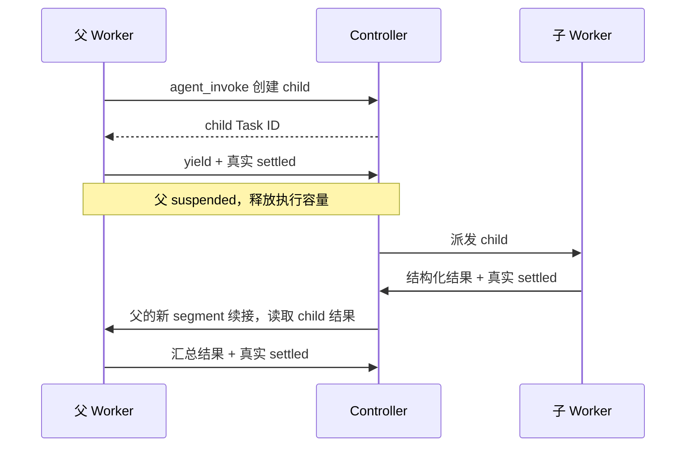

# Squad 明确完成、yield 与调度 tick

## 是什么

业务任务完成、当前模型片段结束、通信租约和调度周期是不同的概念。用户已决定取消业务 Task 的固定时间截止，等待派发工作的明确回传；下面先描述当前机制和缺口。

### 完成回传

Worker 用 agent_task_complete 提议结构化结果，当前 Task/Attempt 进入 result_proposed；Pi 的 agent_settled 回调确认当前执行 idle、无 pending、outcome=completed，并绑定原 session/Attempt/segment，Controller 才确认 completed。结果验收是后续 acceptance，completed 不等于 accepted。没有回传、只有普通文本或进程安静都不能判断成功。

必要 child 未完成时父不能成功结束。child 失败/取消/中断应向上回传明确失败或恢复状态。inherit_parent 验收下不能要求 child 先由父验收为 accepted 才允许父完成，否则会造成循环；依赖的执行完成和单独业务验收应按各自 policy 区分。

### yield 为何必要

这里的父是 Worker 通过 agent_invoke 创建 child 的正式 Task；Leader 使用 squad_decide 协调，不能调用 Worker 的 yield 工具。

invoke 异步返回 Task ID，只代表 child 已创建。当前代码给父追加 child 的 execution_completed 依赖；child 派发还要求父的 Attempt=suspended。因此父要调用 agent_task_yield，结束本模型片段并真实 settled，再转 suspended。它保留会话 affinity 和写 reservation，释放执行容量。child 回传完成后，Controller 用同一个父 Attempt 的新 segment 续接父。

当前漏洞：父未 yield 就提议结果，completion 分支未检查尚未完成的 child 依赖，父可变成 completed/settled；child 仍要求父=suspended，因而 parent_yield 不能自动解除。当前 120 秒期限可能将已受理 child 转成 needs_review，所以“永久卡住”应理解为正常流程无法再派发，并非它永远不发生任何状态变化。

建议在 result_proposed 和最终 settled 两处校验必要 child 的当前状态、版本和结果，并返回可行动的错误信息；未 yield 时提示先 yield。不能靠父提前完成释放资源，也不能静默取消 child 冒充任务闭环。具体错误/自动处理策略尚未实施。

### 500ms tick 做什么

Controller serve 每 500ms 调用 Service.Tick；它是调度状态机的巡检，不是模型每 500ms 执行。

Tick 在写事务里依次消费 outbox、检查结果证据变化、消息过期、业务 deadline 和 lease，尝试 Run 准入、生成 review、启动 clarification response、续接父、生成 LeaderStep，并派发就绪 Task。HTTP 回报当次事务已保存结果；这些后续派发多数靠下一 Tick 推进。Extension 每秒轮询/SSE 与 Go Dashboard 每 2 秒刷新是另两套观察机制。

readTasks 查询没有状态过滤，读取全部历史 Task JSON；Tick 的多个子流程重复调用它。只剩少量活动任务时仍反复处理大量历史记录，增加数据库与文件 hash 检查、占用写事务时间。优化重点是事件提交后唤醒相关调度、按 active Run/Task 与依赖索引查找、合并重复事件和缩短事务；消息/lease、外部文件证据变化保留有界的时间维护或核对，不再扫描全部历史。

### Leader 简报与历史

当前 taskSummary 对 goal/result.value 有单项约 2048 字符预览，不是完全没有摘要。Leader briefing 仍收集本 Run 全部 Task，包含旧 LeaderStep，并累积 guidance；每次派发还将完整 TaskContract + briefing 作为 user 输入加入原 Pi 会话。当前 system sections 同时持有 TaskContract。单项裁短不能限制行数、轮数和整体历史。

固定文件只解决最新状态的存储；若每轮仍读出全量正文追加聊天，历史继续增长。建议 Controller 生成按 Run 隔离、带 revision/hash 的有界当前状态文件，SQLite 保持事实源；Leader 只获取目标、最新有效指导、待决事项、必要依赖结果摘要和精确 ID/version/hash，详情通过查询获取。在 Pi context hook 中裁剪旧正式协调轮消息，保留当前完整工具调用/结果配对和必要用户信息，原 transcript 保留审计。文件路径例如 .runtime/runs/<run_id>/leader-context.json 只是建议，未实现，也不向模型开放整个私有控制目录。

长上下文让 provider 处理、生成和自动 compaction 耗时增加，而 accepted 的 120 秒墙钟截止仍计时，因此可能正在压缩/思考却被 deadline 中断。取消业务 deadline 后该中断链解除，但 token 成本、上下文窗口和延迟问题仍需摘要与裁剪解决。

## 证据

- [父依赖建立](../../pi_squad/controller/scheduler/tasks.go)、[派发与 parent_yield](../../pi_squad/controller/scheduler/dispatch.go)、[yield/result/settled](../../pi_squad/controller/scheduler/execution.go)、[续接](../../pi_squad/controller/scheduler/continuation.go)。
- [500ms 调度入口](../../pi_squad/controller/cli/serve.go)、[无过滤历史读取](../../pi_squad/controller/scheduler/tasks.go)、[结果证据巡检](../../pi_squad/controller/scheduler/invalidation.go)。
- [TaskContract 与 briefing 输入](../../pi_squad/extension/invocation.ts)、[单项预览与 Leader 全 Run 任务行](../../pi_squad/extension/context-assembly.ts)。
- [Pi context 消息修改接口](../../pi-dev/packages/coding-agent/src/core/extensions/types.ts)、[中文扩展说明](../../docs-zh/pi-dev/packages/coding-agent/docs/extensions.md#context)。上游仅作只读证据。

## 相关页面

- 决策: [[decisions/2026-10-04-squad-explicit-completion-and-context]]
- 会话: [[sessions/2026-10-04-squad-review-clarification]]
- 概念: [[concepts/squad-role-instance-lease]]、[[concepts/pi-squad]]
